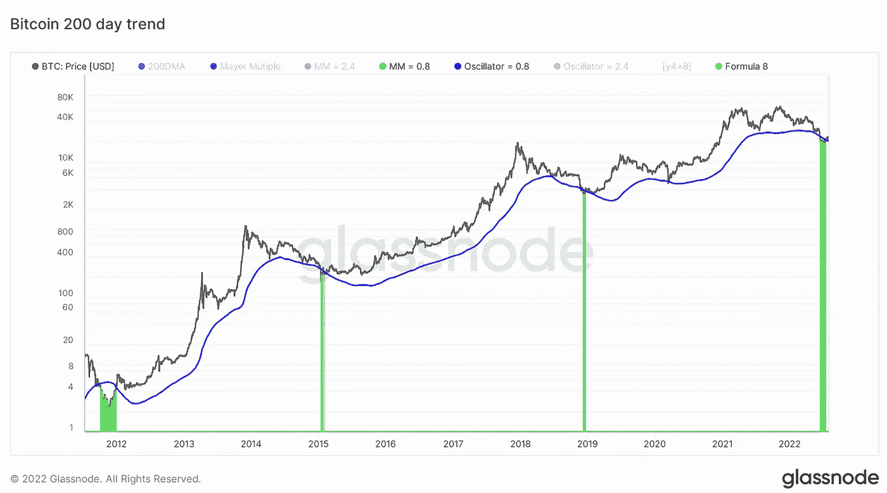
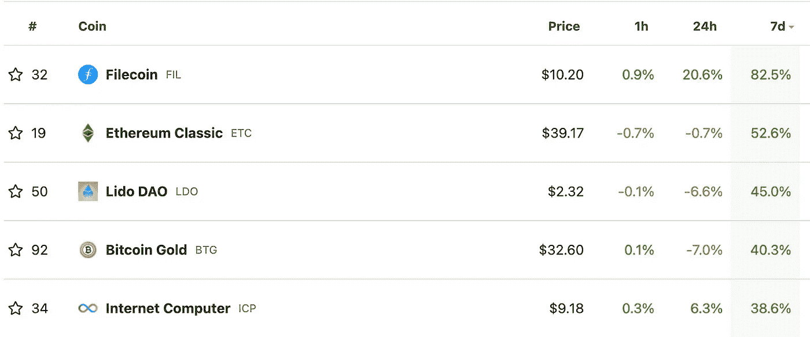
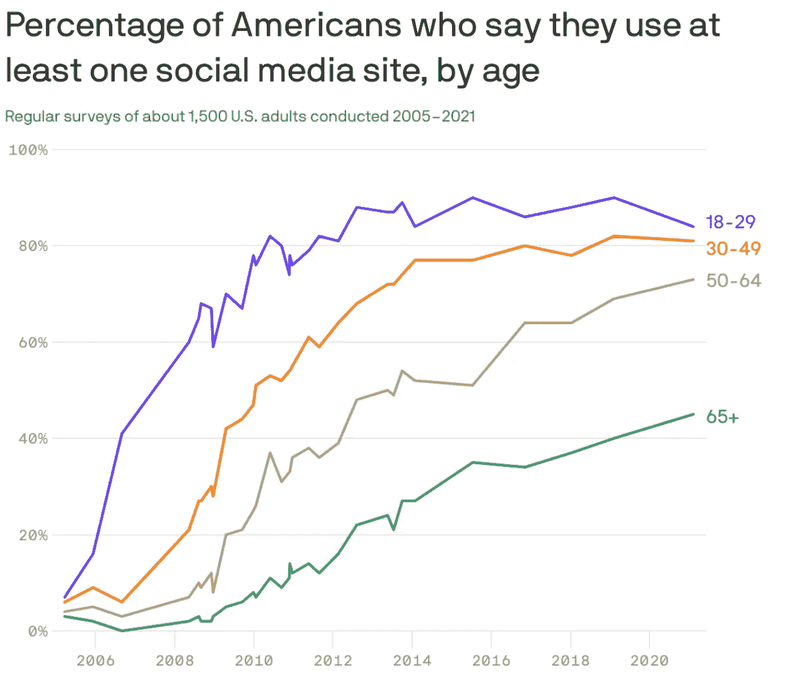

# 😰美国正处于“技术性衰退”吗？

> 原文：<https://medium.com/coinmonks/is-the-us-in-a-technical-recession-7215050323d8?source=collection_archive---------26----------------------->

# 内容(3 分钟阅读):

*   😰美国正处于“技术性衰退”吗？
*   💾Filecoin 是顶级的去中心化存储协议吗？
*   👨‍👩‍👧‍👧Startupy——社区管理的搜索引擎
*   👀Z 世代在新的网络时代走自己的路
*   🏖️个人退休帐户，避税帐户
*   🧾虚拟货币税收公平法案
*   📰基督教青年会
*   🙏🏻感激…

# 👍美国正处于“技术性衰退”吗？

FOMC(美联储)周三宣布将联邦基金利率上调 75 个基点，使目标区间的上限保持在 3 年高点。

而 Q2 国内生产总值增长率为-0.90%，这使美国陷入技术性衰退。技术这个词是最重要的，因为有许多因素可以使经济陷入或摆脱“技术衰退”。

上述消息对加密空间的影响，在很大程度上，并不像我们想象的那样负面。过去一周，比特币[上涨了 6.1%](http://coingecko.com/) ，最大涨幅出现在周三(FOMC 会议日)，当时它上涨了约 1874 美元。

因此，7.5 年来，[比特币 200 毫安](https://substackcdn.com/image/fetch/f_auto,q_auto:good,fl_progressive:steep/https%3A%2F%2Fbucketeer-e05bbc84-baa3-437e-9518-adb32be77984.s3.amazonaws.com%2Fpublic%2Fimages%2Fa0817df9-d568-43d6-a6f9-056f8d57c6ea_1800x1013.png?utm_source=substack&utm_medium=email)一直充当着重要的历史支撑线，支撑着比特币的价格。如今，在对衰退的担忧中，这种局面会被打破吗？这仍有待观察，但看空支撑位通常是投资者和交易者的错误。

在比特币的价格历史上，任何触及该均线的时候都是买入比特币的最佳时机，至少是通过美元平均成本(DCA)来买入。

# 💾Filecoin 是顶级的去中心化存储协议吗？

Filecoin (FIL)，与 Protocol Labs 的同名去中心化文件共享协议相关的令牌，正在风起云涌。其价格在过去一周飙升了 82.5%。

> *中国官员几乎已经正式鼓励 Filecoin*[***mining***](https://decrypt.co/?post_type=post&p=5743)*因为它的分散云存储目的符合中国建设自己的互联网基础设施的议程，作为正在进行的科技冷战的防御机制。*
> 
> 中国的主要公司已经开始涉足 Filecoin 矿业，包括向 Filecoin 矿业公司投资近 1 亿美元的 [*【鑫源】*](https://news.8btc.com/xinyuan-technology-buys-580m-yuan-worth-of-filecoin-miners) *，以及在纳斯达克公开交易的* [*【第九城市】*](https://www.sohu.com/a/458133430_140434) *【自 2 月以来已向 Filecoin 矿业公司投资 1200 万美元。*

[现在就订阅](https://yarocelis.substack.com/subscribe?utm_medium=web&utm_source=subscribe-widget&utm_content=66466305)

[启动-](https://beta.startupy.world/membership/?ref=yarocelis)

> *我很高兴地宣布，我已经成为 Startupy 的策展人和会员。一个社区管理的搜索引擎。零 SEO BS。* [***我邀请你加入这个为漫游、研究和思考而设计的知识和见解的令人愉快的图书馆。***](https://beta.startupy.world/membership/?ref=yarocelis)

# Z 世代在新的网络时代走自己的路

据皮尤研究中心称，Z 世代是唯一一个社交媒体使用下降的一代。根据 Piper Sandler 最新的 Z 世代消费者调查，去年秋天，除了抖音，其他社交媒体应用程序的使用都减少了。

如今，[Z 世代用户](https://www.axios.com/2022/07/26/gen-z-social-media-tiktok-discord-facebook)通过一系列更小的应用程序建立网络，每个应用程序都有不同的功能:Twitch 用于直播和游戏，Discord 用于私人聊天组，BeReal 用于自发更新，Poparazzi 用于拍摄朋友的照片。

加密货币是这些天每个人都在谈论的东西之一。有各种不同的交易所进行加密交易……但是很多人没有意识到他们在税费上损失了多少。

iTrustCapital 允许其客户通过个人退休账户或个人退休帐户投资 crypto，而不必担心税收或费用。

IRA 是避税账户，这意味着你所有的加密交易都是免税的，并且可以随着时间的推移免税增长**。**

没有隐藏的费用。[要了解更多信息，请点击此处并开通免费账户。](https://itrustcapital.com/referral100?utm_source=partner&utm_medium=youtube&utm_campaign=partner637&oid=10&affid=637)

[分享 Yaro 的技术& WebX 简讯](https://yarocelis.substack.com/?utm_source=substack&utm_medium=email&utm_content=share&action=share)

# 🧾虚拟货币税收公平法案——50 美元或以下的购物免税。

两名参议员提出了解决加密货币的最新两党联邦立法——这一次是为了免除 50 美元或更少的数字资产购买的高额资本收益税。

参议员帕特·图米。和 D-Ariz 的 Kyrsten Sinema 正在发起这项法案——虚拟货币税收公平法案——该法案将额外阻止国税局在相关资产升值低于 50 美元时向零售交易商征税。

“虽然数字货币有可能成为美国人日常生活的一部分，但我们目前的税法阻碍了它的发展，”图米在一份声明中说。虚拟货币税收公平法案将允许美国人更容易地使用加密货币作为日常支付方式，对购买一杯咖啡等小额个人交易免税。"

# 📰基督教青年会

*   [上涨了 398%，这是丽都岛在排行榜上的下一站](https://ambcrypto.com/up-by-398-heres-whats-next-for-lido-dao-on-the-charts/)
*   [随着 ADA 成为最发达的加密货币，Cardano 超越了加密专业公司](https://zycrypto.com/cardano-outpacing-crypto-majors-as-ada-reigns-as-the-most-developed-cryptocurrency/)
*   [大多数机构对加密技术的投资仍将持续到 2022 年底](https://cryptopotato.com/most-institutional-investment-in-crypto-is-still-late-in-2022-opinion/)
*   [百威啤酒等主要品牌越来越多地转向 NFT 技术](https://www.cryptoglobe.com/latest/2022/07/major-brands-such-as-budweiser-are-increasingly-turning-to-nft-technology/)
*   [沃顿商学院推出聚焦元宇宙的商业课程](https://www.theblock.co/post/159723/wharton-school-launches-metaverse-focused-business-course?utm_source=cryptopanic&utm_medium=rss)
*   [FTX 与利益相关方会谈后接近收购 Bithumb】](https://beincrypto.com/ftx-close-to-acquiring-bithumb-after-talks-with-stakeholder/)