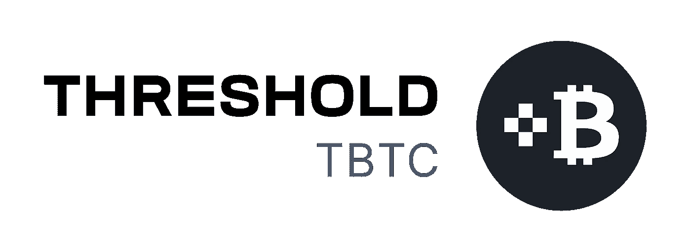
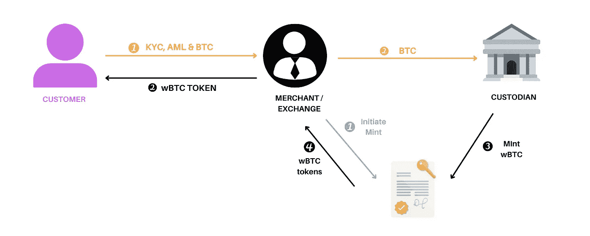
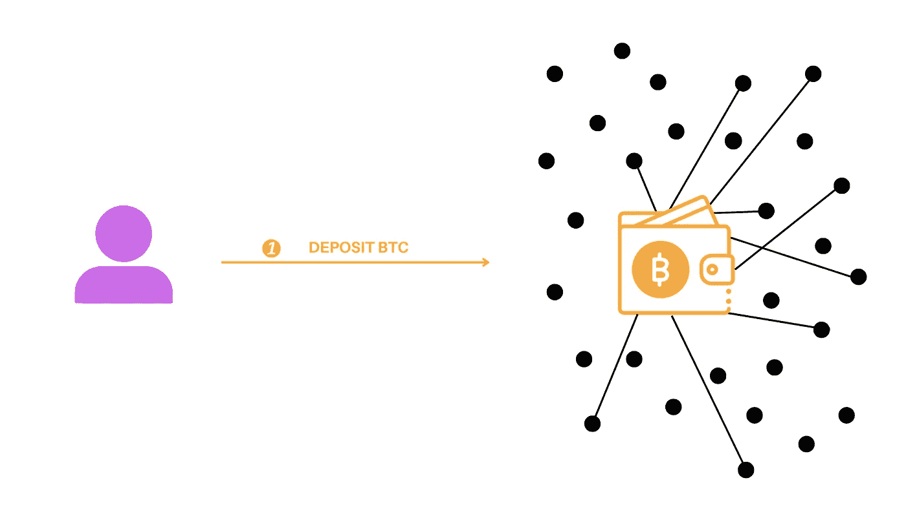
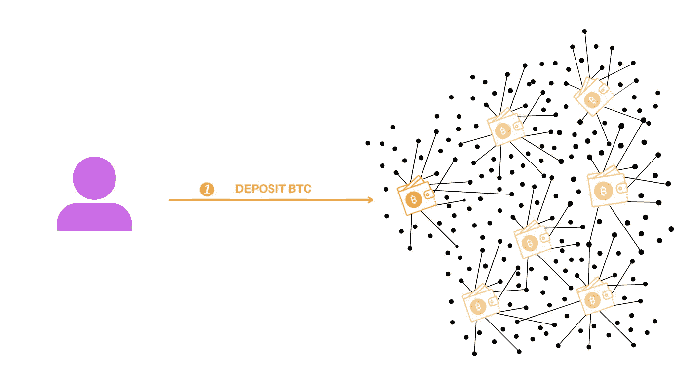
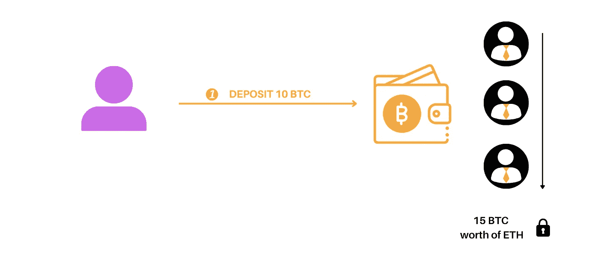

# 有没有一种方法可以在没有中央权威的情况下将 BTC 连接到以太坊？第一集

> 原文：<https://medium.com/coinmonks/is-there-a-way-to-bridge-btc-to-ethereum-without-a-central-authority-4836d56cea5?source=collection_archive---------11----------------------->

阈值已经找到了一种有趣的方法来做到这一点:一种被称为 tBTC v2 的协议。

但是，它是如何工作的呢？让我们从基础开始。

> 从顶级交易者那里复制交易机器人。免费试用。

# 传统的桥

到目前为止，提供 BTC 到以太坊桥梁的解决方案需要用户将 BTC 发送给中介，以换取代表原始资产的 ERC20 令牌。这种模式创造了一个集中点，需要信任第三方，即托管人，并且容易受到审查，这意味着它实际上与比特币安全、无许可去中心化的承诺相矛盾。

¿How a traditional bridge works?

# tBTC v2 如何工作？

另一方面，tBTC v2 不依赖于集中的权威，而是由阈值网络和数学上的分散节点网络来保护。

在 tBTC v2 中，一组在阈值网络上随机选择的节点操作者代替了集中式中间人。通过阈值加密技术，这支由独立运营商组成的团队合作保护您的比特币存款。

## **假设你**想要**将一个 BTC 连接到以太坊:**

你把你的 BTC 寄到一个钱包地址。但是，什么钱包地址？

每周都会创建一个 BTC 存款钱包，私钥在从[阈值网络](https://threshold.network/)中随机选择的 100 个节点之间分配。这个钱包将代管这一周内所有的 BTC 存款。在 wallet 上执行任何操作至少需要 100 个已分配节点中的 51 个。

Deposit BTC in tBTC v2

在您转让您的 BTC 后，您有一个余额，您可以从中铸造您的 tBTC 令牌。

**注意**每周从一组新随机节点创建一个新的存款钱包。这可以防止任何潜在的恶意单个节点或节点组。所以，如果你想在几个星期后存入 BTC，将会有一个新的存款钱包。

New deposit wallet every week

## **撤回 BTC**

拥有账户余额的用户提供一个比特币地址。然后，系统减少他们的账户余额，并向用户释放等量的比特币。

**请注意**最大赎回金额受最大钱包的大小限制，任何大于最大钱包的赎回都需要分成多次赎回。

# 但是为什么是 v2 呢？

## tBTC V1:一座“不可信的桥”

在 V1 tBTC，如果有人想在 BTC 和以太坊之间架起一座桥梁，使用该系统的 3 个随机选择的运营商必须使用他们自己的以太网来抵押存款，从而超额抵押 BTC。

如果一个用户想存入 10 个比特币，三个 Keep 运营商被选中，他们必须拿出价值 10-15 BTC 的 ETH 作为存款的抵押。如果任何人合谋窃取比特币，他们在瑞士联邦交易所损失的价值将超过他们在 BTC 获得的价值。因此，每个人都会受到激励，变得“诚实”。

tBTC v1

尽管相对安全，这种设计的主要缺点是巨大的资金限制。它的成功完全取决于运营商愿意以 ETH 的形式向系统投入多少抵押品。ETH 的供应无法满足 BTC 人的需求。

## tBTC V2:信任最小化的桥梁

所以，tBTC V2 用一个“诚实假设”代替了资本约束:

*给定 X%的操作者是诚实的，一个钱包至少有 50 个不诚实操作者的概率是多少？*

最后*假设 X%的经营者是诚实的，我们每周生产一个钱包，那么连续 5 年我们除了好钱包什么都没有的概率是多少？*

由于风险计算足够低，没有必要让每个钱包单独抵押。因此，V2 提供了一个“保险池”，其运作方式与保险业非常相似。

> 与市场上的其他解决方案不同，tBTC v2 上的用户受到数学力量的保护，而不是易错的硬件或人员。

第二代 tBTC 为比特币持有者提供了对更广泛的加密经济的安全和开放的访问。tBTC v2 允许您释放比特币的价值，进行借贷、铸造稳定的比特币、提供流动性等等。

# 转型中:乐观铸币

在无许可铸币完全放开之前的过渡期，tBTC v2 将实现一个**乐观铸币系统**，其中包括两个额外的角色:铸币人和监护人。

Minters :一个由 3 到 7 个假名组成的授权小组负责监控已发现的矿藏链。在看到有效存款时，铸币商请求铸造必要的 tBTC。在铸币完成之前，会触发三个小时的自动延迟。

**监护人:**在这三个小时的时间里，第二个小组，即监护人，可以取消一个铸币厂，如果他们确定它是邪恶的——由于欺诈或任何其他问题——并删除错误的铸币厂。守护者将被允许从门槛道和更广泛的 DeFi 社区中挑选。监护人人数没有上限。

tBTC v2 向任何人开放和开放是迟早的事。

## **你可以在下面的视频中找到这篇文章的摘要:**

Content in spanish

## 关于[阈值网络](https://threshold.network/)和 tBTC v2 的更多信息:

[推特](https://twitter.com/TheTNetwork) | [网站](https://threshold.network/) | [博客](https://blog.threshold.network/) | [不和](https://discord.gg/threshold)

> 加入 Coinmonks [电报频道](https://t.me/coincodecap)和 [Youtube 频道](https://www.youtube.com/c/coinmonks/videos)了解加密交易和投资

# 另外，阅读

*   [氹欞侊贸易评论](https://coincodecap.com/anny-trade-review) | [霍比保证金交易](/coinmonks/huobi-margin-trading-b3b06cdc1519)
*   [分散交易所](https://coincodecap.com/what-are-decentralized-exchanges) | [比特 FIP](https://coincodecap.com/bitbns-fip) | [Pionex 评论](https://coincodecap.com/pionex-review-exchange-with-crypto-trading-bot)
*   [用信用卡购买密码的 10 个最佳地点](https://coincodecap.com/buy-crypto-with-credit-card)
*   [最好的卡达诺钱包](https://coincodecap.com/best-cardano-wallets) | [Bingbon 副本交易](https://coincodecap.com/bingbon-copy-trading)
*   [如何给 MetaMask 钱包添加 Arbitrum？](https://coincodecap.com/how-to-add-arbitrum-to-metamask-wallet)