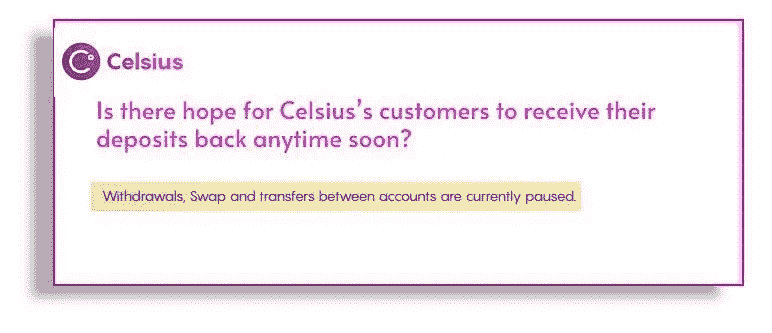
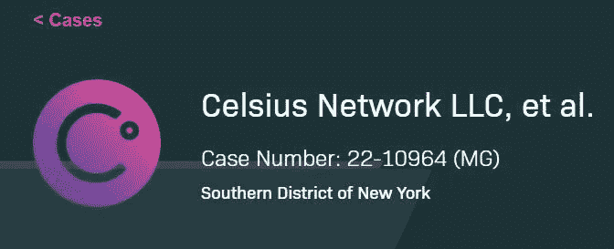
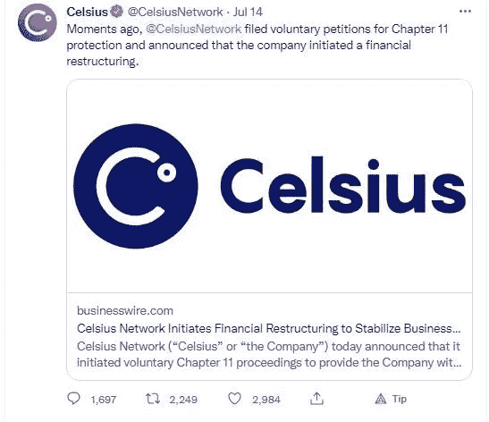

# Celsius 的客户有希望很快收到他们的存款吗？

> 原文：<https://medium.com/coinmonks/is-there-hope-for-celsiuss-customers-to-receive-their-deposits-back-anytime-soon-8dbf207eeefd?source=collection_archive---------38----------------------->

# 随着 Celsius 最近在各种 DEFI 协议中结清债务头寸，人们对其偿付能力抱有希望

上周，我讲述了我的密码卡在摄氏温度下的逃脱过程，你可以在这里阅读。

[欣慰的是，我珍贵的密码没有被锁在摄氏温度下，以免永远丢失……](/coinmonks/relief-that-my-precious-cryptos-were-not-locked-in-celsius-to-possibly-be-lost-forever-15996dfa2192)

人们曾希望 Celsius 有足够的偿付能力偿还其储户，过去几周有消息称，许多被锁定在各种 DeFI 协议中的 Celsius 储户资金被解锁，Celsius 成功偿还了各种 DEFI 协议的债务，并收回了客户存款的加密抵押品。

Celsius 在过去几周还清了债务，解锁了 MakerDao 的 21，962 wBTC、Aave 的 400，000 stEth、Compound Protocol 的 350，020 UNI 和 529，94 COMP，并能够用 300，000 xSUSHI 兑换 395，060.92 寿司。

这是一个好消息，尽管对于仍无法提取、转移和转移资产的焦虑的 Celsius 储户来说，没有积极的更新，因为 Celsius 自 6 月 13 日以来已经冻结了他们的账户。

# 现实情况是，由于缺乏资金偿还储户，Celsius 已经资不抵债

然而，现在，随着 Celsius】根据第 11 章保护申请破产，宣布 Cefi 借贷平台的资产负债表上有 11.9 亿美元的赤字，案件已经明朗。Celsius 的总负债为 55 亿美元，其中欠客户 47.2 亿美元，而其资产只有 43.1 亿美元！！

Celsius Network had its first hearing on July 18th in the US Bankruptcy Court for the Southern District of New York for the entity’s petition filing for relief under Chapter 11 of US Bankruptcy Code. [Source](https://cases.stretto.com/celsius)>>

因此，不幸的是，Celsius 没有资金完全偿还储户，至少目前没有。

看来，Celsius 在法律上也无需偿还其客户，其使用条款规定，利用 Cefi lending platform 的“Earn”和“Borrow”计划服务的 Celsius 客户已在法律上同意将其存放在平台上的加密资产的所有权转让给 Celsius。

因此，这实际上意味着 Celsius 的客户在法律上允许 Cefi lending platform 以 Celsius 团队认为合适的任何方式使用他们的存款，该实体还允许抵押和出售他们客户的硬币存款。

在贷款平台破产或面临清算的情况下，Celsius 的客户被视为无担保贷款人。

# Celsius 提出了偿还客户存款的方法

[Source](https://twitter.com/CelsiusNetwork)>>

然而，Celsius 的代表在法庭上表示，该实体计划[偿还其客户](https://cryptobriefing.com/celsius-unveils-recovery-plans-in-bankruptcy-hearing/)。客户将可以选择以折扣价收回他们的现金，或者通过在 crypto 做多[来收回他们的全部加密价值，其逻辑是，当 crypto 宏观经济条件升值时，也就是当 crypto 牛市到来时，Celsius 将有资源向他们的客户全额付款。](https://cryptobriefing.com/celsius-is-hoping-for-a-bull-market-to-repay-customers/)

根据法院法官的判决，Celsius 的托管账户中有 1.8 亿美元可以分配给客户，因为它可以与其他资产归为一类。

Celsius 预计将从其比特币开采业务中获得收入，预计将开采 1 万 BTC，并将通过出售最近收购的 GK8 公司筹集 1.15 亿美元。这些额外的资金将帮助实体有更多的资金来偿还客户。

# Celsius lending platform 将在业务重组后运营

[Tweet](https://twitter.com/CelsiusNetwork/status/1547375324622618624?s=20&t=MJ0D4N9LoMygcG0MWwlA0g)

根据美国破产法第 11 章申请破产后，Celsius 打算在重组其业务后继续运营，因为美国破产法第 11 章允许他们这样做。

# 预计 Celsius 的储户不会立即得到救助

由于 Celsius 的破产申请和其他针对该实体及其重组计划的案件的所有法庭听证会，实际上预计 Celsius 的案件将[拖上数年](https://cryptobriefing.com/celsius-unveils-recovery-plans-in-bankruptcy-hearing/)，其不幸的储户不会很快收到他们的赔偿或存款。

然而，很有可能有一天 Celsius 的客户至少会拿回部分存款。

> 交易新手？尝试[加密交易机器人](/coinmonks/crypto-trading-bot-c2ffce8acb2a)或[复制交易](/coinmonks/top-10-crypto-copy-trading-platforms-for-beginners-d0c37c7d698c)