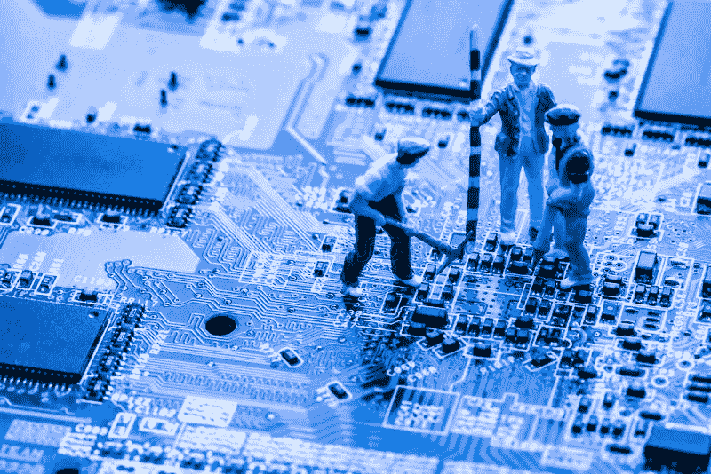

# 这是一个抓住过去不放的例子吗？

> 原文：<https://medium.com/coinmonks/is-this-a-case-of-holding-onto-the-past-231ed814bd8b?source=collection_archive---------64----------------------->

dreamstime

一开始有矿工，矿工开采比特币。较小的矿池可以赚取(作为一个单位工作)收集一部分比特币。这个过程包括用计算机解决一个数学难题。这种努力的回报是 6.25 比特币。

根据 CoinWarz(一个加密挖掘计算器)的数据，一个以太坊矿工每年可以获得 46389.24 美元的税前收入。(确保你的电脑保持在线是一份不错的薪水)

合并来了又走了。它于 2022 年 9 月 15 日星期四启动。接下来会有更多的更新，但是现在看来，以太世界一切都好。

以太坊的工作证明分叉也发生了。网络开发商表示，矿商将继续保护分叉。给出的分叉原因是矿工不愿意赔钱。(每年 4.6 万美元)

除了收入损失，矿工们还剩下昂贵的开采以太坊专用硬件。

随着合并消息的公布，ETHPoW 的预发行版在几个小时内飙升了 70%以上，达到 60 多美元。燃料耗尽，导致硬币暴跌 70%以上。

自 2022 年 9 月 16 日左右推出以来，ETHPoW 一直在挣扎，并经历了一次黑客攻击。

**值得吗？**

可以理解的是，有创造力的矿工们聚集在一起，共同创造一个新的区块链。这是维持他们采矿作业的一种手段。然而，这枚硬币可能会找到一个多愁善感的买家的利基，让它存活一个赛季，永远不会做更多。

ETHPoW 值得投资吗？也许你想帮助一个饥饿的矿工，但如果你正在寻找一个持续增长的长期投资，那就不一定了。原因是基本面不在。

这可能只是一个抓住过去不放的问题。

隐文是给你的。跟着我学；也许你会学到；或许，我们可以一起探索隐密体。

*免责声明:我是一名狂热的加密学生。当新冠肺炎占领世界并锁定全球经济时，隐密体引起了我的注意。从那以后，我花了一部分时间来学习这种货币——未来的货币——和国际商业。作为一名作家，我决定记录我的发现。我选择把它们写成短小精悍的文章，以帮助任何有兴趣了解这个领域的人。这些文章不是用密码或投资写的，而是简单易懂的文章。我不是在提供建议，仅仅是我在意外进入隐密体的旅程中发现的信息。经验丰富的投资者可能会从阅读中获得一些东西，但我的重点是对密码的好奇。*

> 交易新手？试试[加密交易机器人](/coinmonks/crypto-trading-bot-c2ffce8acb2a)或者[复制交易](/coinmonks/top-10-crypto-copy-trading-platforms-for-beginners-d0c37c7d698c)