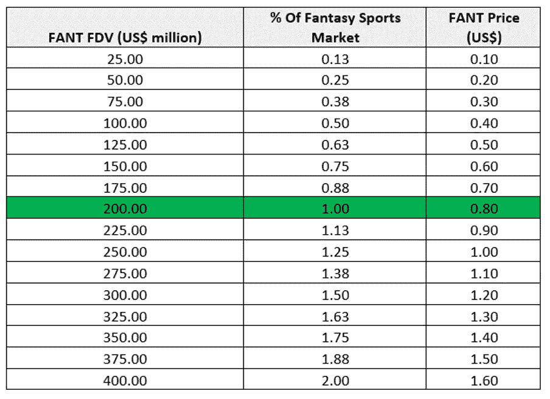

# $FANT 令牌价格预测

> 原文：<https://medium.com/coinmonks/is-this-crypto-token-an-nft-money-maker-100x-gem-all-at-once-6652aa40666e?source=collection_archive---------10----------------------->

小规模市场分析和价格预测

*   **什么是 Phantasia Sports ($FANT)？**
*   **什么因素会促成它的成功？**
*   **请问$FANT token 的价格预测是多少？**
*   有哪些风险？

**简介**

在文章'[*【100 倍到 1000 倍的登月梦(第一部分)*](/coinmonks/100x-to-1000x-moonshot-dream-part-1-47bed2fe4996) '中，我推测了$ FANT token——Phantasia Sports 的公用加密货币 token 的市场机会。

我重访这个项目是因为它有很高的社会潜力。我说的高社交潜力是指它在 GameFi 生态系统中捕捉加密本地人和远离任何加密的普通人的潜力。

我会在文章中进一步解释为什么这个项目有很高的社会潜力。

**Phantasia Sports 可以轻松搭载 crypto 和 Web3 之外的用户。**

Phantasia 寻求利用 Web3 的优势进入梦幻体育市场。该项目利用索拉纳区块链的快速和低成本交易，彻底消除幻想体育中的中间人。因此，参与者不必支付高额费用，可以自由创建他们的定制比赛，并享受即时支付。

该项目抽象了区块链和加密方面，使普通人能够在不知道加密、区块链和 Web3 的存在的情况下参与进来。这个概念使这个项目充满了巨大的社会潜力，因为它可以抓住只有一部手机和一个互联网连接的普通人的兴趣。

此外，Phantasia Sports 将 NFTs 的社会效用融入了梦幻体育市场。NFTs 将授权参与者创建独特的社区，定制他们的身份，并提供额外的功能。

$FANT 令牌是该项目的实用令牌，它使用户能够参与竞赛，为他们的成功赢得令牌。Phantasia 的$FANT token 本质上是其生态系统的游戏内货币。

与目前许多区块链应用程序不同，Phantasia 不打算将加密技术强加给最终用户。Phantasia 团队的目标是让这个平台尽可能对用户友好，区块链在后台悄悄地为系统提供动力。

**幻腾体育有很高的社会潜力**。

Phantasia Sports 已经有了 Android 和 iOS 应用程序，不需要用户有意创建一个加密钱包，连接到任何区块链平台，购买加密货币，甚至不需要知道加密货币。

上述概念赋予了该项目很高的社交潜力——让那些不精通密码，但通过体育、数字体育收藏品和友好的社交比赛等真实世界活动寻求娱乐的用户参与进来的能力。

一个显示出很高社交潜力的项目是 STEPN，它利用了 Move2Earn 叙事，将 NFTs 和 crypto 集成到行走和跑步等现实世界的活动中。除了密码投机，导致其成功的主要因素之一是该项目抽象出了密码和区块链。本质上，该项目推出了移动应用程序，使来自非本地加密的日常公共参与成为可能。

五个主要因素使得一个密码项目具有很高的社会潜力。它们是:

*   通过移动应用程序(如 iOS 和 Android)提供项目。
*   混淆了区块链的基础设施。
*   集成简易平面坡道。
*   整合现实世界的活动和娱乐(如体育)。
*   它的令牌必须具有治理之外的效用。

上述因素可以给予加密项目成功所需的社会动力和社会网络效应。

在下一节中，我们将讨论潜在的价格预测，但首先，快速消息。

*如果你觉得这篇文章的内容到目前为止有用，请考虑在 Twitter 上关注我，地址是*[*@ observer _ kel*](https://twitter.com/observer_kel)*，*[*keltheobserver.medium.com*](https://keltheobserver.medium.com/)*，并订阅我的免费 Substack 简讯(*[*【cbresearch.substack.com*](https://cbresearch.substack.com/)*)，了解更多关于 Web3、NFTs 和 crypto 的前瞻性思想和 alpha。*

如果完成重要的里程碑，Phantasia Sports 将有超过 50 倍的潜力。

在此分析中，我们将始终使用 2.5 亿美元的完全稀释流通量。

此外，我们将为全球梦幻体育市场资本化设定 200 亿美元的静态数字。我们从[研究和市场](https://www.researchandmarkets.com/)的[幻想体育 2021 年全球市场报告:新冠肺炎增长和变化](https://www.researchandmarkets.com/reports/5411782/fantasy-sports-global-market-report-2021-covid)中获得了这个数字。

请注意以下要点以理解下表:

**FDV(百万美元)**:如果所有的$FANT 代币都在流通，则其完全稀释后的价值为百万美元。

**价格(美元)**:对应 FDV 的单个$FANT 代币的价格。

**%**

如果梦幻亚洲体育占据全球 200 亿美元梦幻体育市场的 1%，其市值将达到 2 亿美元。我们将利用这一市场份额，并排除任何价格飙升的秘密投机。

以 2 亿美元的市值计算，这种价值 10 美元的 FANT 代币的价格为 0.8 美元。在撰写本文时，象征性价格低于 0.01 美元，这意味着如果该项目获得相关市场份额，价格将上涨 80 倍。

里程碑指向潜在的成功。

熊市是加密项目走向死亡的地方。因此，关注那些在市场低迷时期继续建设的项目至关重要。Phantasia 运动队即使在当前的低迷时期也在继续建设。

在过去的牛市中，风险投资公司因向散户投资者倾销代币并获得 20 倍至 100 多倍的回报而声名狼藉；无论如何，风投资助的项目将拥有更好的现金跑道，增加它们在熊市中的生存能力。

有鉴于此，Phantasia Sports 从 Alameda Research、CMS、Sino Global Capital 和许多其他机构筹集了 180 万美元。

此外，该项目完成了网络安全公司 Halborn 的安全审计。

付费参赛比赛和代币赌注现已开始。

亚伦琼斯，职业碗绿湾运行四分之一后卫，他的 NFTs 来 Phantasia 体育。

最后，Phantasia Sports 还寻求整合更多体育类型的联赛，包括英格兰超级联赛(足球)。

**尽管项目有潜力，但市场风险依然存在。**

投资加密总是有风险的。此外，即使有前途的项目也可能失败。考虑到这些因素，在投资这种早期阶段的小盘股项目时必须谨慎。

可能使我的推测性论点无效的一些风险包括:

*   索拉纳·区块链失败了。
*   项目基础设施遭遇黑客攻击。
*   该项目甚至未能占领梦幻体育市场的一小部分。
*   加密熊市比该项目的金融跑道还要长。
*   密码产业失败了。

***免责声明:*** *本文提供的信息并非财务建议。您选择如何处理这些信息完全是您的责任。加密货币是不受监管且高度不稳定的资产，资本损失可能超过 100%。*

> 交易新手？尝试[加密交易机器人](/coinmonks/crypto-trading-bot-c2ffce8acb2a)或[复制交易](/coinmonks/top-10-crypto-copy-trading-platforms-for-beginners-d0c37c7d698c)