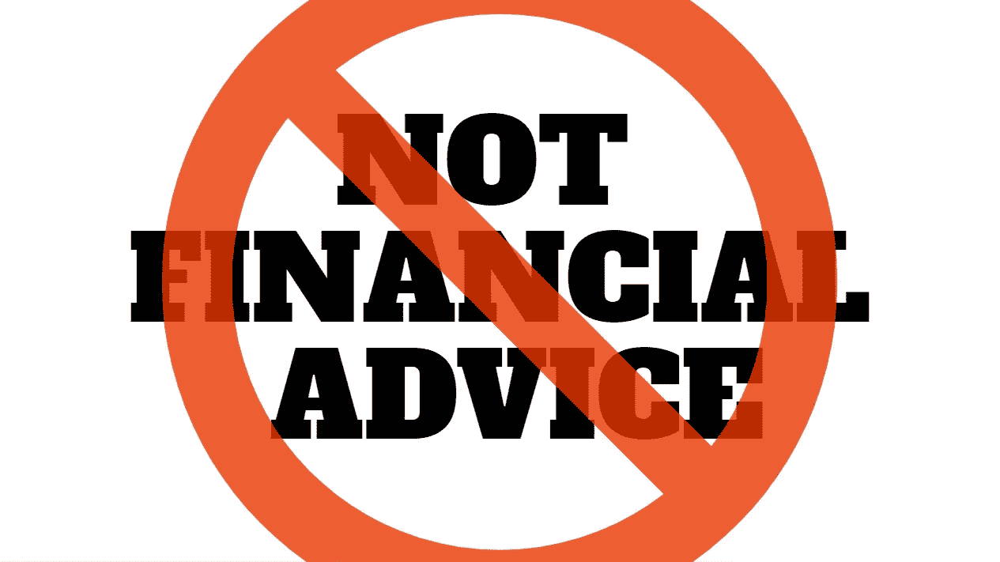
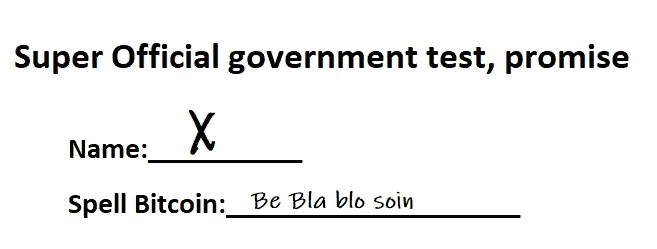

# 这是“不是财务建议”这句流行语的终结吗？

> 原文：<https://medium.com/coinmonks/is-this-finally-the-death-of-the-catchphrase-not-financial-advice-9224bdfe3a65?source=collection_archive---------49----------------------->

澳大利亚和美国的数字资产律师表示，简单地说“不是财务建议”可能对你没有任何帮助。除了可能惹恼你的观众。我想他们和我一样，会立刻想到，“如果这不是建议，你为什么要告诉我它有多好？”。

# 讽刺的转折

如果加密影响者遵守了加密中最常用的口头禅“做你自己的研究”。我要补充的是，我同样讨厌这一点。他们很可能已经意识到“不是财务建议”这句流行语，或者随便你怎么称呼它。实际上并不能让你免于面对法律诉讼。尽管我认为很多人认为。

Social media in all its glory, home if the influencer

根据澳大利亚和美国律师的说法，从法律的角度来看，这个短语几乎毫无用处。希望，如果这种意识传播开来，将会导致更少的 tiktokers 和其他人仅仅因为在他们面前挥舞一叠钞票而宣传 sh*tcoins。个人认为是寄生行为的巅峰。一个人用他们自己的粉丝来赚钱。而大多数时候粉丝们什么都抢。因为他们投资了一些地毯拉泵和转储骗局项目，相信他们仰望的人永远不会误导他们。

在澳大利亚，他们实际上朝着正确的方向更进了一步。在那里，他们要求有影响力的人有执照才能给出金融建议。我只能想象这种应用或测试是如何完成的。它能够显示三个盈利的投资吗？或者有没有一个测试，我想可能是这样的:

“先生，是的，是的。把你的名字写在虚线上，这里写着‘姓名’……好的，打个 X 就行了。我们知道你是谁，所以一切都很好。现在让我们进入第一个问题。”

Probably the hardest test ever devised…

“先生，我很荣幸地通知您，您现在可以正式向植物和一些精选的无脊椎动物(如蜗牛)提供财务建议。这是你的执照。”

虽然我很乐意开这个玩笑。我确实认为需要做点什么，让这些社会寄生虫为他们的行为负责。如果有一个监管机构颁发许可证，或者只是有一个年度 Thunderdome。很遗憾，我没有答案。但是寄生虫影响者雷电穹顶事件对我来说听起来不错。

然而，律师们重申，虽然从法律上讲，“非财务建议”可能没有任何意义。告知听众仍然是一个好的做法，因为我们经常会忘记一些事情。

你认为“非财务建议”实际上是无用的吗？就我个人而言，很高兴听到我的想法。因为我认为这是加密中最烦人的事情之一。我的意思是，如果这不是金融建议，那是什么，娱乐如果 99/100 的案例都是这样，那么内容就很糟糕。我很想听听你对这一切的看法。评论区是你的。

如果你想支持我和我制作的内容，请考虑关注我，阅读我的其他帖子，或者为什么不两者都做。

网络上见！

图片提供:[https://pixabay.com/](https://pixabay.com/)

> 交易新手？试试[密码交易机器人](/coinmonks/crypto-trading-bot-c2ffce8acb2a)或者[复制交易](/coinmonks/top-10-crypto-copy-trading-platforms-for-beginners-d0c37c7d698c)