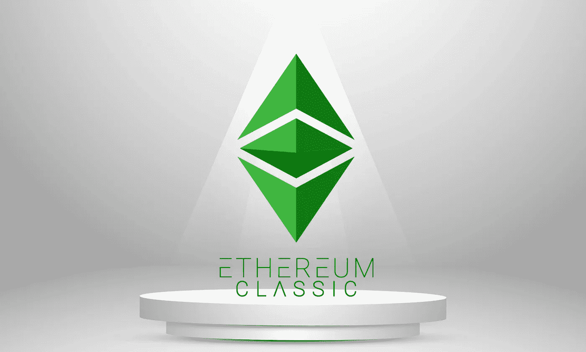

# 这真的是以太坊经典的复活吗？

> 原文：<https://medium.com/coinmonks/is-this-really-the-resurrection-of-ethereum-classic-39c8105caf2a?source=collection_archive---------28----------------------->

在两周之内，以太坊经典公司的股价已经上涨了 150%，市值从 7 月份的仅 1.5 美元 2B 增加到了 1.5 美元 3B 元。

这就引出了一个问题:是什么导致了这种反弹，以及这种反弹能否持续。所以，让我们来深入探究以太坊经典。

# 叉子

2016 年 6 月**“The DAO”是一只建立在以太坊基础上的分散风险基金，代币持有者可以在其中对项目提案进行投票，该基金因利用智能合同漏洞而被黑客攻击，导致其 1.5 亿美元的总资金中流失了约 6000 万美元。**

一个提议的计划是分叉以太坊以逆转盗窃，并将钱归还给*道*，但是以太坊社区在这个决定上存在分歧。pro fork 集团主张进行紧急救助，以拯救 DAO 和其他受其影响的项目。

反 fork 团体认为，攻击不是区块链核心协议中的缺陷造成的，因此，fork 拯救 DAO 将挑战区块链的不变性，并给人这样一种印象，即如果人们愿意，区块链的最终解决方案可以逆转。

他们主张坚持严格的“代码即法律”原则。

在【2016 年 7 月 15 日，关于叉子的在线投票在短时间内进行。总以太坊持有者中只有 5.5%的人出来投票，其中 87%的人投了赞成票，13%的人投了反对票。

硬叉完成**2016 年 7 月 20 日**。但是，一组开发人员决定继续在留下的原始链上进行构建，这就是后来众所周知的以太坊经典。

# 它与以太坊有何不同

以太坊经典在意识形态上与以太坊根本不同。该社区遵循严格的“代码即法律”原则，在其网站上写道“ ***应用程序完全按照编程运行，没有宕机、审查或第三方干扰*** ”，考虑到正是最初以太坊愿景的同一批铁杆信徒复活了以太坊经典，这并不奇怪。

至于使用案例，支持者表示，它可以像黄金或比特币一样作为价值储存手段，因为它的硬币供应量是有限的，尽管多年来看它的价值并不能给人太多信心。第二个用例是智能合约功能，它允许开发人员在其上构建应用程序。

以太坊经典也更加关注安全性(尽管它已经被黑客攻击过很多次)而不是可扩展性，因此目标是数量少但价值大的结算。这导致了一个比以太坊更不可变的链条，但不如比特币。比比特币更具可编程性，但不如以太坊。

因此，它被置于比特币和以太坊之间的某个中间位置，比特币具有硬币上限和价值储存功能，以太坊具有智能合约功能。

# 夹在中间

但这也产生了一个问题，哈佛大学商业战略教授迈克尔·波特称之为“夹在中间”——产品不能提供自己独特的优势。例如，在这种情况下，想要存储价值的人可能会选择比特币，而想要构建应用程序的人会选择以太坊。

证明这一理论，直到现在以太坊经典没有取得很大的成功，作为一个价值储存。想要加密货币的人仍然更喜欢比特币。

在应用方面，它也没有受到太多的关注。**根据 Defi Llama 的数据，锁定的总价值仅为 23.7 万美元，相比之下，以太坊为 400 亿美元，创为 58 亿美元，币安智能连锁为 57 亿美元。**

基于以太坊经典的顶级应用是 [HebeSwap](https://hebeswap.com/) ，这是一个[去中心化的交易所](https://bitnewsbot.com/what-are-decentralized-exchanges/)，用于交换 ERC-20 代币，仅锁定了 212K 的价值，贡献了该链中锁定的总价值的 90%。

剩余价值由“ [ETC Swap](https://etcswap.org/) ”贡献，另一个从 Uniswap 分叉的去中心化交换，24.6K 价值锁定。

与其他估值类似的 L1 和 L2 连锁店开发的应用相比，这是一个很大的差距。 [Avalanche](https://bitnewsbot.com/tag/avalanche) 有 242 个构建在它上面的应用程序， [Polygon](https://bitnewsbot.com/tag/polygon) 有 282 个， [Fantom](https://bitnewsbot.com/tag/fantom) 有 254 个。

# 安全问题

以太坊经典的另一个问题是它的安全性。

对于一家为了安全而牺牲可扩展性的连锁店来说，几年前发生的一系列黑客攻击损害了它的声誉。它的低和易变的散列值使它容易受到 51%的攻击。

2019 年，它目睹了一次超过 100 万美元的双重支出攻击，促使比特币基地停止交易硬币一段时间。

2020 年 8 月，仅在一个月内，它就目睹了三次 51%的攻击，导致数百万 ETC 被盗。

虽然开发社区已经实现了一个名为 [MESS](/etc-core/agreeing-to-disagree-proposing-a-weakly-subjective-finality-solution-for-ethereum-classic-7daad47efc0e) 的终结算法，这是 2020 年 10 月修改的指数主观评分的缩写，以使 51%的攻击更加昂贵，[批评者](https://iohk.io/en/blog/posts/2020/10/23/ensuring-etc-network-security/)说它不能提供针对此类攻击的强大安全性。

# 为什么 ETC 的价格在上涨？

那么是什么导致了硬币价格的突然上涨呢？

部分原因是以太坊即将进行的合并，其中以太坊将在今年 9 月从当前的工作证明转移到股权证明共识，这使得采矿过时，据推测矿工将迁移到以太坊经典。

在第 11 大以太坊矿池**蚁池**宣布投资 1000 万美元进一步开发以太坊经典矿池后，这一猜测进一步升温。

蚂蚁金服是总部位于北京的比特大陆公司的子公司，该公司生产加密货币开采硬件。

一年多前，当采矿收入达到顶峰时，比特大陆宣布推出以太矿机，并于 2022 年 7 月开始销售，每台售价 1 万美元。

但比特大陆的问题是，在以太坊提议的合并后，将不再需要采矿。以太坊的“难度炸弹”更新显著增加了采矿计算，这将抑制采矿。

这给矿工造成了一个困境，是清算他们的硬件还是转移到以太坊经典等其他工作链的证明，因为比特币不适合，因为它需要 ASIC 来高效挖掘，而 GPU 用于以太坊。

**根据加密货币研究公司 Messari 的数据，以太坊矿业是一个价值 190 亿美元的行业**，矿业收入在 2021 年 5 月达到 24 亿美元的峰值，但根据 Block 的数据，从那以后下降到 2022 年 7 月的 620 万美元，下降了 74%。

如果矿工不转移到其他工作链的证明，而是清算他们的硬件，这将不会对比特大陆和 Antpool 的业务有好处。因此，**他们有动力推广其他的工作证明链，比如以太坊经典**。

因为如果 ETC 价格通过资助和促销努力提高，对矿工的块奖励增加，从而激励更多的矿工加入网络。

这反过来又增加了安全性，从而让开发商有信心在链条上建设，让投资者有信心在硬币上投资，导致更多的交易和采矿需求，从而为比特大陆和 Antpool 带来更多的销售和收入。

但在现实中，实现这样的场景说起来容易做起来难。一个原因是前面提到的以太坊经典陷入困境，另一个原因是竞争加剧，因为以太坊和其他连锁店已经获得了大量的用户群和强大的网络效应。

雪上加霜的是，政府已经开始打击能效低下的工作证明链。

[纽约州](https://techcrunch.com/2022/06/03/new-york-senate-passes-moratorium-to-ban-carbon-based-crypto-mining/)和[欧盟](https://www.coindesk.com/policy/2022/04/21/sweden-eu-discussed-bitcoin-proof-of-work-ban-report/)对工作证明链的拟议禁令凸显了可能长期影响该链的监管风险。

最后，仍有推测认为矿工会选择以太坊经典，因为他们可以很容易地将现有以太坊链与工作共识证明分支。最近，Tron 的 Justin Sun 宣布向社区和开发人员捐款，以建立一个工作证明以太坊。

因此，为了让以太坊经典版的反弹持续更长时间，其基本面应该会有所改善。正如本格雷厄姆(Ben Graham)曾谈到股市时所说，“短期而言，市场是一台投票机，但长期而言，它是一台称重机”。这也适用于加密市场。

*原载于 2022 年 9 月 3 日 https://bitnewsbot.com***。**

> *交易新手？尝试[加密交易机器人](/coinmonks/crypto-trading-bot-c2ffce8acb2a)或[复制交易](/coinmonks/top-10-crypto-copy-trading-platforms-for-beginners-d0c37c7d698c)*