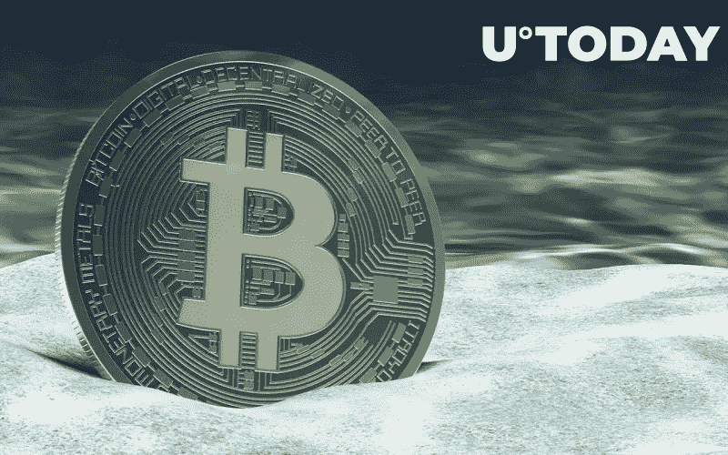
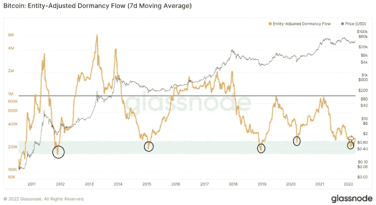
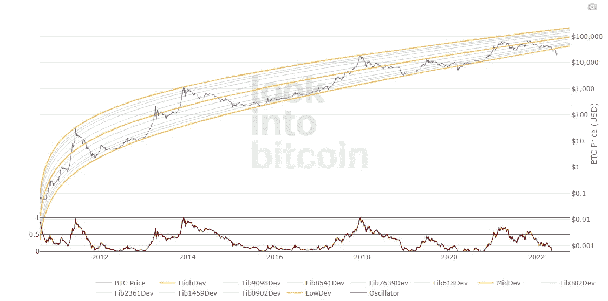
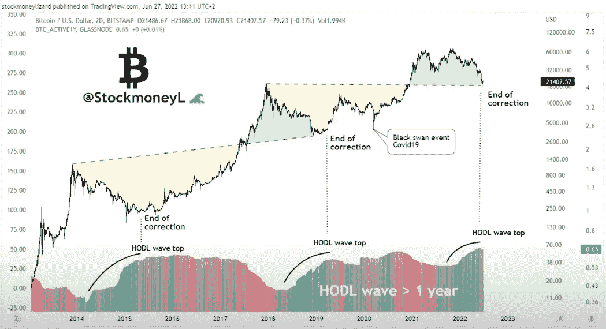
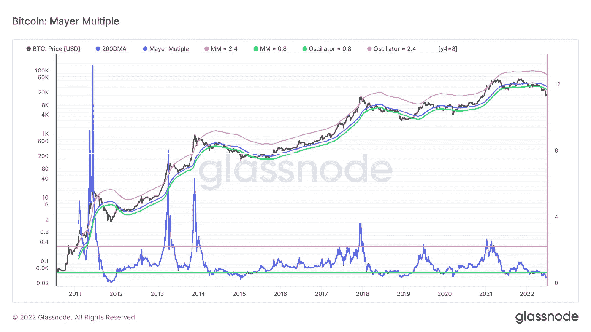
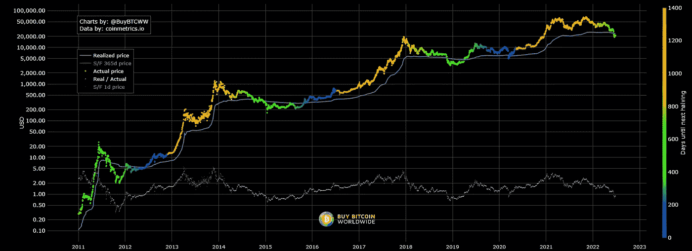

# 这是密码市场的底部吗？比特币和加密市场的 5 个重要底部指标

> 原文：<https://medium.com/coinmonks/is-this-the-crypto-market-bottom-5-important-bottom-indicators-for-bitcoin-the-crypto-market-70bc5f20f1a4?source=collection_archive---------5----------------------->

## 帮助你找到买卖比特币的最佳价格的指标



Crypto Winter

# 加密中要注意的底部指示器

```
· [Bottom Indicators to watch in Crypto](#3cb5)
  ∘ [1\. Bitcoin Dormancy Flow](#ae5f)
  ∘ [2\. Logarithmic Growth Curve](#5f58)
  ∘ [3\. HODL Wave](#6fd9)
  ∘ [4\. Mayer Multiple](#09d5)
  ∘ [5\. Realised price](#6bbb)
· [Conclusion](#09ca)
```

## 1.比特币休眠流程

实体调整的休眠流，加密货币的当前市场价值与比特币休眠的年化美元价值的比率比特币休眠流。**实体调整休眠流量**是过去周期中最重要的底部指标之一，BTC 通常会在休眠流量达到 25 万以下水平时触底。这就是我们所说的积累阶段。



Bitcoin Dormancy Flow (2022 June)

## 2.对数增长曲线

**对数分析**是一种统计方法，利用历史数据预测未来价格。在这种情况下，对数增长曲线采用比特币的所有历史价格数据，并使用对数增长分析来开发预测未来价格增长潜在路径的曲线。

它显示了比特币现在被低估的程度。这是比特币真正脱离对数增长曲线的少数几次之一。通常，增长曲线充当比特币价格反弹的通道。对于长期持有人来说，这可能是一个绝佳的买入机会。



Bitcoin Logarithmic Growth Curve 2022

## 3.HODL 波

**HODL 波**是一个比特币图表，使用区块链数据显示不同年龄段的流通比特币数量。它使用不同的颜色来显示不同的年龄段，以及每个年龄段的比特币数量如何随着时间的推移而变化，从而在图表上创建类似波浪的模式。

你可以看到，每一个 HODL 波浪顶部都表明了市场底部(即市场调整的结束)。



Bitcoin HODL wave 2022

## 4.迈尔倍数

**迈耶倍数**是当前比特币价格超过 200 天移动平均线的倍数。当价格突破迈尔倍数曲线和 200 日均线时，价格往往会反弹，这通常意味着底部。过去所有熊市都发生过，2015 年、2018 年和 2020 年 COVID 崩盘也是如此。历史会重演吗？



Bitcoin Mayer Multiple Chart 2022

## 5.实现价格

**变现价格**是变现市值除以生成硬币的总量。类似于迈耶倍数，当价格打破了实现的价格曲线，我们往往是在底部。



Bitcoin Realised Price chart 2022

# 结论

以上指标帮助你确定一个比特币的价值是多少。从图表中，我们可以看到，基于这些指标，比特币目前确实超卖。长期投资者会在熊市中以低于 20，000 美元和 DCA 的价格慢慢买入。但在这个流动性和交易量慢慢枯竭的动荡市场中，我会保持谨慎。

> 祝你好运，注意安全！

#

#

#

**在推特上关注**我:[https://twitter.com/tvstsang](https://twitter.com/tvstsang)

**在媒体上跟随**我:【https://medium.com/@tvstsang】T2

去看我的[最新故事](/@tvstsang/celsius-network-crash-what-happened-to-celsius-network-adc363387c21)关于**比特币价格预测&技术分析**:[https://medium . com/@ TVs tsang/best-bit coin-fundamental-Technical-Analysis-in-2022-bear-and-bull-case-for-cryptocurrency-c 72 cdfbecddc](/@tvstsang/best-bitcoin-fundamental-technical-analysis-in-2022-bear-and-bull-case-for-cryptocurrency-c72cdfbecddc)

去看看我的故事吧，关于**摄氏度发生了什么**以及**阿拉米达研究**如何在其中发挥作用。:[https://medium . com/@ TVs tsang/celsius-network-crash-what-happed-to-celsius-network-ADC 363387 c 21](/@tvstsang/celsius-network-crash-what-happened-to-celsius-network-adc363387c21)