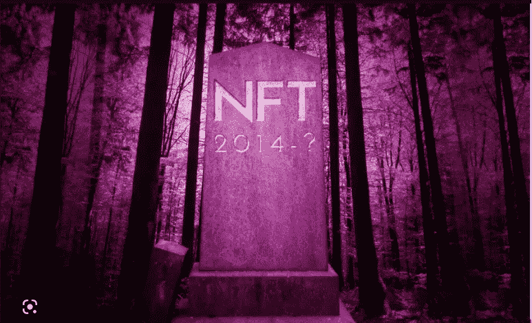

# 这是 NFTs 的终结吗？

> 原文：<https://medium.com/coinmonks/is-this-the-end-for-nfts-3bbbd77128c7?source=collection_archive---------23----------------------->

崩溃的价格、摇摇欲坠的项目和前所未有的损失一直是 2022 年加密领域的标志。加密货币空间已经从 2021 年达到的高点回到了现实。在此之前，只有少数人会认真对待密码传播者的预防性建议。仍然想知道这条建议是什么？正是如此——只投资你愿意在加密上失去的东西。

我们已经到了 2022 年底。我们所能做的就是回顾 2021 年牛市的辉煌高度，同时舔舔我们在 2022 年熊市中遭受的灾难性损失的伤口。

不过，如果你认为如果你投资了加密硬币和代币，你的损失是最小的，你可能会被原谅。NFT 投资者在这次熊市中遭受了最大的打击。统计数据显示，在持续的加密冬天中，多达 97%的 NFT 市场已经消失。

那么，最大的问题是:这是否意味着不可替代代币的终结？

# 九重天上的 NFTs

2021 年，NFT 太空成为人们关注的焦点。像皮普尔和 XCOPY 这样的艺术家引领着唱片销售。没过多久，这个新的数字金矿就获得了发展势头。很快，几个新的收藏出现了，NFT 空间成了类人猿形象的代名词。

没过多久，各大品牌也搭上了 NFT 的列车。如今，几个不同行业的全球品牌已经进军 NFT。这个领域的一些著名品牌包括可口可乐、兰博基尼、耐克和阿迪达斯。在上一轮牛市的巅峰时期， [NFT 空间](https://www.outlookindia.com/business/will-nft-market-rebound-from-a-deep-contraction-here-s-what-experts-say-news-227087#:~:text=The%20Non%2DFungible%20Token%20(NFTs,Analytics%2C%20a%20blockchain%20analytics%20firm.)的估值约为 170 亿美元。

# 2022 年的悲哀

加密冬天始于 2022 年 4 月，并将持续到今年年底。早期迹象表明，熊市将持续到 2023 年。尽管三箭资本(Three Arrows Capital)、Celsius 和 FTX 等大型加密项目崩溃的消息已经成为熊市的缩影，但对 NFT 空间来说，这完全是可怕的一年。

一份[报告](https://nairametrics.com/2022/07/22/nft-trading-volume-slumps-by-64-in-q2-2022/)显示，2022 年第一季度和第二季度之间，NFT 交易量暴跌超过 60%。数据显示，NFT 交易量从 Q1 2022 年的 330 亿美元下降到 Q2 2022 年的略高于 10 亿美元。这个数字在 2022 年第三季度下降到[5.37 亿](https://nonfungible.com/news/corporate/nft-market-report-q3-2022)。这意味着 NFT 交易量又下降了 60%。

就 [NFT 销量](https://www.reuters.com/technology/nft-sales-plunge-q3-down-by-60-q2-2022-10-03/)而言，目前为止已经出现了大幅下滑。销售额从 2022 年 Q1 的 125 亿美元下降到 2022 年第三季度 Q2 的 84 亿美元和 34 亿美元。

# 这是 NFTs 的终结吗？

你可能会忍不住说，对 NFT 的狂热已经走到了尽头。然而，对顶级品牌采用率的敏锐观察很容易改变你的想法。

不久前，来自 Dune Analytics 的一份[报告](https://cointelegraph.com/news/iconic-brands-including-nike-gucci-have-made-260m-off-nft-sales)流传开来。这份报告显示了在 NFT 销量最高的品牌。其中包括耐克、蒂芙尼、古驰、百威啤酒和 D & G 等品牌。这些品牌在 NFT 的总销售额约为 2.8 亿美元。

这份报告有趣的部分不是上榜的顶级品牌的数量。重点在于这些顶级品牌所代表的行业的多样性。值得注意的是，该报告涵盖的行业横跨时尚、消费品、媒体和奢侈品。

这里的重点是更多的品牌开始采用非功能性营销，这可能是非功能性营销复兴的基础。业务采用才刚刚开始。NFT 成为日常生活的一部分只是时间问题。

NFT 的应用已经开始在医疗、供应链、电子商务、娱乐和房地产等领域出现。在证明所有权和真实性的同时表现独特的物理项目的能力使得 NFTs 很容易吸引人。断定持续的熊市将标志着非金融交易的终结，这将是一种谬误。

# 结论

目前的加密市场形势还没有结束的迹象。这也意味着 NFT 空间的困境将暂时存在。尽管如此，有一件事是肯定的——非正规金融机构将会继续存在。他们独特的属性将为他们在下一轮加密牛市中的出现奠定基础。

> 交易新手？尝试[加密交易机器人](/coinmonks/crypto-trading-bot-c2ffce8acb2a)或[复制交易](/coinmonks/top-10-crypto-copy-trading-platforms-for-beginners-d0c37c7d698c)