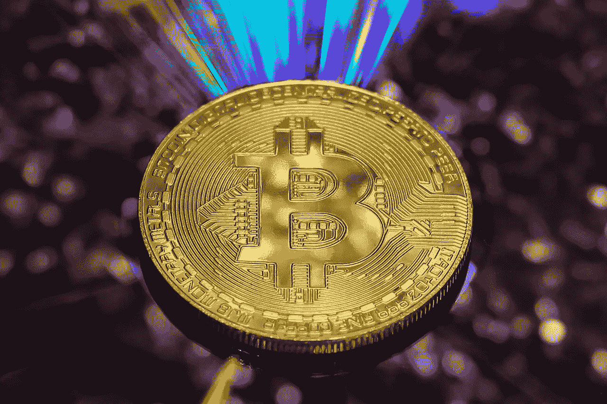

# 这是加密熊市的终结吗？

> 原文：<https://medium.com/coinmonks/is-this-the-end-of-the-crypto-bear-market-8419dc7d21e6?source=collection_archive---------23----------------------->

## 英国新首相 Rishi Sunak 能拯救比特币和加密货币吗？

Bitcoin Image, Courtesy of [Eivind Pedersen](https://pixabay.com/photos/currency-money-wealth-finance-3341499/) (Pixabay)

itcoin 已经两次被鼓吹高估、市场泡沫和通货膨胀的*熊市叙事*从 6 万美元的区间打压下来。现在，以 20，000 美元以上的价格交易，领先的加密令牌终于*冷落了*看跌情绪，并上涨对…