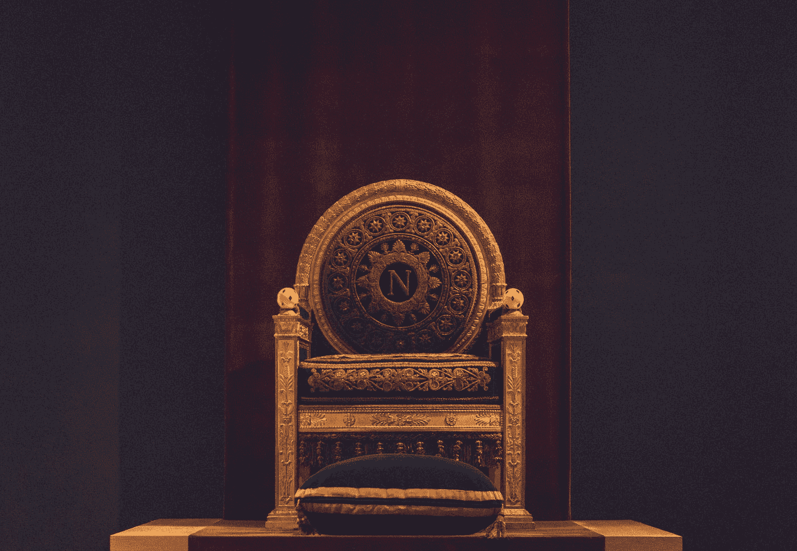

# 这是密码的结尾吗

> 原文：<https://medium.com/coinmonks/is-this-the-end-of-the-crypto-fa9f3ef2ece4?source=collection_archive---------22----------------------->

Photo by [William Krause](https://unsplash.com/@williamk?utm_source=medium&utm_medium=referral) on [Unsplash](https://unsplash.com?utm_source=medium&utm_medium=referral)

区块链已经存在。这只是一个时间的问题，以及什么类型的收养将会发生。然而，对于整个行业来说，这可能是近年来最重要的数字化转型事件之一。今年见证了第一个主要加密货币市值的推出，在 2021 年期间，投资者总共筹集了超过 1 万亿美元。那么我们的立场是什么？我们需要…