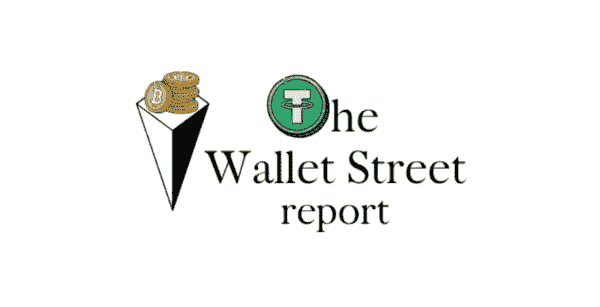
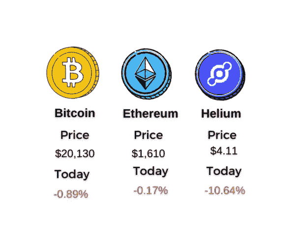
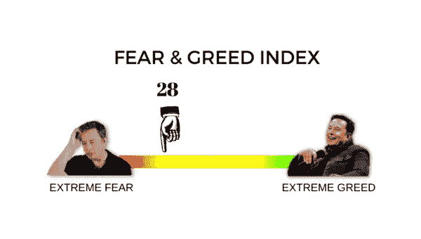
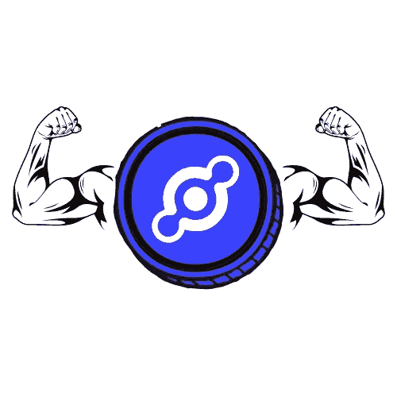

# 钱包街报道#1:周四的加密骗局

> 原文：<https://medium.com/coinmonks/is-this-the-start-of-the-new-internet-ba5d7a0575ee?source=collection_archive---------3----------------------->

*大家好，*

*这是一个新项目，我和其他一些人已经做了几个星期了。我们将推出钱包街报告，这是一份加密简讯，我们将每周发送几次。我们还计划在社交媒体平台上创建大量原创加密内容，尤其是 Instagram 和 Twitter。特别是在 Twitter 上，我们将每晚分享顶级加密推文的汇编，以便您可以在不到 2 分钟的时间内获得绝对最佳的 CT。你可以在下面的最佳加密 Twitter 部分找到我们的页面。*

*这个新项目一点也不妨碍＄1k 到 10k 挑战赛，因为我们的每周更新将于周日发布。我已经得到了关于我的立场的消息(剧透警告:转储 f- me)，但很快会有更多的消息(如果你那么不耐烦，请查看* [*此处*](https://twitter.com/WolfOfWalletSt) *)*

享受你的阅读，让我知道你对这个项目的看法！

Disclaimer: We don’t actually like Tether. It just looked cool on the logo.

嘿大家好！欢迎来到钱包街。这是钱包街报告的首次官方发布，所以如果你正在读这篇文章，恭喜你。你可以称自己为 OGs 中的 OG。让我们开始吧。

Prices from September 15th

## 今天是你们的合并日！

在写这篇文章的时候，我们离密码史上最大的事件只有不到两个小时了。当你读到这里的时候，它可能已经完成了。以太坊正在完成从工作证明到利益证明的转变，并将能耗降低了 98%以上。不再挖矿，不再 bs 环保论调反对世界上最流行的链(我说的是链，不是币，冷静比特币 Maxis)。这也为未来的升级奠定了基础，使以太坊能够显著改善其性能，提高交易速度和降低汽油费。还没有。今天的更新除了改变 ETH 的令牌组学之外，不会对网络用户产生太大影响:

*   预计年发射量将下降 10 倍(象征性年通货膨胀率下降 10 倍)
*   一个新的 ETH 协议(EIP-1159)将被实施，这将为网络上的每个交易消耗一部分交易费用，从而导致更多的通货紧缩
*   没有更多的矿工，这意味着更少的抛售压力，因为矿工们一拿到奖金就卖掉很大一部分(以弥补能源成本)。取而代之的是，网络将由验证者来保护，验证者以他们的 ETH 为赌注，没有出售的动机
*   占所有以太网约 10%的股份(目前价格约 250 亿美元)将被锁定(不能出售或交易)至少 6 个月

所有这些通缩因素，加上机构需求的增加(因为 ETH 现在是环保的)，**应该会**推高 ETH 的价格。当然，宏观经济状况非常不确定，只要市场继续看跌，就不要期待任何疯狂的反弹。

并不是每个人都对升级感到满意。一群矿工和战俘决定脱离这个网络，创建另一个连锁店 ETH-PoW。新连锁店将向所有 ETH 持有者空投 ETHP 令牌，并使用工作证明继续运营。

大多数建立在以太坊上的项目都声明不支持 fork，所以 ETH-PoW 不太可能有任何重要的用途。尽管如此，空投看起来很诱人，人们疯狂地接受 ETH 贷款，以获得更多的免费 ETHP。但是不要太兴奋。预计 ETHP 的价值仅为 ETH 的一小部分，如此之小，以至于大多数退化者可能会赔钱，因为贷款利息的成本将超过 ETHP 的利润。

## **其他新闻**

*   **在获得“欺诈交易”的证据后，权道在韩国被捕。**

露娜甩和露娜经典甩。很难说这是因为逮捕或因为他们是不值钱的狗屎硬币(对不起疯子这是真的)。

*   NFT 收藏涂鸦以 7.04 亿美元的估值获得 5400 万美元的融资。

他们有一个很好的社区，他们有一个很好的团队，他们有很好的，独特的艺术。总的来说，他们是一个很好的项目。他们的 7.04 亿美元有用吗？地狱没有，如果你问我。我喜欢 NFT 等，但我认为这些估值越来越荒谬。一个除了出售 JPEGs 图片集之外什么也没做的项目价值 7.04 亿美元？祝贺 tho 团队。让我们希望他们用所有这些钱来建设一些好东西。

*   **HIP-70 获得批准，氦网络将迁移至 Solana**

氦是一个非常有趣的项目，但他们迄今为止取得的成功有限。Solana 迁移预计将有助于氦生态系统的开发和提高可扩展性。他们的愿景很大，但他们必须做很多工作才能实现。让我们看看这步棋会怎么走。

## **3 分钟项目分析:氦气**

我知道你们中的一些人读了上面的故事，心里想:“但是等等！WTF 是氦气？?"

别担心，我掩护你。在今天的 1 分钟项目分析中，我们将深入了解氦。

**目标:**

分散互联网基础设施。

**工作原理:**

一方面，你有互联网提供商。任何人都可以通过购买和设置一个类似路由器的设备来连接到氦网络的其余部分，从而成为互联网提供商。这些设备像 wi-fi 热点一样工作，它们相互连接并提供全球互联网覆盖。这就像是威瑞森(或沃达丰，或美国电话电报公司，或任何你有服务)的无线网络的人民自有版本。起初，互联网连接很慢，主要用于物联网，但经过最近的升级，它支持 5G 连接。

另一方面，有些人想上网。任何人都可以通过氦网络接入互联网，他们用氦的本地令牌支付服务费用。这些代币在互联网提供商个人之间分发，以创造一个双赢的局面。这允许全球互联网连接(只要有人设置热点)并开启新的可能性，如微交易。例如，想象一下，支付几美分就可以获得足够的互联网宽带来播放视频或发送电子邮件。

没有哪家大公司控制着你的互联网接入，有权增加成本或实施审查。网络为民所有，为民所用。

**问题:**

*   HNT 价格的波动使得成本无法预测。当价格太低时，互联网提供商(矿工)的收入不足以支付最初购买的成本，或者他们的收入太少，不值得关心维护。利润有时很低，人们甚至懒得设置热点
*   $HNT 令牌是在自己的区块链上，与其他协议几乎没有互操作性。这意味着它缺少像 DeFi，NFTs 等可以帮助生态系统增长的东西。预计在索拉纳迁移后，这种情况会有所改变
*   由于上述原因，一些地方没有足够的热点来提供互联网覆盖

## **最佳加密推特**

CT 是加密信息的金矿，但是我们知道你没有时间去挖掘(以太坊 lol 也没有)。这就是为什么每天，我们无休止地浏览无用的热门话题、垃圾机器人、垃圾评论和无价值的帖子，为您带来 Twitter 提供的最佳内容加密。这是我们今天为你准备的:

## 今日迷因

今天到此为止！合并日快乐，很快再见！

如果您喜欢这份时事通讯，请在此订阅(免费):

 [## 钱包街报道

### 嘿大家好！欢迎来到钱包街。这是钱包街报告的首次官方发布，所以如果你…

www.getrevue.co](https://www.getrevue.co/profile/walletstreet) 

**钱包街举报推特** [**此处**](https://twitter.com/walletstreetct)

免责声明:这不是财务建议。本简讯仅供娱乐，并非买卖任何资产或做出任何财务决策的投资建议。自己做研究。

> 交易新手？试试[密码交易机器人](/coinmonks/crypto-trading-bot-c2ffce8acb2a)或者[复制交易](/coinmonks/top-10-crypto-copy-trading-platforms-for-beginners-d0c37c7d698c)