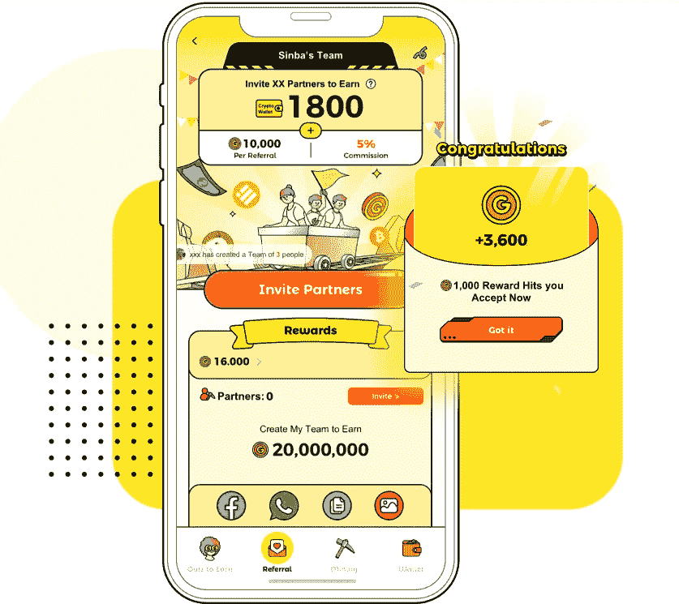
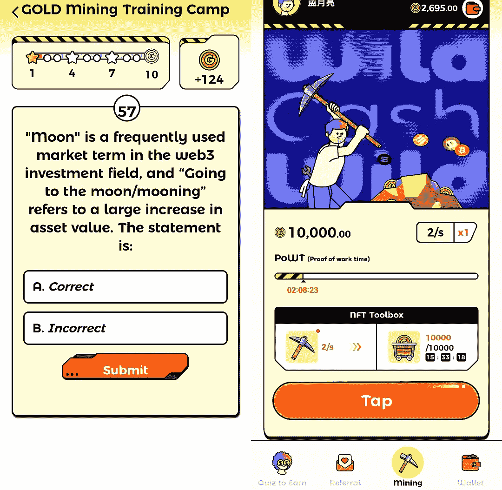
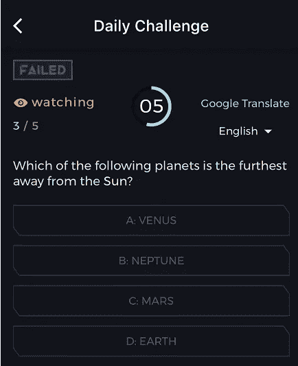
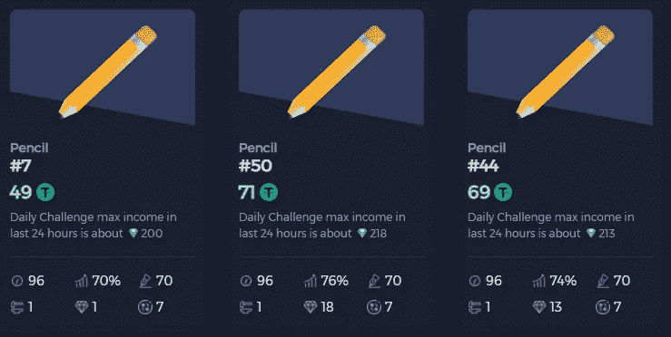
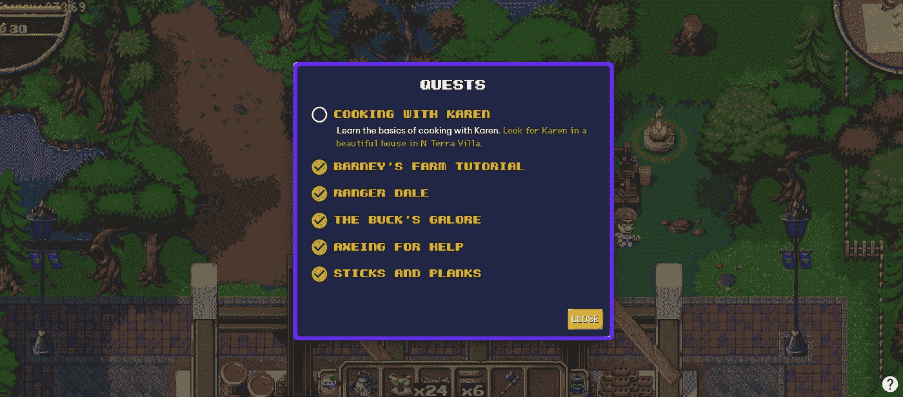
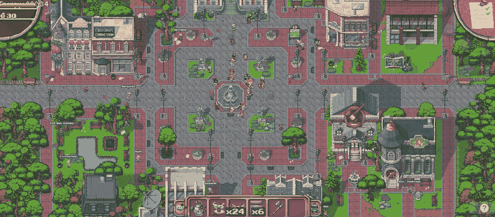

# 这款 web3 游戏百搭现金又流行了吗？

> 原文：<https://medium.com/coinmonks/is-this-web3-game-wild-cash-popular-again-4526db316eef?source=collection_archive---------7----------------------->

币安宣布 HOOK 即将上线，HOOK 背后的项目 Wild Cash 一下子引起了关注。

百搭现金是一款 web3 问答游戏。问题围绕 web3 知识点。玩家一边答题一边学习 web3 知识，并获得金币作为奖励。

同时还可以在游戏中挖矿，挖出来的金币可以用来升级工具和质押；你也可以看广告来收集奖励，和游戏 PVE 等。

Wild Cash mining game

狂野现金游戏已经在东南亚推出了一段时间，为期两天的 Launchpad 活动带来了一些热情。

但是游戏的收入比较低，80 万金币可以换 0.5 刀，有的玩家折算下来，就算扣除手续费也不够一顿鸡腿。

但从 web3 关键词科普的角度来看，可能也是一个参与点。感兴趣的玩家可以私信获取游戏玩法策略。

Wild Cash game page

还有一个 web3 知识变现项目，Quiz3，也卖完了。玩家还可以在游戏中答题赚钱，储备的知识派上了用场。

Quiz3 的问题涉及天文地理、web3、生活常识、世界地理等。是一个生活百科的互动问题。

玩家可以免费参与每天一次答题，也可以购买游戏 NFT，多次答题，答对获得钻石奖励，钻石可以兑换收入。

Quiz3 interactive questions are getting harder

铅笔 NFT 首次公开销售的价格是 89 美元。在第一天的第一天，初晓连锁店收到了 300 颗钻石，约合 3 美元。铅笔 NFT 的使用周期是 100 天，用的天数越多，回报率会持续下降。

目前最快的回收期是 32 天，但很可能会越来越长，还要看游戏能否持续健康发展。

目前，有人在市场上列出了 67 美元的铅笔 NFT，白名单铸造仍然是 69 美元，还有一个 2500 美元的水晶笔。

Quiz3 的定位是用知识赚钱。如果玩家能变现知识，自然会留下来；

Quiz3 game NFT

我还关注了一款 web3 游戏，据说是像素农场，Opensea 投资的像素农场。相比之前玩的 QQ 农场，这次的 web3 农场又回到了像素版。

游戏全是英文，你要用英文和游戏角色交流。对中国玩家来说确实很难，但是学习过程充满乐趣。

像素农场土地 NFT 之前已经在 Opensea 上线，目前楼面价为 0.4ETH

农场的玩法主要是关于种植的。玩家种植作物，制造工具，完成任务等。在游戏中，并在探索的过程中找到乐趣。

Pixel Farm NFT

楚小莲在像素游戏里玩了一整天，终于有所发现。

从最开始在农场种庄稼，到砍树做工具，到跑腿传递信息，再到学习烹饪等一系列任务，我收获了 30 个浆果奖励，目前还不知道浆果是否可以在交易所交易。

游戏场景看起来像一个有许多建筑的城镇，如市政厅、银行、农场等。不同的地方有不同的功能。如交换、交易、生产等。，像迷宫一样。

游戏比较耗时间，是一种修炼，有各种小任务，而且是持续性的。

In-game quest guidance

虽然这个游戏可以通过第一次快照，但是如果你现在在游戏中足够活跃，花时间探索游戏场景，也可能算是一个活跃账号，后面可能会有空投奖励。

Pixel Farm Game Page

目前有各种各样的 web3 项目。不知道哪个能坚持更久。更多的是探索和体验。收益相对较低，投资甚至可能归零。

如果换个角度想，探索和学习是主要重点，空投是附加的红利，那么 web3 的玩法就充满了乐趣。

熊市流动性差，多找项目，不要投入太多资金，投入学习时间，可能是最大的收获，某个时候可能会有意想不到的喜悦。

以上只是我个人观点，没有投资建议。我是楚小莲，我正在关注元宇宙和 web3。​​​

> 交易新手？试试[加密交易机器人](/coinmonks/crypto-trading-bot-c2ffce8acb2a)或者[复制交易](/coinmonks/top-10-crypto-copy-trading-platforms-for-beginners-d0c37c7d698c)