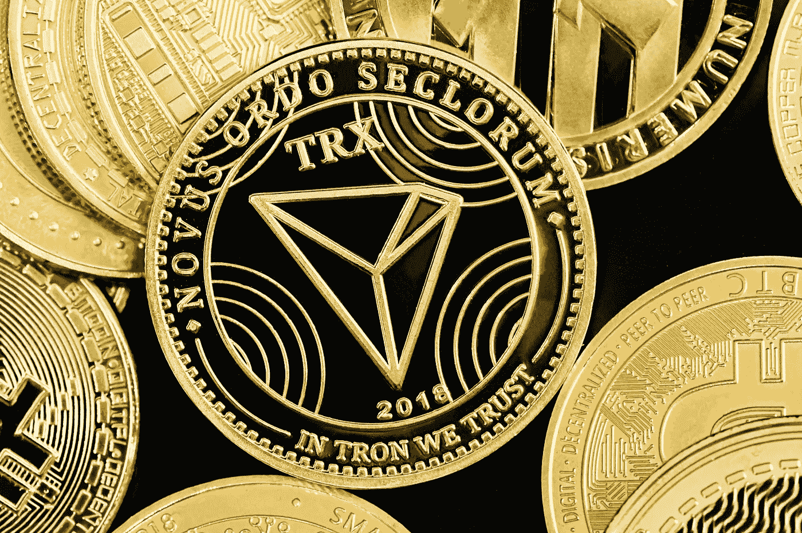

# 2022 年 12 月创(TRX)是个好买卖吗？

> 原文：<https://medium.com/coinmonks/is-tron-trx-a-good-investment-cf9d475c813b?source=collection_archive---------29----------------------->

Source photo [Free Money Image on Unsplash](https://unsplash.com/photos/nKjTPPwEAsE)

尽管按锁定的总价值计算，TRX 是交易量第二大的加密货币(仅次于以太坊)，但在 2022 年全年，其价值份额保持在令人满意的水平，交易价格略高于 5 美分。创在媒体中保持其突出地位。以太坊的第一层替代品已经与各国政府建立了合作伙伴关系，探索使用自己的稳定币，并推动其发明者 Justin Sun 进入…