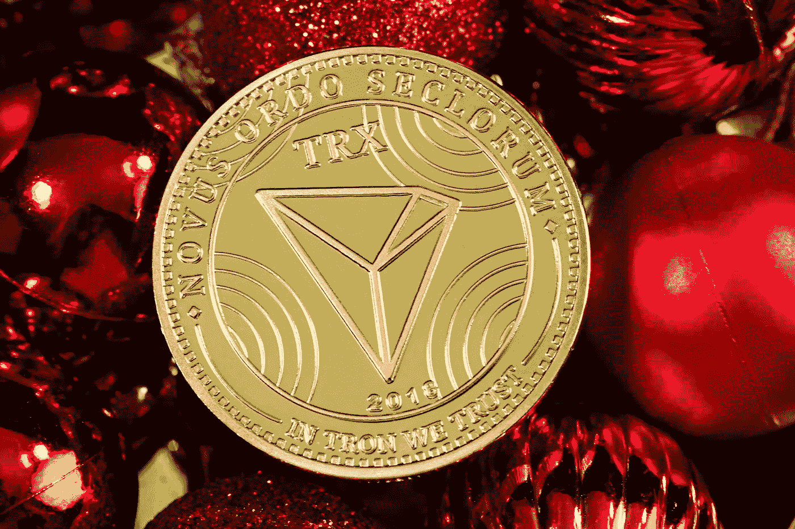

# 2022 年 12 月创(TRX)是个好投资吗？

> 原文：<https://medium.com/coinmonks/is-tron-trx-a-good-investment-in-december-2022-3a3f93e2697b?source=collection_archive---------24----------------------->

Source photo [Free Coin Image on Unsplash](https://unsplash.com/photos/IGueDU9pi4w)

诚然，创(密码:TRX)没有像它的一些竞争对手一样的闪光灯，但这不一定是一件坏事。2022 年，它已经比绝大多数其他投资更好地保值了。与比特币和以太坊的下跌相比，更不用说雪崩和索拉纳等其他更受关注的加密货币 90%的下跌，今年迄今 28%的跌幅是…