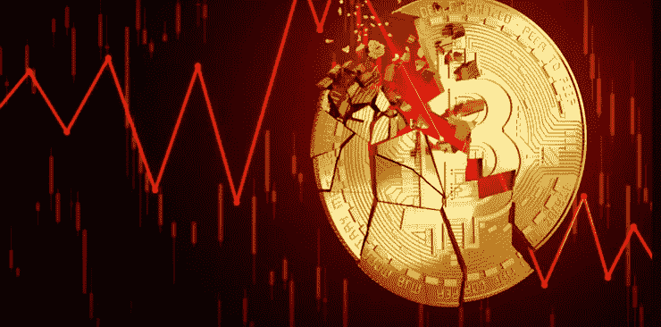

# 无抵押贷款 crypto 的下一步是什么？

> 原文：<https://medium.com/coinmonks/is-uncollateralized-lending-cryptos-next-leg-down-baf184c665f9?source=collection_archive---------2----------------------->

如果您还没有注册，请使用此[链接](https://theguywhowrites.medium.com/membership)注册 Medium。

像 Aave 这样创造流动性、增加购买力等的贷款协议是 DeFi 最有力的方面之一。

第一代贷款协议的问题是，你必须提供抵押品来借款，这在资本方面效率低下。用户将…