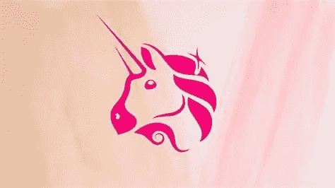

# Uniswap 是一个好的投资吗？

> 原文：<https://medium.com/coinmonks/is-uniswap-a-good-investment-c2bc12cc7630?source=collection_archive---------24----------------------->

Source photo [uniswap — Bing images](https://www.bing.com/images/search?view=detailV2&ccid=tQVzzIX%2f&id=DD37048CEACEDE56900B67FBC5CDE8E8112F17F2&thid=OIP.tQVzzIX_tdD0iy3IXxscYAHaEK&mediaurl=https%3a%2f%2fcoincodex.com%2fen%2fresources%2fimages%2fadmin%2fnews%2fhow-to-claim-free-un%2funiswap-v2-launch.jpg%3aresizeboxcropjpg%3f1580x888&cdnurl=https%3a%2f%2fth.bing.com%2fth%2fid%2fR.b50573cc85ffb5d0f48b2dc85f1b1c60%3frik%3d8hcvEejozcX7Zw%26pid%3dImgRaw%26r%3d0&exph=888&expw=1580&q=uniswap&simid=608028955612707303&FORM=IRPRST&ck=DD718A2E96BEB9B964D4D0CC41D796AD&selectedIndex=0&ajaxhist=0&ajaxserp=0)

Uniswap 是世界上最大的分布式交换系统。它利用了投资者对加密匿名的需求，这一趋势预计将继续推动人们进入像 DEX 这样的匿名交易平台。随着越来越多的人参与进来，对统一代币的需求也在上升，这就提高了它们的价格。

Uniswap 是 2022 年最值得投资的公用事业令牌之一