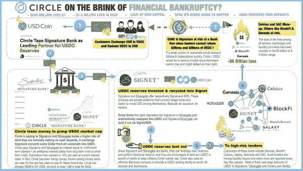
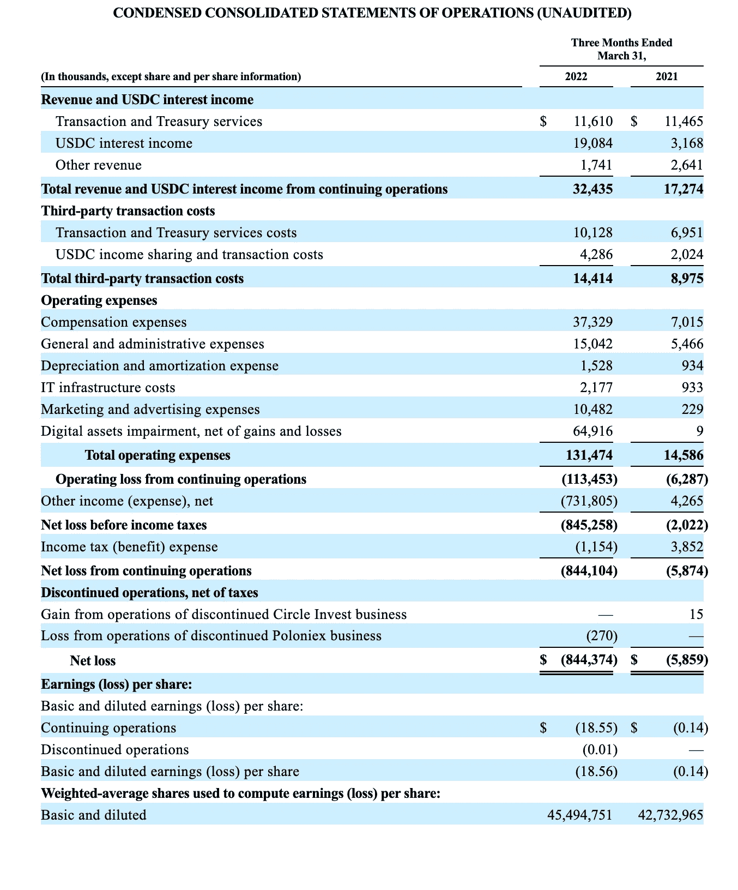

# USDC 有麻烦了吗？不是很明显。

> 原文：<https://medium.com/coinmonks/is-usdc-in-trouble-not-obviously-so-fa71a21b22f5?source=collection_archive---------34----------------------->

# 总结:

*   关于圈崩溃的指控
*   Circle 会借出自己的储备吗？(否)
*   Circle 的储备是否被间接借出？
*   Circle 是否向 Silvergate/Signature 支付 5%的押金？(几乎可以肯定不是)
*   对 Circle USDC 的总体评估

# **关于圈塌的指控**

@CoinInsider 最近在 Twitter 帖子中对 USDC 提出了一些强烈的指控:

[杰洛特·戴维森@CryptoInsider23](https://twitter.com/CryptoInsider23/status/1542027718677504002?s=20&t=Zm7EvQNvlBnCCpMFeu_iIw)

【2022 年 6 月 29 日

[1257 条转发 3848 个赞](https://twitter.com/CryptoInsider23/status/1542027718677504002?s=20&t=Zm7EvQNvlBnCCpMFeu_iIw)

提出的核心指控是:

1.  这种循环间接地以高风险的方式出借外汇储备，就像 Celsius 所做的那样。
2.  这个圈子目前向 USDC 的银行支付约 5%的利息。

这两项指控对我来说似乎都不可信，但它们确实在我脑海中提出了一些新的问题。

感谢阅读 Hype or Hodl！免费订阅接收新帖，支持我的工作。

> 交易新手？尝试[加密交易机器人](/coinmonks/crypto-trading-bot-c2ffce8acb2a)或[复制交易](/coinmonks/top-10-crypto-copy-trading-platforms-for-beginners-d0c37c7d698c)

# **Circle 有没有出借储备？(否)**

Circle 分享了审计公司 Grant Thornton 的月度证明，其中显示了支持 USDC 的储备的数量和类型。[5 月报告](https://www.centre.io/hubfs/PDF/2022%20Circle%20Examination%20Report%20May%202022.pdf?hsLang=en)显示，储备至少与未偿 USDC 一样多，储备要么是现金，要么是短期美国国债。

Circle 首次披露了其详细持股的[(未经审计)摘要](https://6778953.fs1.hubspotusercontent-na1.net/hubfs/6778953/USDC%20Reserves%20Reports/USDC%20Reserve%20Breakdown_June.pdf)，显示约四分之三是美国国债，其余是美国各银行的现金。持有的平均到期日为 43.9 天。

Circle 将大量投资于美国国债是有道理的，因为它们是有息的，并为 Circle 带来收入。当然，现金不会产生任何收益。作为一个技术说明，短期国债非常像现金。事实上，我知道在某些情况下，人们可以用美国国债向美国纳税。

因此，如果你相信审计报告，Circle 并没有直接借出其储备。

# Circle 的储备是否被间接借出？

外汇储备是否有可能以某种方式被间接借出？

Circle 储备的现金部分由多家银行持有，这些银行并未明确说明，但 Circle 称包括了[贝莱德和 BNY 梅隆](https://www.circle.com/en/usdc#transparency)。查看美国证券交易委员会的文件，可以看到与 Silvergate 和 Signature Banks 有合作关系，但不清楚现金储备的哪一部分(如果有的话)存在这两家银行。我猜要么没有，要么只有少量，但我不知道。

任何持有 Circle 储备现金部分的银行都可以，而且我认为确实会，贷出这些资金。这就是受监管的银行所做的，他们贷出存款并持有部分准备金。这与如果我的非加密业务向一家美国银行存入 100 万美元，银行会将这些资金用于放贷没有任何区别。当然，借出的将是法定美元，而不是 USDC。

这给我们带来了一个问题，即持有 Circle 储备现金部分的银行是否存在遭遇银行挤兑或重大损失的风险。就贝莱德和 BNY 梅隆而言，它们资产负债表上的资产水平远远超过了 Circle 储备的现金部分。我的理解是，这两家银行都没有做太多的加密业务——所以我不认为它们会对失败的加密公司有太多的敞口。就 Signature Bank 和 Silvergate 而言，我的猜测是这些银行对加密业务有更多的敞口(贷款)。然而，尚不清楚 Circle 的现金储备中有多少(如果有的话)存在这些银行。

即使 Signature 和/或 Silvergate 遇到流动性问题*和*有很多 Circle 的现金储备，人们也需要假设美联储会允许美国监管银行的储户受到损失。也许这不是不可能的，但似乎不太可能。

总而言之，我看不到 Circle 的储备被直接或间接用作加密贷款基础的明确方式。

# Circle 是否向 Silvergate/Signature 支付 5%的押金？

@CryptoInsider23 有一个相当疯狂的说法，Circle 正在亏损，因为它要向 Silvergate/Signature 这样的银行支付 5%的利息来持有他们的存款。

不仅根据储备的实际持有情况(主要是美国国债，现金可能主要在贝莱德和 BNY 梅隆)，而且根据 Circle 向 SEC 提交的账户文件，Circle 似乎不太可能向银行支付 5%的储备存款。这大大高于美元存款的市场利率(银行通常不收取存款费用)。让我们来看看 Circle 2022 年第一季度的账目:

[Circle’s accounts from SEC database](https://www.sec.gov/Archives/edgar/data/0001876042/000110465922078873/tm2124445-12_s4a.htm#fCCSO).

从收入部分可以看出，Circle 正从其储备金中赚钱(见“USDC 利息收入”)。不仅如此，其收益分成仅为其利息收入的四分之一左右。

非常粗略地说(不包括收入分成)，Circle 在 2022 年第一季度赚了约 1900 万美元，存款约为[510 亿美元](https://www.centre.io/hubfs/PDF/2022%20Circle%20Examination%20Report%20March%202022.pdf?hsLang=en)。这相当于约 15 个基点的年化利率。Q1 的联邦基金利率为 25 个基点，因此 15 个基点的回报率表明，当时 Circle 超过一半的储备是美国国债。我预计未来几个季度利息收入将大幅增加。例如，在 250 个基点的利率下，Circle 可能每季度获得 1 . 5 亿美元的收入(以 75%的国债-现金储备分割)。这是为什么加息对金融企业有利的经典故事。

再往下看经营报表，就有更多值得关注的地方:

*   数字资产减值损失 6400 万美元，这似乎与 Circle Yield 项目中借款人清算导致的抵押品损失有关。我预计这个数字在第二季度会变得更糟。这个项目中似乎有大约 2 亿美元的未偿贷款，所以这可能为可能的损失提供了某种限制。但这可能是错误的，因为 2 亿美元的总额使得 Q1 6400 万美元的减值(一个季度没那么糟糕)作为一个百分比看起来很糟糕。似乎有许多衍生合约混杂在[证券交易委员会的文件](https://www.sec.gov/Archives/edgar/data/0001876042/000110465922078873/tm2124445-12_s4a.htm#fCCSO)中，让人很难理解风险敞口。
*   有一个巨大的“其他收入(支出)，净”行项目造成了 7.31 亿美元的损失。深究一下，这似乎与将可转换债券转换为股票有关——对公司来说成本很高。看起来大部分可转换债券已经转换，所以这可能是一次性的。也就是说，在 2022 年第二季度，该公司可能面临现金压力，需要寻找其他方式筹集现金。

总之，Circle 肯定不会为其所有储备支付 Silvergate/Signature 5%的利息。Circle 似乎从其储备存款中获得了毛利，而不是成本。事实上，随着利率的上升，Circles 储备似乎是收入增长的一个来源。该业务的风险似乎来自 Circle 的收益计划，也来自难以理解的衍生产品组合，以及从短期现金需求到利率风险。

事实上，Circle 可能不会为任何东西支付 Silvergate/Signature 5%的费用。@CryptoInsider23 似乎误解了 Circle 的商业模式以及银行存款的运作方式。

# 对 Circle USDC 的总体评估

我对 Circle 的 USDC 有以下担忧:

1.  [Circle 最近才决定将储备金限制为现金和短期国债](https://www.circle.com/blog/evolving-usdc-reserves-to-100-cash-and-short-duration-us-treasuries)。在此之前，Circle 在储备中还有其他资产，这让我质疑 Circle 之前为什么认为那是安全的。
2.  Circle 关于被监管的说法是正确的，但具有误导性。据我所知，Circle 是作为一个货币传递者来监管的。然而，USDC 并没有规定准备金的构成，政府机构也不会对 USDC 进行审计。这与纽约州金融服务局所认为的 USDP 或 BUSD 等受监管的稳定货币有着明显的区别。
3.  即使 Circle 的储备在破产的情况下会被隔离，但作为一家公司，Circle 的财务健康对于 USDC 的可持续发展显然是非常重要的。Circle 的财务报表显示，该公司仍然依赖融资(债务或股权)，根据市场情况，融资可能会变得更加昂贵。也许上升的利率会提供一个救星，但是 Circle 的商业健康并非没有风险。

有利的一面是:

1.  Circle 已经转向为 USDC 提供纯现金+国债支持。
2.  Circle 通过分享其具体持股的细节变得更加透明。
3.  利率(以及 Circle 的利息收入)在上升。

这是这一块乡亲，请评论下面，如果有错误，以纠正以上。

感谢阅读 Hype or Hodl！免费订阅接收新帖，支持我的工作。

> 加入 Coinmonks [电报频道](https://t.me/coincodecap)和 [Youtube 频道](https://www.youtube.com/c/coinmonks/videos)了解加密交易和投资

# 另外，阅读

*   [如何在 Uniswap 上交换加密？](https://coincodecap.com/swap-crypto-on-uniswap) | [A-Ads 评论](https://coincodecap.com/a-ads-review)
*   [加密货币储蓄账户](/coinmonks/cryptocurrency-savings-accounts-be3bc0feffbf) | [YoBit 审核](/coinmonks/yobit-review-175464162c62)
*   [Botsfolio vs nap bots vs Mudrex](/coinmonks/botsfolio-vs-napbots-vs-mudrex-c81344970c02)|[gate . io 交流回顾](/coinmonks/gate-io-exchange-review-61bf87b7078f)
*   [CoinFLEX 评论](https://coincodecap.com/coinflex-review) | [AEX 交易所评论](https://coincodecap.com/aex-exchange-review) | [UPbit 评论](https://coincodecap.com/upbit-review)
*   [AscendEx 保证金交易](https://coincodecap.com/ascendex-margin-trading) | [Bitfinex 赌注](https://coincodecap.com/bitfinex-staking) | [bitFlyer 评论](https://coincodecap.com/bitflyer-review)