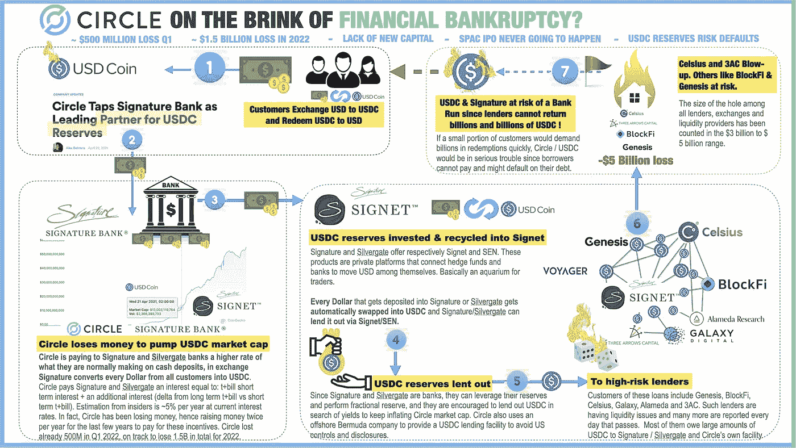

# USDC 正处于崩溃的边缘吗？如果这是真的，会发生什么？

> 原文：<https://medium.com/coinmonks/is-usdc-on-the-brink-of-collapse-and-what-could-happen-if-this-is-true-ebcc2ba4cdf6?source=collection_archive---------0----------------------->

在密码市场经历了艰难的几周后，投资者全天候警惕多米诺骨牌上的下一个倒下的可能是什么。在 Luna、3AC、Babel 和 Celsius 已经不被市场信任之后，BlockFi 和 Voyager 即将成为下一个，但 FTX 等大玩家参与了阻止这种情况发生。

> 交易新手？试试[加密交易机器人](/coinmonks/crypto-trading-bot-c2ffce8acb2a)或者[复制交易](/coinmonks/top-10-crypto-copy-trading-platforms-for-beginners-d0c37c7d698c)

但有一件事可能真的是市场的红色警报，那就是主要稳定债券可能会脱钩，尤其是 USDC，该国被认为是该领域最安全、最可靠的国家之一。上周，[的一条 Twitter 帖子](https://twitter.com/CryptoInsider23/status/1542027718677504002)声称 Circle 的 USDC 可能处于崩溃的边缘，这引起了加密社区的热议。

USDC 是如何工作的？

美元硬币由加密领域最重要的两家公司支持:Circle 和比特币基地，它们在遵守全球监管机构方面投入了大量资金。

对于这种稳定的硬币，如果你用法定货币购买一枚美元硬币，那么这种法定货币就被储存为一美元，一枚新的 USDC 被铸造出来。如果你用法币(美元)卖出 USDC，稳定币会被烧掉，而法币会被转回到你的银行账户。

**破产的传言基于什么？**

@CryptoInsider23 的一条 Twitter 帖子称，Circle 一直在亏损，因为该公司在过去几年里每年融资两次，以支付他们提供的约 5%的激励。

根据 Gerald Davidson(@ cryptoinsider 23)在 Twitter 上的分析，Circle 在 2022 年第一季度已经亏损了 5 亿美元，今年将亏损 15 亿美元。

从理论上讲，USDC 现在被借给了高风险贷款机构，如 Genesis、BlockFi、Celsius、Galaxy、Alameda 和 3AC。如果这份名单是准确的，它包括了我们新闻简报开头提到的那些已经倒闭或即将倒闭的公司。

**Circle 的回应是什么？**

Circle 的首席执行官杰里米·阿莱尔(Jeremy Allaire)迅速回应了 CryptoInsider23 的指控，并声称“ *Circle 处于有史以来最强的财务状况*”，他们将继续增加透明度。

他还在他的帖子上分享了 Circle 的最新报告，如果你想详细了解 stablecoin 的作品，值得一看:

*   [USDC 透明与信任](https://www.circle.com/blog/how-to-be-stable-usdc-transparency-and-trust)；
*   [如何建立信任— USDC 审计和证明](https://www.circle.com/blog/how-to-build-trust-usdc-audits-and-attestations)；
*   [USDC 信托与透明度——流动性问题](https://www.circle.com/blog/usdc-trust-and-transparency-liquidity-matters)。

作为投资者，你应该怎么做？

在看到 UST 持有者发生的事情后，我认为没有人想经历他们的储蓄减少 90%-100%的情况，这些持有者将投资组合中稳定的硬币作为他们的现金配置或“最安全”的持有以避免高波动性。

如果 USDC 崩溃，这将产生重大影响，并带来对整个加密市场的不信任，因此值得关注此事。

尽管 USDC 的思路可能仅仅是 FUD(恐惧、不确定性和怀疑)，但现在最安全的做法是:
-将你的稳定资产换成美元或其他法定货币
-将你的加密资产从借贷平台转移到冷库——比如账本——耐心等待，直到混乱结束。

[*乔·罗伯特*](https://joerobert.com/) *现任罗伯特风险投资公司首席执行官，拥有超过 20 年的资产管理经验。自创办以来，乔已经为投资者和合伙人创造了可预见的两位数回报。Joe 已经投资了股权和代币的种子轮，以及比特币、以太坊和其他顶级加密货币的投资组合。*

*如果您是合格投资者，并想了解更多关于我们产品的信息，请联系我们。*