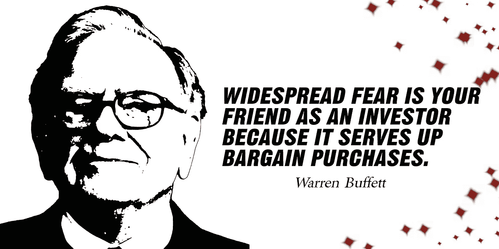

# 沃伦·巴菲特是有史以来最伟大的投资者吗？

> 原文：<https://medium.com/coinmonks/is-warren-buffett-the-greatest-investors-of-all-time-4e1a77c36de0?source=collection_archive---------45----------------------->

Source photo [Warren Buffett Bogat Bani — Imagine gratuită pe Pixabay](https://pixabay.com/ro/illustrations/warren-buffett-bogat-bani-miliardar-5000311/)

人们普遍认为沃伦·巴菲特是有史以来最好的投资者之一。他目前的职位是伯克希尔·哈撒韦公司的首席执行官兼董事长，这是一家总部位于内布拉斯加州奥马哈的全球联合控股公司。沃伦·巴菲特以其价值投资策略而闻名，即购买低价股票并长期持有。