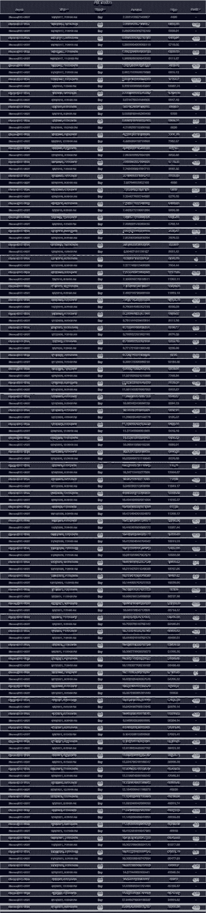

# 我的目标是在 5 年的交易中赚 100 万美元，但结果是 129 万美元。

> 原文：<https://medium.com/coinmonks/it-was-my-goal-to-earn-a-million-dollars-in-profit-within-five-years-of-trading-but-the-results-af0448076c92?source=collection_archive---------12----------------------->

*“在过去的两年里，人们尝试了许多策略来从加密货币市场获利，但这一策略最终胜出。在 Tradingview 等任何图表程序中，你都可以看到同样的结果。”*

我想开发一种交易策略，在五年内只用两万美元的投资就能产生超过一百万美元的利润。通过这篇文章，您将了解我是如何做到这一点的，您也可以做到这一点。

该战略仅由几个简单的指标组成，这些指标相互关联，构成一个完美的战略。任何 app，比如 Treadingview，都能产生同样的结果。

**证明**

尽管我们对未来一无所知，但我们对过去却了如指掌，如果在过去五年里某件事奏效了，那么它很可能在未来也会奏效。

我们在 2017 年 8 月至 2022 年 11 月期间对以下交易者进行了回溯测试。

这是图表的一部分:

凭借五年期内稳健的交易策略和初始投资的复利，数百万美元的利润指日可待。

# 这是购买信号的公式

1.  如果日线 RSI 大于 RSI 的移动平均线，我们处于上升趋势。
2.  4 小时蜡烛线中的均线 60 应该大于均线 120，均线 120 应该大于均线 300
3.  4 小时蜡烛线的收盘价应该高于所有这些均线
4.  超级趋势应该从低点开始计算，ATR 乘数应该设置为 1

# 主要的销售信号是

1.  只要我们高于 HMA 300 点的 4 小时蜡烛线，我们就不会卖出。
2.  为了销售，我们必须至少有 3%的利润
3.  高点应该作为超级趋势的来源，1 应该作为 ATR 的乘数

# **熊市中的第二个卖出信号**

1.  4 小时蜡烛线低于 300 均线
2.  除了设置 3 为 ATR 乘数，我们还需要提供高点作为超级趋势的来源

牛市的时候亏损 2.8%以上，熊市的时候亏损 1%以上，至少要止损。

这是我们为之努力了一年的这个迷人场景的全貌。你可以编写自己的代码或者使用[SmartStopSet.com](https://smartstopset.com)来达到同样的效果。这只是我们可以使用的众多场景之一！

**这一战略还有改进的空间**

你可以复制这种策略并加以改进，或者改变时间框架，因为它是开源的。

当你在 SmartStopSet.com 注册的时候获得 100 信用点。

> 交易新手？试试[加密交易机器人](/coinmonks/crypto-trading-bot-c2ffce8acb2a)或者[复制交易](/coinmonks/top-10-crypto-copy-trading-platforms-for-beginners-d0c37c7d698c)