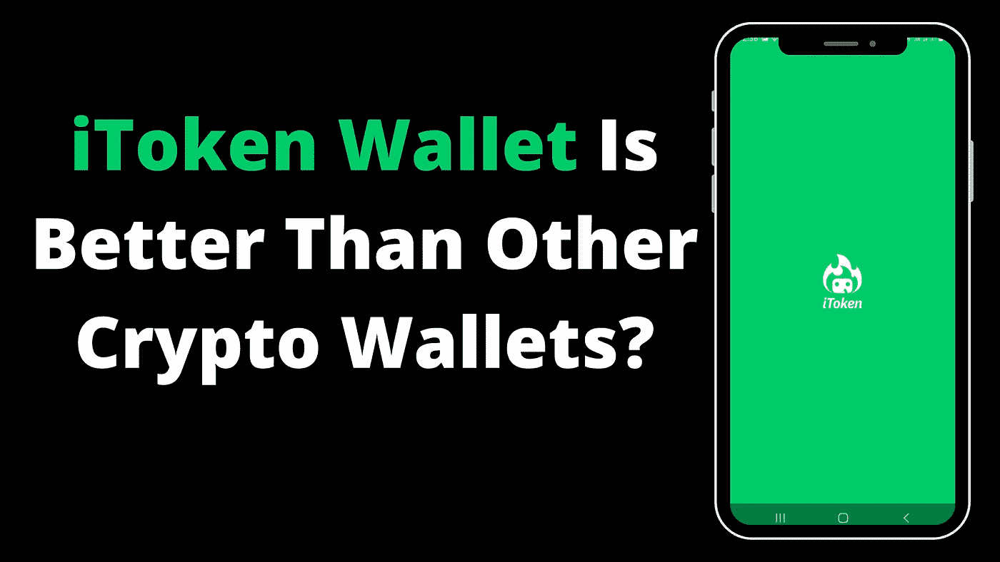
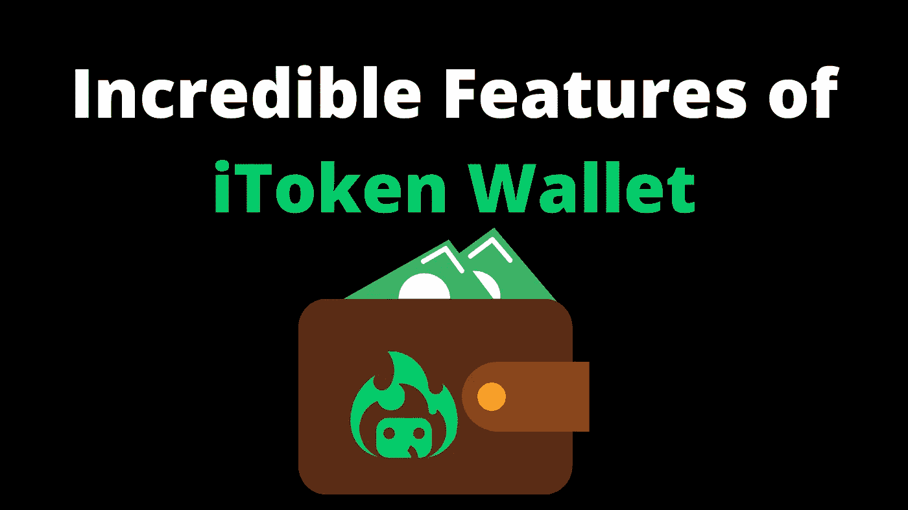
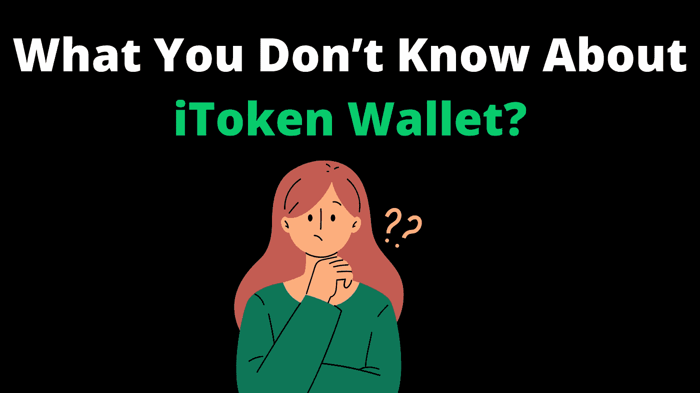

# iToken 钱包比其他加密钱包好？

> 原文：<https://medium.com/coinmonks/itoken-wallet-is-better-than-other-crypto-wallets-aae14f9a0285?source=collection_archive---------13----------------------->

最近偶然发现 iToken 钱包，发现的东西很牛逼。郑重声明，我用过不少加密钱包。目前，热门钱包的一个重要特征是它允许用户毫无问题地与 Web 3.0 交互的能力。

此外，当我在 iToken 博客上读到他们现在支持 ETHW chain 时，我很惊讶。在我看来，那是超快的！

我曾有过这样的经历:在支付了一定金额之前，钱包服务提供商不会支持区块链。这些人还没有准备好接受一个去中心化的网络。

iToken wallet 由 Huobi Global 提供支持，他们已经转变为钱包服务提供商中的一支重要力量。

在任何区块链上创建钱包都是一个简单的步骤；

1.  从 app store 下载应用程序
2.  创建一个带密码的帐户
3.  开始创建你选择的加密钱包(BTC，瑞士联邦理工学院，多边形，HECO，等等)。)

为什么现在不试试钱包呢？

## iToken 钱包令人难以置信的功能

今天，让我们来谈谈你想要的加密钱包应用程序的功能。超过 80%的加密交易者使用移动电话进行日常加密交易，因此 iToken 开发者关注移动用户是有道理的。

我今天要介绍的一些功能包括 Dapp、Swap 和 Wallet。

钱包:没有钱包就没有加密交易(冷或热)，这是 iToken 所有其他功能的基础。但是能够创建兼容所有 EVM(以太坊虚拟机)的钱包是非常棒的。

Dapp:意思是去中心化的应用，事实上，任何部署在公共区块链上的应用都是 Dapp。它可以是一个 Play2Earn 游戏，Defi 贷款协议，投资组合跟踪，等等。使用 iToken wallet，您可以与无限数量的 Dapps 互动。

Swap:这是分散交易的另一个名称，该应用程序允许用户直接用他们的钱包购买和出售密码。不需要 KYC，这是纯粹的分散。

## 你不知道的 iToken 钱包(立即阅读)

跨链交换是密码行业的新发展，它将有助于大规模采用。

之前，可以将你的以太坊从多边形转移到以太坊，反之亦然。唯一的办法就是把你多边形链上的 Eth 发送到和火币一样交换，然后撤回以太坊网。

快进到 2020 年，由于 Polygon dev 团队，我们有了一个等离子桥，允许用户在以太坊和 Polygon chain 之间移动资产。这是一个突破，这项技术为更先进的桥梁铺平了道路。

我们现在是在 2022 年，随着 iToken 钱包官方跨链互换，事情变得更加容易和更好。这是第一款具备该功能的手机钱包。

这项功能将为您节省金钱、时间和精力。

欢迎来到一个新的时代，交换你的资产跨越几个区块链与更少的点击。

如果你想测试这个钱包， [**现在就下载**](http://www.itoken.com) ，使用 **RY18RT** 作为邀请码。

如果这篇文章对你有帮助，请为它鼓掌，并关注更多像这样有见地的加密内容。

# 关于作者

**Ojeniyi Ayobami Abimbola** 自 2015 年以来一直从事加密货币交易，他是区块链的内容创作者和 Cryptoniche 的加密教练。你可以和他联系:[https://t.me/cryptoniche_hangout](https://t.me/cryptoniche_hangout)

**Tubebuddy 附属链接:**[https://www.tubebuddy.com/abimbola](https://www.tubebuddy.com/abimbola)

注意:如果你注册了会员链接，我会从中获得一小笔佣金，这也是从经济上支持这个博客的一种方式。

**或者加入隐壁龛电报频道:【https://t.me/cryptoniche_hangouts】T22**

**在推特上和他连线:**[https://mobile.twitter.com/ojeniyi_ayobami](https://mobile.twitter.com/ojeniyi_ayobami)

要不要终身被动收入？看他上一篇文章 [**这里！！！**](https://contentking.medium.com/this-undoubtly-the-best-way-to-earn-passive-income-through-cryptocurrency-7ce547cedbe)

我有一个免费的礼物给你:“如何在年底前成为密码百万富翁。” [**点击这里下载。**](https://ojeniyiayobami.crd.co/)

为你制作的几十个加密内容， [**现在就订阅**](https://www.youtube.com/c/CryptoNiche/videos)

> 交易新手？试试[加密交易机器人](/coinmonks/crypto-trading-bot-c2ffce8acb2a)或[复制交易](/coinmonks/top-10-crypto-copy-trading-platforms-for-beginners-d0c37c7d698c)