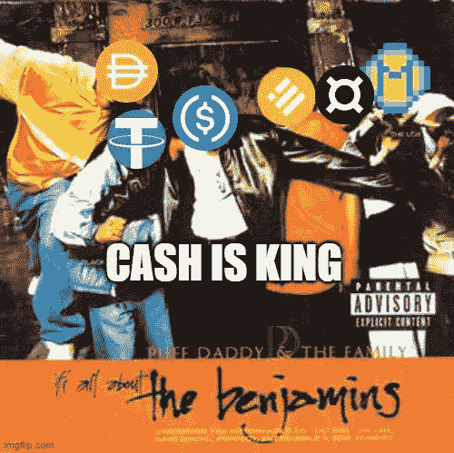
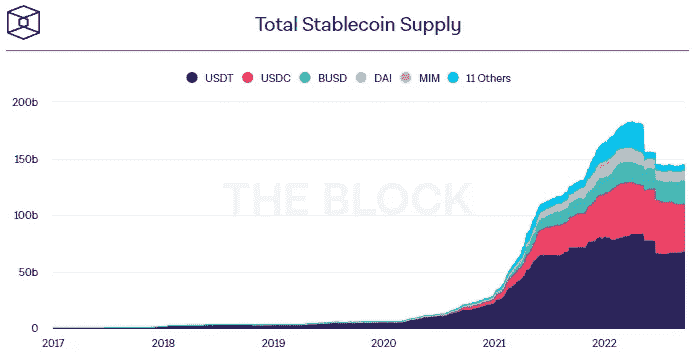
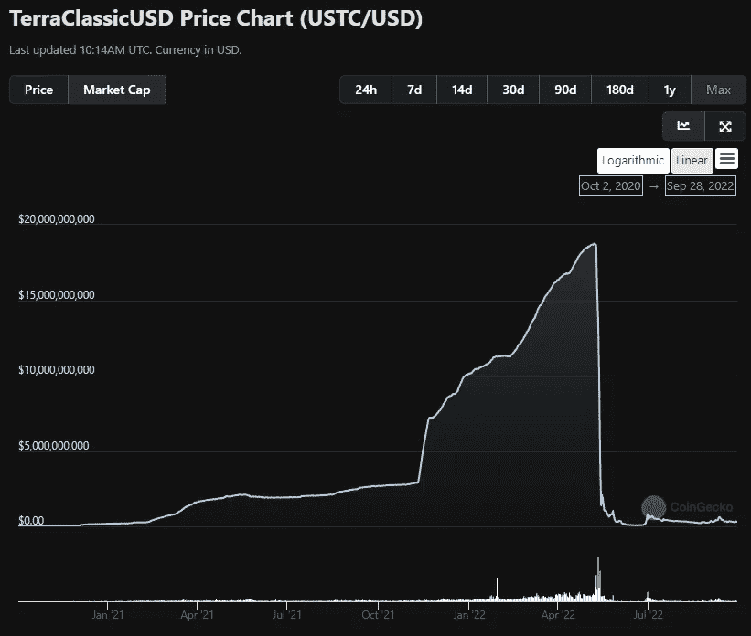
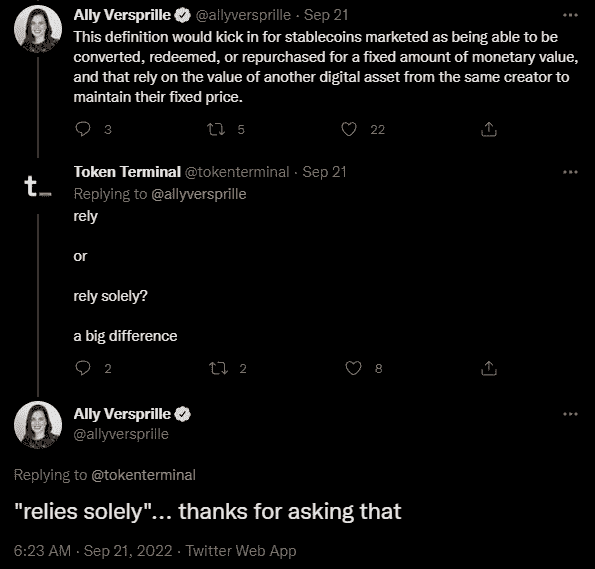
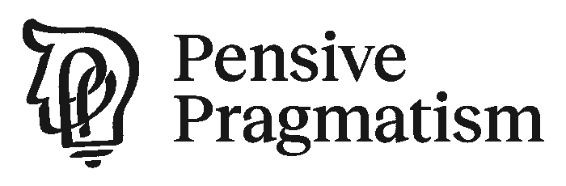

# 都是关于本杰明的

> 原文：<https://medium.com/coinmonks/its-all-about-the-benjamins-13486d5eebf6?source=collection_archive---------31----------------------->

## 1500 亿美元的产业会如何演变？

免责声明，NFA，所有这些法律的东西:本出版物及其附属机构上呈现的所有信息严格地仅用于教育目的。它不应被解释或视为财务、法律、投资或任何其他形式的建议。

嗨，伙计们🙋🏻‍♂️,

Token2049 大会正在新加坡举行，所以这是忙碌的一周。为迟发的问题道歉。由于一些私人事务，我没有参加，但活动的数量和精力是通过屋顶。毫无疑问，这是东南亚最繁忙的加密时期之一。从疯狂的推特密码人物到夸张的滨海湾沙滩派对，这个行业似乎资本雄厚。如果最后一句听起来像是我在 FOMO，相信你的直觉。

# 都是关于本杰明的

快速前进，让我们谈谈稳定的内容。截至 2022 年 9 月，stablecoins 约占整个加密市场的 15%,约为 1500 亿美元。它被密码市场参与者大量使用，并显示出具有出色的产品市场适应性。在 2017 年的牛市周期中，稳定的 coins 几乎不存在。它们并不是每个人的首选，因为用例通常是特定于 exchange 的。2020 年初中，当 DeFi summer 发生时，一切都变了。以前，如果你在一个集中的交易所交易，没有任何重要的理由使用 stablecoins。交易是场外结算的，如果你想保持观望，你可以很容易地兑现成美元。即使在衍生品市场，交易员也会在 BitMEX 上做 1x BTC 做空，同时持有现货 BTC 以保持中立。

随着 2020 年 DeFi 的出现，连锁市场基础设施呈指数级增长。Uniswap 和 Compound 等协议为 stablecoins 提供了必要的环境，让它们找到适合自己的产品市场——开始了它们供应的繁荣。

Source: [The Block](https://www.theblock.co/data/decentralized-finance/stablecoins)

不久之后，行业参与者意识到拥有自己的稳定硬币的重要性，并开始了一系列实验来创新稳定硬币模型。最著名的是 Terra 的 UST 稳定币，它有一个聪明的想法，创造了一种没有任何实际抵押品的算法稳定币。stablecoin 与该协议的本地令牌 LUNA 相关联，并利用一种先铸后烧的机制来维持与美元 1:1 的挂钩。第二，这似乎是一个天才的想法，将区块链的本地令牌与智能合约功能与本地 stablecoin 相结合。

惊喜惊喜。

Source: [CoinGecko](https://www.coingecko.com/en/coins/terraclassicusd)

UST 发生内爆，一夜之间损失了 180 亿美元。简单来说，这一脱钩事件是由 UST 的内生设计引起的。内生的基本意思是稳定的硬币由来自同一发行者的任何代币支持或部分支持。活跃在 MakerDAO 社区的研究员 Luca Prosperi 之前已经写了关于这个概念的文章。事实上，内生一词是美国众议院稳定货币法案草案中的一个关键用语**，我们将在本文中对此进行阐述。这个数万亿美元产业的未来可能会被永远改变。**

****

****以下是一些快捷的方法:****

*   **美国稳定币法案如果获得通过，将产生更加严格的监管要求，包括注册和禁止内源性抵押稳定币。**
*   **重要的部分是注册方面，它可以为协议拥有的 stablecoins 创建二阶效果。**
*   **一个强大稳定的硬币行业将加剧“美元奶昔理论”。**
*   **不指望任何形式的监管，或者指望宽松的监管，都是不现实的。**
*   **将会出现非美元挂钩的货币，其目的是在不与任何法定货币挂钩的情况下稳定币值。**

** [## 马可·马诺波沉思的实用主义

### 有见地的秘密故事，内容超过炒作。点击阅读马尔科·马诺波的《沉思的实用主义》,一个 Substack…

pensivepragmatism.substack.com](https://pensivepragmatism.substack.com/)** 

## **账单**

**该法案的目标是围绕稳定的硬币发行引入一个框架。它涵盖了如何和谁。**

****部分规定了可以发布什么类型的稳定代码。归咎于所有跆拳道。根据新法案，没有现金或高流动性资产抵押的稳定债券将被禁止发行两年，发行“内生抵押”稳定债券将受到刑事处罚。对于采用上述模式的现有稳定债券，发行人将有 2 年的宽限期来改变其抵押模式。****

****随着该法案在这一过程中的推进，这里将涉及更多的细节。Twitter 上的一段对话指出了一个有趣的语言差异。“完全依赖”意味着 Terra 的 UST 可能不会受到该法案的影响，因为它在生命的最后阶段得到了 BTC 的部分支持。****

********

****Source: [Twitter](https://twitter.com/allyversprille/status/1572365887394713600)****

******“谁”**部分规定了稳定货币发行人需要遵守的必要要求，以及谁将监管这些发行人。****

> *****由法定货币支持的稳定债券的非银行发行人也将受到州银行业监管机构和美联储的监管。*****
> 
> *****银行或信用合作社可以发行自己的稳定货币，由货币监理署和联邦存款保险公司监管*****
> 
> ****未经监管机构批准发行稳定币**最高可被处以* ***五年监禁和 100 万美元罚款。********
> 
> ******—* [*该块*](https://www.theblock.co/post/171565/draft-stablecoin-bill-in-congress-to-require-fed-state-regulator-approval)*****

*****如果获得通过，获得批准的要求可能会产生更多的问题。这可能会直接破坏 DeFi 的可组合性。例如:*****

*   *****如果 USDC 已经获得相关监管机构的批准，那么 Compound 发行 cUSDC(其贷款平台的一种收益率资产)的协议是否需要获得同样的批准？*****
*   *****如果我运行桥接协议，我需要获得 USDC 桥接版本的批准吗？*****
*   *****如果 stablecoin 的包装版本对于连接现实世界的资产是必要的，那将如何进行呢？*****

*****你明白了。该法案可能会产生更多的不确定性，而不是为行业参与者提供一个清晰的框架。*****

## *****现有 Stablecoins*****

*****这对排名靠前的非集中式稳定客户有什么影响？*****

*******戴*******

*   *****戴得不到的支持，但可以作为最后手段，在协议制定者亏损的情况下弥补协议的赤字。*****
*   *****这种情况很少发生，但它以前在 T21 发生过。*****
*   *****该法案应该不会影响 MKR。*****

*******FRAX*******

*   *****FRAX 得到 FXS 的部分支持，这是 FRAX 的治理象征。*****
*   *****FXS 的抵押率将根据 FRAX 的使用率进行更新。*****
*   *****该法案将 FRAX 置于审查之下，因为它部分是由同一发行人发行的令牌进行内生抵押的。*****

*******LUSD*******

*   *****LUSD 没有 LQTY 的支持，而 LQTY 是 LUSD 的统治象征。*****
*   *****LUSD 主要由 ETH 支持。*****
*   *****该法案应该不会影响 LUSD。*****

*******USDD*******

*   *****USDD 在一定程度上得到了 TRX 的支持，这是 USDD 生态系统的内生因素。*****
*   *****USDD 得到了 TRX 30%以上的支持。*****
*   *****该法案将 USDD 置于审查之下，因为它部分是由同一发行人发行的令牌进行内生抵押的。*****

*******USDN*******

*   *****USDN 有 WAVES 做后盾，WAVES 是 USDN 生态系统内生的。*****
*   *****该法案将使 USDN 受到审查，因为它部分是由同一发行人的令牌进行内生抵押的。*****

*******MIM*******

*   *****MIM 没有法术做后盾，法术是 MIM 的治理令牌。*****
*   *****MIM 由其他资产支持，主要是 FTT。*****
*   *****该法案应该不会影响 MIM。*****

*****我相信我们会看到非美元挂钩货币的增加，这种货币旨在稳定价值而不与任何法定货币挂钩。然而，这些类型的稳定硬币不太可能被主流接受。不要误解我的意思，我并没有放弃这些概念(例如 RAI)，但要对其进行扩展并使其对非加密原生用户友好，还有很多工作要做。我有一些想法，但那是另一篇文章。*****

## *****实用主义*****

*****本着这份出版物的精神，我认为期望对稳定的硬币没有管制或宽松的管制是不现实的。尽管自由主义科技兄弟公众人物的崛起，我们仍然生活在一个政府统治的社会。稳定的货币与法定货币直接挂钩，法定货币是世界各国政府治理和稳定的工具。这就是为什么即使是过去几十年经济增长惊人的国家，如韩国，仍然实施某种形式的资本管制。*****

*****即使在美国放任稳定的货币行业繁荣并加剧美元奶昔理论的情况下，非美国管辖区也不会按兵不动，让自己的货币贬值。我是美元奶昔理论的信徒，但期待其他法定货币不战而降是幼稚的。*****

*****唉，我们将在稳定的货币环境中看到越来越多的规则。行业参与者需要从这两个光谱中汲取营养。务实并适应形势，同时通过各种措施积极倡导更友好的监管。无论发生什么，稳定的硬币产业仍将价值数万亿，这不是什么时候的问题，而是如何的问题。*****

**********

## *****生活与工作*****

*****25 岁左右是最好的感觉，同时也是最奇怪的感觉。在你 20 出头的时候，几乎所有的同龄人都在朝着他们的职业目标努力。人们谈论工作和如何赚更多的钱。但在你 20 多岁时，人们开始出现分歧。你会看到那些比以往任何时候都更渴望拥有一种 [FatFire](https://time.com/nextadvisor/financial-independence/what-is-fat-fire/) 生活方式的人，那些成为巴厘岛电子商务直运的数字游民的人，以及那些已经有了孩子的人。我仍然不知道我在哪里跌倒；但是几天前，我的一个朋友写了一篇关于当代工作状态的[精彩文章](/@patprabowo/the-contemporary-state-of-work-a-reversal-of-progress-250e98dddba)。在他的文章中，他假设有两种人。对于第一类人来说，工作给他们的生活带来快乐，这是他们的 [Ikigai](https://www.betterup.com/blog/what-is-ikigai#:~:text=to%20find%20it.-,What%20does%20ikigai%20mean%3F,out%20of%20bed%20every%20day.) 。对第二类人来说，工作是确保生计的邪恶必需品。我所知道的是，我很高兴找到了秘密空间——这个疯狂古怪的世界的确是我的 Ikigai。*****

*****直到下一次，*****

*****马尔科·m。*****

*****如果你喜欢这首曲子，请考虑[分享](https://medium.com/r?url=https%3A%2F%2Fpensivepragmatism.substack.com%2Fp%2Fon-crypto-branding%3Futm_source%3Dsubstack%26utm_medium%3Demail%26utm_content%3Dshare%26action%3Dshare%26token%3DeyJ1c2VyX2lkIjoxODM0MDA5LCJwb3N0X2lkIjo3NDA3MzQ5OCwiaWF0IjoxNjYzNzg2NjE3LCJleHAiOjE2NjYzNzg2MTcsImlzcyI6InB1Yi0yODUxODEiLCJzdWIiOiJwb3N0LXJlYWN0aW9uIn0.DYnEsGLsz7JcHsiKScjgcxf0szs7fQqTUlPMpcykC0A):)*****

*****如果您想在当天的收件箱中收到未来的期刊，请在下面订阅:*****

***** [## 马可·马诺波沉思的实用主义

### 有见地的秘密故事，内容超过炒作。点击阅读马尔科·马诺波的《沉思的实用主义》,一个 Substack…

pensivepragmatism.substack.com](https://pensivepragmatism.substack.com/) 

> 交易新手？尝试[加密交易机器人](/coinmonks/crypto-trading-bot-c2ffce8acb2a)或[复制交易](/coinmonks/top-10-crypto-copy-trading-platforms-for-beginners-d0c37c7d698c)*****