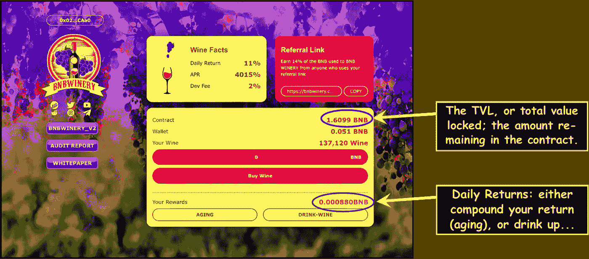
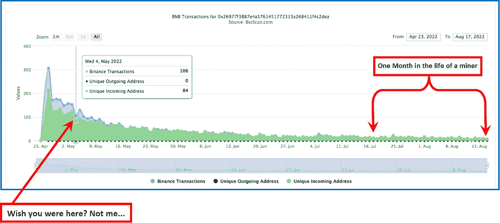
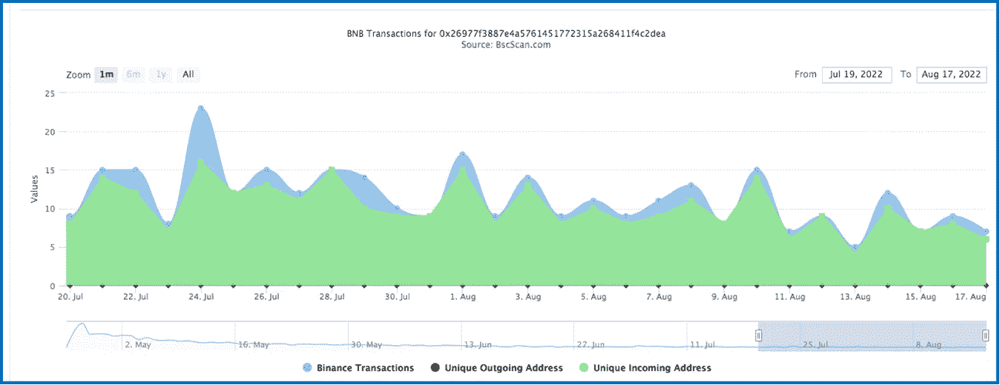
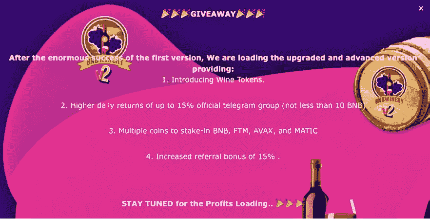
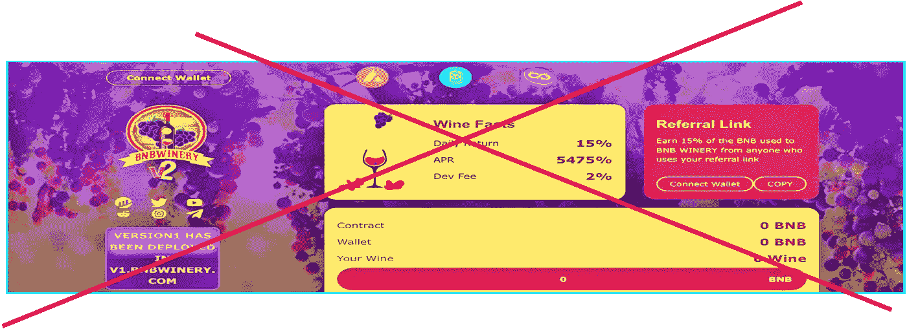
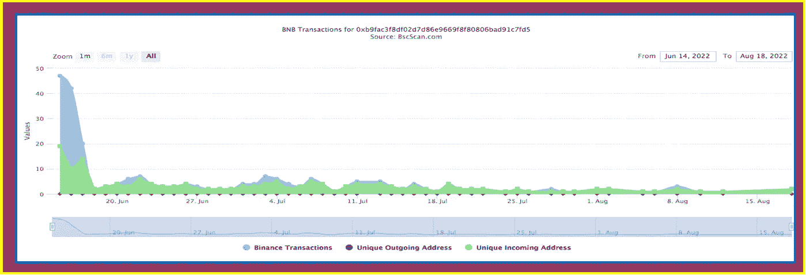
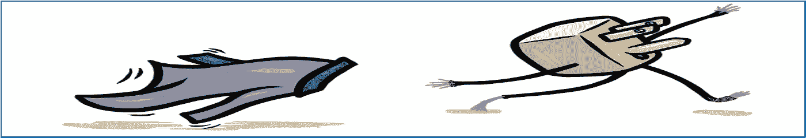
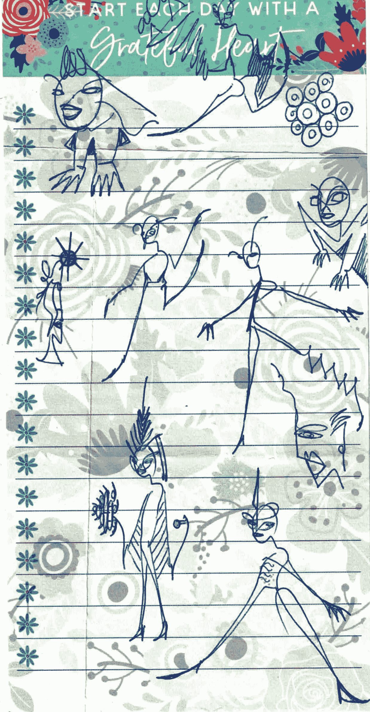

# 它已经死了！！请不要再投资了…

> 原文：<https://medium.com/coinmonks/its-already-dead-please-stop-investing-in-it-79643e274cdb?source=collection_archive---------3----------------------->

观察 DeFi 袋装更换方案生命周期的经验教训

This not-quite-yet-defunct crypto investment project called BNBWinery is flat broke — for the love of Pete’s Sake, please don’t buy any more virtual wine from it…

本周，我最不喜欢的友敌——一个叫做 BNBWinery 的古老 DeFi 加密协议——短暂地回到了我的生活中。我以为它已经死了&按理说它应该死了。

> 它仍然存在的唯一原因——它的霓虹灯亮着，一个破裂的欢迎标志在窗口闪烁——是因为太多新兴的加密投资者有点无知。

我是其中之一。我在没有做任何研究的情况下玩 BNBWinery，损失了很多钱——甚至不知道更多的研究(总是)是必要的。[在这里阅读相关内容](/@jebalucas/diving-head-first-into-pocket-change-crypto-miner-protocols-581a03ade2fc) …

> **然而，这篇文章不是关于那个的。而是接下来发生的事。**

让我们倒回去一点…

## 这张图怎么了？

上图是加密堆栈协议 BNBWinery 的当前仪表板。当我在仲春发现它时，它还是全新的。除了一些非常重要的数字，几乎所有的东西看起来都和现在一样

请注意，上面圈出的**合约 TVL** ，合约中有 1.6099 BNB，相当于 300 美元。数百名投资者希望每天都能收回一些投资，这对每个人来说都是很小的一笔钱。这不是做生意的方式…

还注意到**你的奖励**数字，也圈出:0.00088 BNB 是我最后的奖励金额，要放进我的口袋里。太好了。

> 顺便说一下，这是 0.24 美元的奖励:获取和转移奖励的汽油费约为 14 美分，所以我在这笔交易中的净收益是一个冷的一角。实际上，不太好。

也不再值得了。当我的回报低于 1 美元时，我已经放弃了那个零花钱矿工。

## 一个短的口袋改变协议生命周期

事情是这样的:BNBWinery 是一个考虑不周的项目，有一个华而不实的仪表盘；它开始时轰轰烈烈，但随后迅速崩溃&而且很严重。它带走了几乎所有人的钱，除了所有者&一些首日投资者。

## 问题:

11%的日投资回报率是不可持续的，特别是在反鲸功能有限的情况下&没有可持续性或长寿功能，这在严肃的项目中已经变得司空见惯。主人没有给它任何启动资金，而是希望它能自己成长。

> 大多数这类破产前的小钱矿工每周来来去去，希望很快消失，不会给投资者造成太大的财务损失。
> 
> 不管出于什么原因，BNBWinery 是不同的。它开始时很典型:在第一个七天之后——就像大多数糟糕的加密矿工一样——它已经给所有投资者带来了递减的回报。然而，随着如此灾难性的下跌，它本应在一个月后崩溃&完全消失。它没有。

> 为什么？
> 
> 因为刚刚发现这些小动作的加密投资者，还没有学会对他们的零花钱保持警惕。在加密空间的这个角落，不信任是健康的，因为它总是与钱有关。

同样，这些 dApps 中的一些就像一个嘉年华——很容易吸引人:有趣&愚蠢&严肃&复杂&凌乱&美丽&令人沮丧&有利可图；&所有承诺超快投资回报。他们中的一些人实现了这个承诺；大多数人不知道。

这是我偶然发现这个故事的地方…

The long, tumultuous, horribly tedious, & pretty boring, drawn-out lifecycle of a failed pocket-change crypto miner…

## 我是其中之一

在一周的时间里，我把我所有的东西，差不多 3000 美元，都投资到了 BNBWinery 上。当时合同中只有大约 42 BNB——相当于 1.2 万美元。第二天只有 40 个 BNB…

它总是一个小协议，所以我对 TVL 的巨大贡献是一件大事。你可以通过**希望你在这里看到它对上面图表的影响？**箭头。但是下降是不可避免的……从那以后，这个协议继续着它单调乏味的下降，从流量图的另一边下降，见上图。

正如我被告知的那样，我在第一天复合了几天，同时看着 TVL 迅速减少。恐慌之下，在接下来的两个月里，我取出了我能取出的钱，每天都要刮几次。

我的第一个奖励差不多是 50 美元；然后降到 30 美元；然后是 25 美元，等等。很快，减少的回报是如此之低——每天不到一美元——以至于不再值得花时间。总的来说，从 3000 美元开始，我带走了 1800 美元，损失了 1200 美元。

> 在学习了许多精彩的课程后。

## 矿工的生活

正如你从上面的图表中看到的——这个生命周期对这个矿工来说是痛苦的财务上的非生产性的，因为只有几美元进入协议，而且更多的钱花出去了。

One month in the life of a crypto miner: each green bump is another hapless investor…Let’s hope they start taking advantage of the free Medium.com articles…

## 快进…

> 虽然该项目从一开始就明显走下坡路——锁定的 TVL 不到 500 美元——**在过去的一个月里，十几个无知的人投资了注定失败的协议**。BNBWinery 的上述步行交通图片段描述了从 7 月 20 日到今天的唯一传入地址活动。

注意绿线在过去的 30 天里上升了 12 次。每一次冲击都是一个投资者把钱投入到协议中&他们现在想知道钱都去了哪里…

希望他们中的一些人正在阅读这些文章…

## BNBWinery 不是拉地毯的。

没有大量的钱突然被撤回，这个项目也没有突然结束。它结束了(悲伤的)自然生活。

然而，最终人们可以了解项目创建者/所有者的意图…

A BNBWinery V2 party? Of course I was invited!…I just didn’t want to go is all.

## 一个月后

6 月，当协议负责人非常清楚该项目失败时，他/她决定创建 BNBWinery 公司。大约在那个时候，我收到了上面的小册子，鼓励我加入“新&更新”协议。

> 项目“版本 2”的期望是**总是**它是第一个项目的改进。然而，这个“更新”的 BNBWinery V2 比原来的差多了。

日回报率被推高至不可持续的 15%；引荐奖金也降到了 15%。它还鼓励我“继续关注利润加载…”注定，我说…

15% return?! Previously tempting, perhaps; however, I now know **when to say when**.

知道什么时候你喝得太多了…

> 显然其他人也把这个教训放在心上，因为 bnb V2 比第一次失败得更快。下面是令人沮丧的人流量图。

The failed BNBWinery V2 doesn’t look so good. I added some carnival colors around it to make it feel more festive…

## 外卖食品

Medium.com 的[是这个星球上最大的论坛！每天，在做出重要的(财务)生活决定之前，我们能够阅读无数其他人的研究意见。](/@jebalucas)

这类似于集体思考，许多人试图提出最佳解决方案。我们可以接受召唤我们的信息，留下那些看起来不合适的。如果我们读了这些文章并做了研究，我们就有希望避免上述投资者例子没有避免的陷阱。

> 我当然会继续回来…

谢谢你走到这一步。我希望你能在这篇关于我们生活的疯狂的密码世界的观点文章中找到一些有价值的东西。总是很高兴有你**跟着我** …

我鼓励朋友们只玩你不需要的东西。在放弃你辛苦挣来的零花钱之前，请把这次谈话当作你整体研究的一小部分。又是 Thx。

Shameless Plug! Borrowed from @shamelesslyplugged

# 不要脸塞:

*我探索&剖析新的口袋变化加密赌注协议。我要么把他们分开，要么决定投资这个项目，鼓励他们的可持续性发展。这些矿工中很少有人会升到最高层；那些是我正在寻找的。*

> 注意:当我成功地从一个协议中赚钱时——不一定是我的全部投资回报，只是现在——我会写下我的经历。
> 
> 如果你喜欢这个协议并决定投资其中，这就是我的目标-&我很激动。使用我的文章中的推荐链接将会给我提供一点补偿&这是让我知道这些对话是有益的极好方式。如果你使用我的推荐链接，谢谢！

我投资了 BUSDCartel 这是我正在尝试的一种更新的、高风险的协议。

 [## 布斯卡特尔矿工

### BusdCartel——可持续发展是我们让您获得更高利润的关键

busdcartel.app](https://busdcartel.app/?ref=0x024ee915c2BF9d12F98b750119051A752e18CAa0) 

我哥们什么都画！我称之为他的账本系列。我喜欢下图。

Flower power…

> 加入 Coinmonks [电报频道](https://t.me/coincodecap)和 [Youtube 频道](https://www.youtube.com/c/coinmonks/videos)获取每日[加密新闻](http://coincodecap.com/)

# 另外，阅读

*   [如何购买 Monero](https://coincodecap.com/buy-monero) | [IDEX 评论](https://coincodecap.com/idex-review) | [BitKan 交易机器人](https://coincodecap.com/bitkan-trading-bot)
*   [CoinDCX 评论](/coinmonks/coindcx-review-8444db3621a2) | [加密保证金交易交易所](https://coincodecap.com/crypto-margin-trading-exchanges)
*   [红狗赌场评论](https://coincodecap.com/red-dog-casino-review) | [Swyftx 评论](https://coincodecap.com/swyftx-review) | [CoinGate 评论](https://coincodecap.com/coingate-review)
*   [Bookmap 评论](https://coincodecap.com/bookmap-review-2021-best-trading-software) | [美国 5 大最佳加密交易所](https://coincodecap.com/crypto-exchange-usa)
*   [如何在 FTX 交易所交易期货](https://coincodecap.com/ftx-futures-trading) | [OKEx vs 币安](https://coincodecap.com/okex-vs-binance)