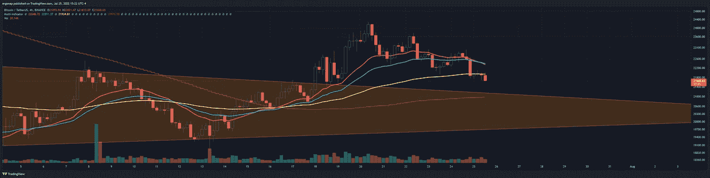
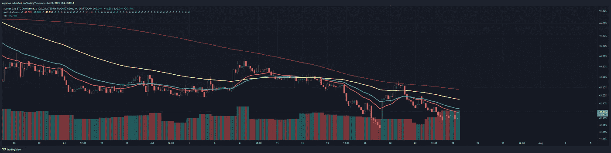
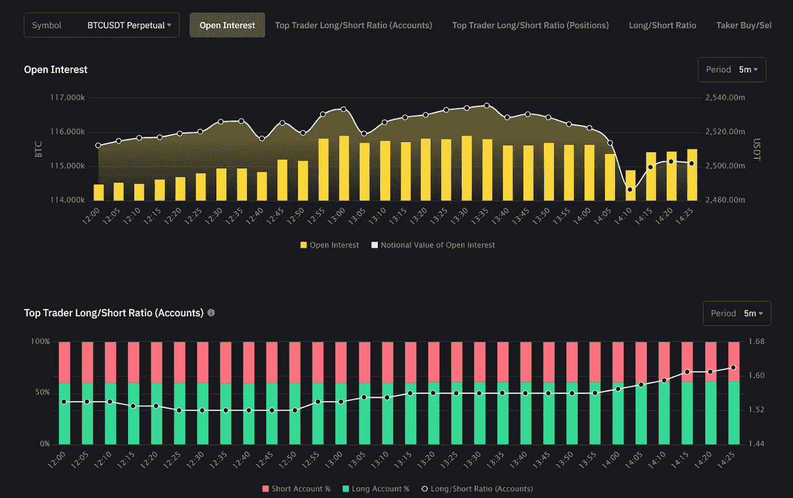
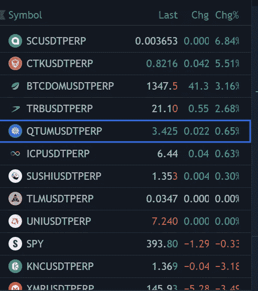

# 今天担心是正常的

> 原文：<https://medium.com/coinmonks/its-alright-to-be-worried-today-f68c247c1eab?source=collection_archive---------38----------------------->

## 比特币/加密货币分析 7 月 25 日

今天标志着一个非常重要的转折点。我们刚刚跌入重要的 4h 89 均线，对我来说，这通常是牛市/熊市的标志。显然不要马上采取行动，但我们是否会从熊市旗顶反弹是唯一剩下的问题。想知道为什么我一直在翻跟头吗？这是因为我们是否会跌破(黄色 89 均线)的预测。这几乎定义了一切。现在的问题是我们是否会反弹 4h 200ma(又名 1d 34EMA)。如果没有，那就滚出这个市场。即使绘制了[趋势线](https://www.tradingview.com/x/TD9icCoj/)，看起来还是一个相当明显的突破。我不会动我的现货头寸，但我会把筹码从桌上拿走。

not happy tidings for bitcoin [https://www.tradingview.com/x/WtT4AdGa/](https://www.tradingview.com/x/WtT4AdGa/)

这自然是在明天的 [FOMC 会议的背后。如果你和密码有关的话，这就有点重要了。第二个潜在的警告是看到 BTC。再次崛起。显然还早，我们也确实很努力的拒绝了，再说吧。](https://www.federalreserve.gov/monetarypolicy/fomccalendars.htm)

BTC.D rising here, if it goes above, means we are headed to some ugly times ahead.

期货融资数据显示，有人在散户方面建立大量多头，而空头获利了结。所以…目前尚无定论，但获利的空头增加了风险。

someone is really determined to long

至少可以说，其他的代币到处都是。但不是很好。

why things would go up middle of a dump is super countertrend

我很好奇这些多头是否会投降或胜出，但现在知道还为时过早。简而言之，在外面要小心。

> 交易新手？试试[密码交易机器人](/coinmonks/crypto-trading-bot-c2ffce8acb2a)或[复制交易](/coinmonks/top-10-crypto-copy-trading-platforms-for-beginners-d0c37c7d698c)