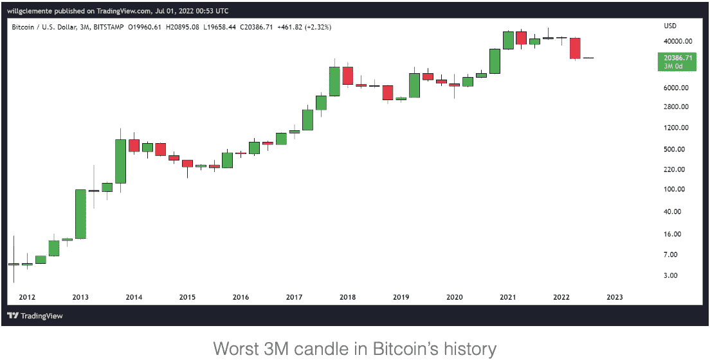
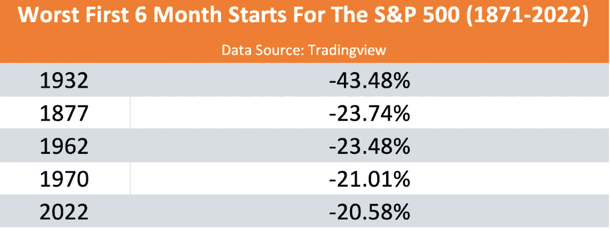

# 现在是中场休息。密码的下一步是什么

> 原文：<https://medium.com/coinmonks/its-half-time-what-next-for-crypto-2002c1b3453f?source=collection_archive---------47----------------------->

# 内容(3 分钟阅读):

*   😫现在是半场时间
*   📉股票市场前景
*   👨‍👩‍👧‍👧Startupy——社区管理的搜索引擎
*   🏖️个人退休帐户，避税帐户
*   📰基督教青年会
*   🙏🏻感激…
*   💸优惠券

# 😫中场休息了

官方消息:比特币刚刚经历了自 2011 年以来最严重的季度亏损——4 月至 6 月间，T2 下跌了 56.2%。毫无疑问，现在形势严峻。

Crypto 一直以其波动性而闻名，由于这次的宏观环境，其估值可能会继续下降，并在更长时间内保持低水平。然而，对于手握重权的投资者来说，这又是一个折价买入的机会。**萨尔瓦多和 Microstrategy 以及其他许多公司都在积极购买 dip。**

2022 年第二季度，比特币经历了有史以来最严重的下跌，价值损失超过 50%。

> 交易新手？尝试[加密交易机器人](/coinmonks/crypto-trading-bot-c2ffce8acb2a)或[复制交易](/coinmonks/top-10-crypto-copy-trading-platforms-for-beginners-d0c37c7d698c)

**从 2021 年 11 月的历史高点 69k 美元，BTC 下跌了 70%。【cryptohopper 的[分析师](http://cryptohopper.com/)从过去 4 年的减半周期中发现了一个有趣的模式，即比特币价格可能平均暴跌 82%。**

在之前的减半周期中，每个后续的周期性高点之后都有极端的抛售期:
从 2013 年的高点，BTC 价格暴跌 86%
从 2017 年的高点，BTC 价格暴跌 84%

> *此外，每一个减半周期低点都是在下一个减半事件之前 18 到 17 个月建立的。* ***下一次减半事件定于 2024 年 3 月*** *发生，这意味着如果我们从那段时期回溯 17-18 个月，* ***我们需要在今年 9 月-11 月左右触及下一个 16k 美元左右的周期性低点。***

[启动-](https://beta.startupy.world/membership/?ref=yarocelis)

我很高兴地宣布，我已经成为 Startupy 的策展人和成员。一个社区管理的搜索引擎。零 SEO BS。我邀请你加入这个为漫游、研究和思考而设计的知识和见解的令人愉快的图书馆。

# 📉股票市场前景

上周四是这个月的最后一天，也是 2022 年第二季度。今年上半年是历史上最糟糕的一年。如果我们回顾一下 1871 年以来标准普尔 500 指数的所有上半年，只有 4 年比这一指数更糟糕。

正如我们上面提到的，这些天有许多宏观经济条件影响着所有的市场，很难准确地指出我们如何才能走出这些衰退时期。在很大程度上，如果我们能够在全球层面上遏制通胀和畅通的供应链，我们或许能够在 2022 年看到一个更好的下半年。

有趣的是，对于那些比 2022 年开局更差的年份，他们都看到 S&P 在下半年上涨。

# [立即加入 Kucoin，注册后即可获得高达 500 美元的欢迎奖金。](https://www.kucoin.com/r/af/rPY4DDD)

开始交易 BTC 和 600+加密宝石，仅需 1 美元

[连同 iTrustCapital](https://itrustcapital.com/referral100?utm_source=partner&utm_medium=youtube&utm_campaign=partner637&oid=10&affid=637)

加密货币是这些天每个人都在谈论的东西之一。有各种不同的交易所进行加密交易……但是许多人没有意识到他们在税费上损失了多少。

iTrustCapital 允许其客户通过个人退休账户或个人退休帐户投资 crypto，而不必担心税收或费用。

IRA 是避税账户，这意味着你所有的加密交易都是免税的，并且可以随着时间的推移免税增长。

没有隐藏的费用。[要了解更多信息，请点击此处并开通免费账户。](https://itrustcapital.com/referral100?utm_source=partner&utm_medium=youtube&utm_campaign=partner637&oid=10&affid=637)

[分享 Yaro 的技术& WebX 简讯](https://yarocelis.substack.com/?utm_source=substack&utm_medium=email&utm_content=share&action=share)

# 👁雷达下的️

*   [Moonbeam (GLMR)](http://moonbeam.network/) —不仅仅是一个 EVM 实现:它是一个高度专业化的第 1 层链，镜像以太坊的 Web3 RPC、帐户、密钥、订阅、日志等等。它扩展了以太坊的基本特性集，增加了额外的特性，比如链上治理、堆栈和跨链集成。
*   FTX(FTT)——FTT 是 FTX 的交换信物。持有者可以获得一小部分交易费、一小部分清算保险基金，并可以将代币用作抵押品，以获得更低的 FTX 场外交易利差。在这个隐秘的冬天，他们已经抢走了几家公司，现在在他们的平台上提供股票交易。它们向不同行业的扩张似乎没有停止过，因为在许多资不抵债的公司中，它们非常具有流动性。
*   [Mojo Vision](http://mojo.vision/)——宣布了一种智能隐形眼镜的原型，它可以促进和改变我们与元宇宙的互动。隐形眼镜能够显示基本信息，例如仅使用眼睛运动来控制显示器的驾驶方向。虽然智能眼镜经常被吹捧为我们增强现实未来的固定设备，但少数公司正在朝着不同的方向发展——专注于将智能融入隐形眼镜。

# 📰基督教青年会

*   [脸书薪酬更名为元薪酬](https://techcrunch.com/2022/06/23/facebook-pay-rebrands-meta-pay-digital-wallet-metaverse/)
*   [**比特币基地 Pro 关机**](https://url-e.coinmarketcap.com/ls/click?upn=3XGtgU0aTcvSIJEH-2F-2B3WuJkIhkYd79WXDZ3slvXMJhsOMlj0gMvmn6-2BH91MDv4lP5z3cMIVJAUbWUwvfjdUTnBy1F5yz4L6MyWac-2BByfsJ0fB8EsfijXHPYqEwwpkYp5tt0iHSx4KkPwH8A1FdH-2BVw-3D-3Dzhtr_uYqL4p72S3BV1QzvSAJ8EqylmF8Q7x3AgZrHIqFEc2-2F9oGZ80P932XQ2R-2FFPdsM2TZlmlBAC8S4v35hwhInEo6zHoCKVZvC86Tn-2FeuNYzIz6W-2FTQTIahd9k-2BkpBQsRnMjK0eCS7VNBTXJBsogqyFpll0-2FnC9Y0g4nt-2FO47Xwe-2FIOI-2FVtinG2teyTPuzixC8yMSpHL3frZ6tWJPUOz1rVWdztzf-2FhklM-2FTaVuRgxWwMWUaL5ERXKOlme1RNI9c7TLmYLcDgMr4TiSv6MWo7Nl83agGX9I4GdXLeX6ljuRQvDTand2uxeK8e7m43pTwF7NhlwnSxXeFRyWQ5L94e7MrBypEc0pBWeL-2F1r9EOrS5TmJvuAPF-2FjaT-2BENqB5HtJWTarkoT8ZqzCwogOdr27v6FiTBoVe7-2BbTKEwNDQQogJbscPgz-2B8K4UWlJPIG2eM-2FkpdZZeB4Ydwy6gRsDz-2FVaCmfsGDY33n03hF3z7NNN-2BISq6PXO3NK9nSWZtAOfya-2F28rkDnhTbAIu12H3-2Bn0kAtA4fibff01wUIcuA829nxP4iq4SshZ4lDRSq2AvQ7vz7xtHcD-2Bo9a9PCn0qCos-2B29wIgZIQShUcFU-2FcU9kYXxR3hv9c3BI5lVyS72e1dTm-2FOsUvPEub02R9dwCkqOLumq5bdpnD-2FwSvxuhB0OBxIXyq0741-2BUZ57rf5YThEYuSFyt-2Fmul5wbmvNyQEm6RGK-2BoT8f38M7fx58BO5Mt7ytGS9KFOGOzMn79wtBNsRDxnq9vS2YCbnkiAIDVdsWutAMM8M689Lq6xFy9KnxHmi9EeH0OQQc4xaxxROeJi9mrcPeCa-2BE5ztnMYP-2BTrLIdOfhTkvBzwQUgWA3t-2BMV-2FnqQF7yOeJg3nNRWh8G-2Fis8xeaNh3E89H6IR1kxK5mIt54bKbinO5ogjeR1-2FdN1KOODQ5OzzVwBi4xbC-2FmugX0EXrGcKDvz2OUrlr8Subv7AqZMP1oFnEd3zAcraieQtB1VMcF3uZ6ooAEMmt6OMVNIG0g3e4)
*   [灰度对证券交易委员会提起法律诉讼](https://newsletter.coingecko.com/click.html?x=a62e&lc=ZSa&mc=0&s=P1PM&u=p&z=hnaRaps&)
*   [3AC 清算](https://www.coindesk.com/business/2022/07/01/blockchaincom-deribit-among-creditors-that-pushed-for-3ac-liquidation-report/)
*   [**易贝收购 NFT 市场**](https://www.prnewswire.com/news-releases/ebay-acquires-leading-nft-marketplace-knownorigin-301573028.html)
*   [本周最值得关注的五种加密货币:BTC、SHIB、MATIC、ATOM、APE](https://cointelegraph.com/news/top-5-cryptocurrencies-to-watch-this-week-btc-shib-matic-atom-ape)
*   [比特币巨鲸和投资者在 19k 美元时大举“买入”](https://zycrypto.com/bitcoin-whales-and-investors-heavily-buying-the-dip-at-19k-even-as-miners-adopt-risk-off-approach/)
*   [调查显示，美国千禧一代拥有的密码比共同基金还多](https://cryptopotato.com/us-millennials-own-more-crypto-than-mutual-funds-survey/)