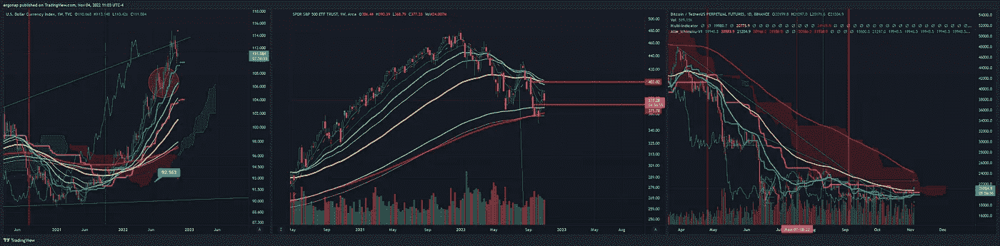

# 这次不太一样，但我不确定人们是否注意到了。

> 原文：<https://medium.com/coinmonks/its-not-quite-the-same-this-time-but-i-m-not-sure-if-people-have-taken-heed-34e78b0563fe?source=collection_archive---------33----------------------->

## 市场分析 11 月 4 日(星期五)

所以…..我们刚刚加息了。很多盈利电话。许多股票最近大幅跳空(META，TWLO)，少数股票因无意义交易(ETSY)大幅跳空。

[https://www.tradingview.com/x/bBW5ZyyK/](https://www.tradingview.com/x/bBW5ZyyK/)

只是到那时…继续…非常奇怪的场景？

[https://www.tradingview.com/x/csR2hPt2/](https://www.tradingview.com/x/csR2hPt2/)

老实说，这说不通。现在，麝鼠将会得到他应得的仇恨，但事实是他在很多方面都搞砸了。所以我认为这将会引起很多社交媒体的关注。

很多人想离开 twitter。好的，当然，不管怎样——但是……去哪里？我看不到真正的解决方案。我看到垃圾，到处都是。

Social media is a dumpster fire and generally always was.

不管怎样，我们该何去何从？

[https://www.tradingview.com/x/F5dW559j/](https://www.tradingview.com/x/F5dW559j/)

嗯，$SPY 看起来要下跌了，BTC 有所转向，但总体上仍然看跌，DXY 今天下跌，因为谁知道呢。我不会屏住呼吸。一种可能性是我们在年底假装反弹，但我看到了世界上最大的警告信号，这是我们有一段时间没有看到的。[https://www.tradingview.com/x/l9womFdD/](https://www.tradingview.com/x/l9womFdD/)。通货膨胀期间，美联储预算飙升，这是矛盾的。因此，要么削减预算，要么降低通胀。猜猜哪个可能性更大？我将把这部分留给经济学基础研究者，因为我认为这应该告诉人们接下来会发生什么。

同时，当不同的 TA 方法交叉时，不是也不足为奇吗？

[https://www.tradingview.com/x/IHz29UCK/](https://www.tradingview.com/x/IHz29UCK/)

这里给交易者一个提示:200MA + Ichimoku 云顶。那是会做决定的地方，很容易猜多下来。甚至是咄咄逼人。

> 交易新手？试试[密码交易机器人](/coinmonks/crypto-trading-bot-c2ffce8acb2a)或者[复制交易](/coinmonks/top-10-crypto-copy-trading-platforms-for-beginners-d0c37c7d698c)