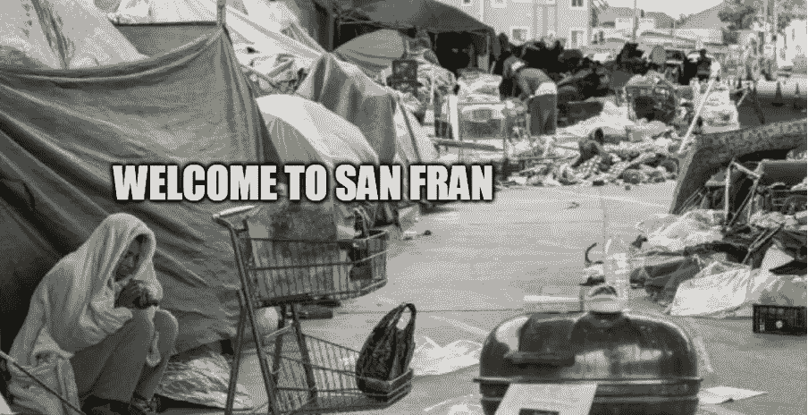
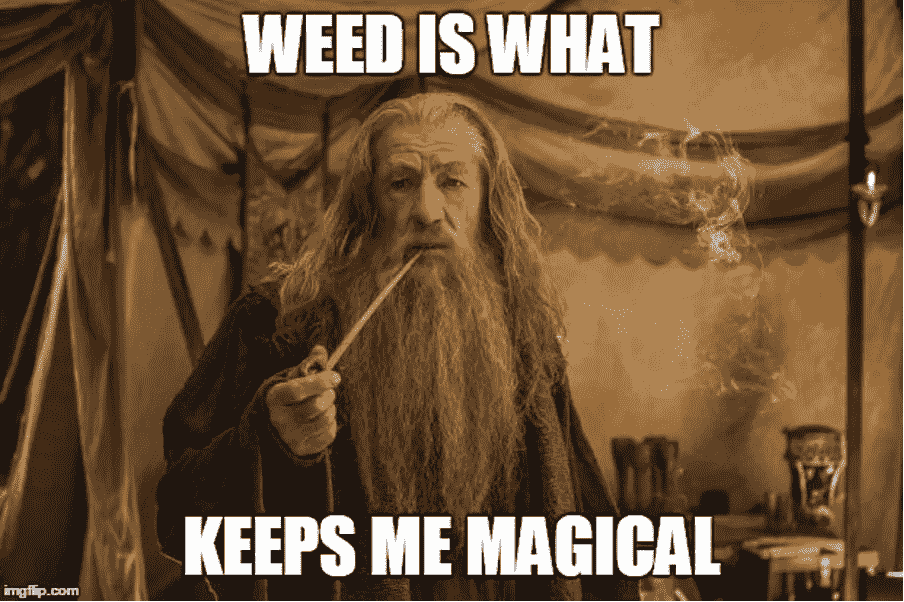
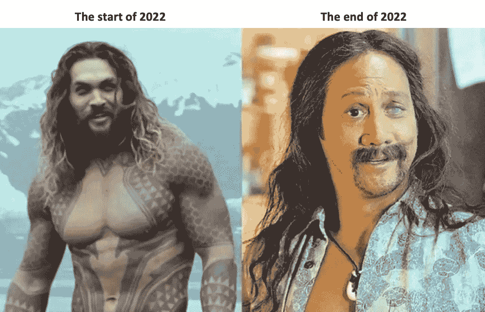

# 这是假日 Szn

> 原文：<https://medium.com/coinmonks/its-the-holiday-szn-c846798208d3?source=collection_archive---------20----------------------->

亲爱的读者，祝你圣诞快乐，新年快乐！

既然我们正处于假期，我想我会分享一些我最近的假期经历和想法。我第一次去美国；这是一次令人大开眼界的经历。除了几个景点，美国是一个迷人的旅游目的地。这是一个美丽的地方，但也有一些混乱和不适。在这篇文章中，我将简单地谈谈我对旧金山的看法。

> 不知道什么时候买卖，试试[复制交易](http://coincodecap.com/go/bityard)。

根据维基百科，美国的政治意识形态与左右政治光谱一致，大多数美国人认为要么是保守的，要么是进步的，要么是温和的。

进步主义、福利资本主义和社会自由主义都是现代美国自由主义的组成部分。直到我在现实中看到了美国的政治意识形态，我才明白它的重要性。

在旧金山呆了三天后，我对自由主义的看法改变了。我最难忘的经历是从鲍威尔街(所有高端精品店的所在地)漫步到市场街上的 Twitter 总部大楼，我清楚地记得这真的像电影《疯狂的麦克斯:愤怒之路》中的一个场景。到处都是无家可归和喝醉的人，还有垃圾和帐篷，更不用说毒品和粪便的恶臭了。我走了这么远，仅仅是为了在收购日偷看一眼埃隆·马斯克(Elon Musk)拿着水槽的门厅，这很不方便。结果，我现在因为大麻的味道患上了 PTSD。

一个社会对自由的影响可能是有益的，也可能是有害的。尽管这座城市取得了成功，但它的失败同样可怕，如果不是更糟的话。去那里让我害怕得要死。我可能不会去旧金山，除非我有免费票去看斯蒂芬·库里的比赛。

以下是我的观点，我希望它能给你一些启示和鼓励，让你开始探索 crypto 和 DeFi，它可能什么都不是。

够了，狗屎；尽管蛮荒的西部无法无天，但无限的环境刺激了发明。我们都知道旧金山是世界上最重要的科技和创新中心。在我的访问中，我目睹了城市中几家公司对自动驾驶汽车进行严格的测试。这显示了解决棘手挑战并最终为世界开发新用例的雄心。我能把这个地方和密码联系起来。与 crypto 一样，狂野西部和开源开发导致了许多用例的出现，如 ICO、DeFi、NFT，以及许多未来无法想象的功能。

Many friends recommended me not to visit the United States as a vacation destination because it is dangerous and highly overrated, but after experiencing it for myself, I can say that this is not entirely true. According to Ronnie Chieng, the Chinese word for the United States is 美国. That directly translates to “beautiful country” in English. I now understand the appeal of moving to the United States and in pursuit of the American Dream. Like most immigrants where freedom is the common factor for them to put everything on the line to come to this beautiful country.

当我想到 2022 年时，我会想到我在 crypto 上投入的所有时间和金钱，从年初到现在，我作为一个个体发展了多少(更不用说我损失了多少财富)。正如我之前所说，要想在加密投资中取得成功，你不仅要了解背后的技术，还要了解宏观经济学、货币、银行和金融、历史、人类心理学，天知道还有什么..也就是说，我感谢每天都有机会提升自己；但愿我学得越多，挣得越多。

疲惫的人，你并不孤单；让我们继续播种，直到下一个收获季节。

亲爱的读者们，祝你们来年好运！我们走吧！！！

感谢阅读，请继续关注更多加密和定义内容！

*免费加密&股票连同推荐启动你的旅程:*[*https://docs . Google . com/spreadsheets/d/1 f2bx-xkvmezorxdzqavgckina 1 PME _ uI9pa _ c4l 4-DM/edit？usp =分享*](https://docs.google.com/spreadsheets/d/1f2bX-xKvmEzOrxDZqAvgCkIna1pmE_uI9pa_C4l4-DM/edit?usp=sharing)

> 加入 Coinmonks [电报频道](https://t.me/coincodecap)和 [Youtube 频道](https://www.youtube.com/c/coinmonks/videos)了解加密交易和投资

# 另外，阅读

*   [Bookmap 评论](https://coincodecap.com/bookmap-review-2021-best-trading-software) | [美国 5 大最佳加密交易所](https://coincodecap.com/crypto-exchange-usa)
*   [加密交易机器人](/coinmonks/crypto-trading-bot-c2ffce8acb2a) | [造币评论](https://coincodecap.com/coingate-review)
*   最佳加密[硬件钱包](/coinmonks/hardware-wallets-dfa1211730c6) | [Bitbns 评论](/coinmonks/bitbns-review-38256a07e161)
*   [新加坡十大最佳加密交易所](https://coincodecap.com/crypto-exchange-in-singapore) | [购买 AXS](https://coincodecap.com/buy-axs-token)
*   [红狗赌场评论](https://coincodecap.com/red-dog-casino-review) | [Swyftx 评论](https://coincodecap.com/swyftx-review)