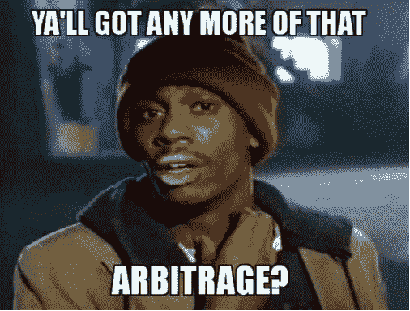

# 是时候创造历史了

> 原文：<https://medium.com/coinmonks/its-time-to-make-history-27d35aa13c8d?source=collection_archive---------13----------------------->

在成长过程中，我从来没有意识到历史课的重要性，我总是觉得它很无聊，浪费大量时间。尽管如此，我还是在最后一刻成功地通过了高中历史国家考试。向马克·张(Mark Chang)致敬，他提供了几门临时速成课程。

如果你不懂历史，那你就什么都不懂。你是一片不知道自己是树的一部分的树叶。—迈克尔·克莱顿

每个历史事件都有不同的重要程度，有些叙述可能是错误的。然而，它至少可以为我们的推理过程提供来自人类经验的观点。

最近的加密金融危机的许多受害者和观察者已经完全放弃了加密和 DeFi。一朝被蛇咬，十年怕草绳。

与银行和 TradFi 相比，为什么我们对 crypto 和 DeFi 的要求更高？

美联储的货币政策是自 19 世纪以来发展和演变的，但我们现在面临着滞胀风险，因为尽管经过一个多世纪的政策完善，经济增长放缓，通胀仍居高不下。银行和其他金融机构在过去卷入了几次金融危机，但我们完全相信他们有能力在任何时候全额退还我们的存款。

以下是我的观点，我希望它能给你一些启示和鼓励，让你开始探索 crypto 和 DeFi，它可能什么都不是。

套利是交易和做市行业中最流行的商业模式。套利是一种交易方法，交易者在许多市场同时买入和卖出一个项目，以从低效率市场带来的价格差异中获利，这种差异导致市场之间的价格或利率不匹配。每一家成功的交易公司和做市商都必须能够比对手更好地进行套利。然而，由于利润微薄，竞争对手众多，这个市场竞争异常激烈。因此，经常需要利用杠杆来保持竞争优势。

这种商业模式适用于所有公司，包括银行和货币做市商。银行的存在是为了支持现金的持续流动。如果缺乏竞争优势，他们怎么能保证每年的收益增长来取悦董事会和股东呢？最终，人性会占上风，因为我们都天生自私和贪婪。因此，他们经常选择冒险和激进的策略。

正如埃隆·马斯克常说的，命运爱讽刺，墨菲定律总会实现。过度杠杆化、不透明的贷款和人类判断失误导致影子银行被追加保证金，引发严重的流动性危机。可怜的平民最终要为他们不负责任的行为承担后果。

怀疑论者反对 crypto 的一个常见论点是，它解决了一个不存在的问题。从根本上说，加密货币是为了解决当前金融系统的问题。法定货币的主要问题是什么导致了比特币的产生。它的目标是从新的金融体系中移除上述杠杆，并对抗货币贬值。没有最后贷款人，也没有中央银行来扩大其资产负债表，以便在隐性金融危机时期纾困项目，这与现有金融体系中使用的公开市场操作不同。

有了加密基础设施，交易、义务和关系比传统市场更加明显。我觉得很有趣的是，在当前的危机中，任何拥有必要技能的人都可以从事法医工作，而不必等待专家来理清细节。然而，这也表明我们应该对这些结果持怀疑态度，因为会产生更多的 FUD。

鉴于卓越的回报和用户体验，以及生产力和透明度，区块链技术实现了一种新的价值传递方式。太有效了，太好了，不容忽视。随着市场的发展，我认为在建立一个更好的值得信任的系统之前，会有更多的夜晚充满噩梦。

美元指数(DXY)可能(也可能不会)呈抛物线走势；但当这种情况发生时，我们是否应该在重新获利之前从美元中获利以对冲风险？当然，除非你认同菲亚特的“超级周期”概念。

还记得你最想买 crypto 的时候吗？朋友们，是时候创造历史了。

感谢阅读，敬请关注更多 DeFi 内容！

作为我的新年决心的一部分，我将分享我在 crypto 的经历，以讲述由我工作中的朋友& crypto OGs 激发的更好的故事。

*免费加密&股票连同推荐启动你的旅程:*[*https://docs . Google . com/spreadsheets/d/1 f2bx-xkvmezorxdzqavgckina 1 PME _ uI9pa _ c4l 4-DM/edit？usp =分享*](https://docs.google.com/spreadsheets/d/1f2bX-xKvmEzOrxDZqAvgCkIna1pmE_uI9pa_C4l4-DM/edit?usp=sharing)

> 加入 Coinmonks [电报频道](https://t.me/coincodecap)和 [Youtube 频道](https://www.youtube.com/c/coinmonks/videos)了解加密交易和投资

# 另外，阅读

*   [3 商业评论](/coinmonks/3commas-review-an-excellent-crypto-trading-bot-2020-1313a58bec92) | [Pionex 评论](https://coincodecap.com/pionex-review-exchange-with-crypto-trading-bot) | [Coinrule 评论](/coinmonks/coinrule-review-2021-a-beginner-friendly-crypto-trading-bot-daf0504848ba)
*   [莱杰 vs n rave](/coinmonks/ledger-vs-ngrave-zero-7e40f0c1d694)|[莱杰 nano s vs x](/coinmonks/ledger-nano-s-vs-x-battery-hardware-price-storage-59a6663fe3b0) | [币安评论](/coinmonks/binance-review-ee10d3bf3b6e)
*   [加密交易机器人](/coinmonks/crypto-trading-bot-c2ffce8acb2a) | [Bingbon 评论](https://coincodecap.com/bingbon-review)
*   [Bybit Exchange 审查](/coinmonks/bybit-exchange-review-dbd570019b71) | [Bityard 审查](https://coincodecap.com/bityard-reivew) | [Jet-Bot 审查](https://coincodecap.com/jet-bot-review)
*   [3 commas vs crypto hopper](/coinmonks/3commas-vs-pionex-vs-cryptohopper-best-crypto-bot-6a98d2baa203)|[赚取加密利息](/coinmonks/earn-crypto-interest-b10b810fdda3)