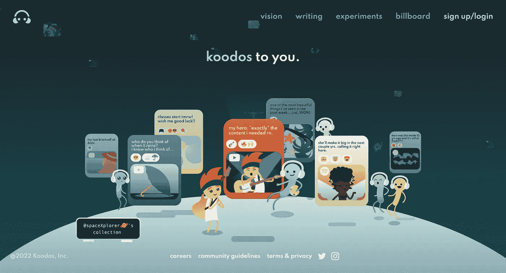

# Jad Esber 定义了 Web3 中的设计思维&他对没有区块链的 Web3 的看法

> 原文：<https://medium.com/coinmonks/jad-esber-is-the-co-founder-and-ceo-of-koodos-a-vc-backed-web3-company-31738149121a?source=collection_archive---------27----------------------->

Jad Esber | Co-Founder of Koodos | Affiliate at Harvard’s Centre for Internet & Society

贾德·埃斯伯是风投支持的 Web3 公司 koodos 的联合创始人兼首席执行官。他还是哈佛大学伯克曼·克莱恩互联网与社会中心的成员，也是新学院平台合作联盟的成员。他以社交空间和创造性工具以及与分散技术的交叉为主题进行创作、写作和演讲。他的兴趣涵盖数字身份、声誉系统、消费市场、监管和互联网文化。

Jad 之前在 Google & YouTube 工作，在那里他与新兴市场的创作者和艺术家一起工作和创作。他还获得了剑桥大学的工程学士和硕士学位，以及哈佛大学的工商管理硕士学位。在哈佛时，他是 Sainsbury 管理研究员，领导企业家俱乐部，并在 Lightspeed、Pear VC 和 Unshackled 担任研究员。

你们都会同意 Jad 有丰富的背景，我们非常荣幸在这一集的 NEWFORUM 中有这样一位不可思议的设计思想家！

我们以该领域许多人心中的一个问题开始了对话。

# **web 3 和 Web2 的设计思维有什么不同？**

> “我认为 Web3 和 Web2 的设计思维没有太大的区别。在这两种情况下，你都在试图理解用户的需求，并弄清楚如何最好地找到解决这些需求的方案，而不管技术是什么；Web3 中有趣的部分是，如果你愿意的话，许多后端是共享的基础设施，你可以依赖或贡献给其他人来构建，所以当涉及到为消费者构建应用程序时，Web3 中的许多焦点往往集中在更多的 UI 上，UX……”—Jad

他补充说，在 Web3 设计思维中，人们更加关注解决需求和建造人们喜欢的东西，因为他们可以带着他们的数据进入其他空间。

Jad 在完整的采访中进一步解释了 Web3 和 Web2 设计思维的差异。

Jad 和 Scott Kominers 教授共同为 [@a16z](https://twitter.com/a16z) 的未来&写了一篇[的论文](https://future.com/reputation-based-systems/)，这是一个帮助 Web3 平台设计声誉系统的框架。

> “我和 Kominers 教授一起写的这篇文章是因为我们非常关注人们如何设计令牌系统以及金融方面的过度指数化——锚定这一点的金融激励，许多系统非常专注于给人们一个令牌，数字上升是人们留下来的主要激励，所以我们想写一篇文章，为人们提供另一个可以依赖的框架……”—Jad

他概述了这篇文章，并鼓励大家阅读。他还谈到了自从他们在本期 NEWFORUM 中写了这篇文章以来发生了什么变化。

# 杰德在幻想库多斯的时候脑子里在想什么？

> “我从小在网上匿名写诗。我从小到大对自己的身份很迷茫。我来自一个混合的背景。我经常搬家，所以我像很多孩子一样求助于互联网来了解我是谁。我通过写诗做到了这一点，我写的诗最终成为了其他人接触的背景，所以我在成长过程中在网上交了很多朋友……”——Jad

Jad 让我们一瞥他的童年，因为互联网一直是一个身份探索和联系的地方，这一直是他从小到大的关注点、职业和生活的一大部分 Jad 在梦想 Koodos 时的主要想法。另一个灵感来自他在 YouTube 工作的时候。

> “这种想法就像我们可以在消费和积极创造的过程中受到启发，这一过程是我们探索自我、表达自我和与他人联系的一种方式，这种想法有点像是我非常受启发的东西……”—Jad

# **为什么在这个数字时代，创造一个安全积极的网络世界至关重要，Koodos 是如何弥合这一鸿沟的？**

Jad 谈到了建造感觉像我们身份的延伸的空间，这是你的，一个感觉像避难所的地方——这是 Koodos 旨在为他们的用户实现的目标。

> “在构建 Koodos 应用程序时，我们希望它感觉像是一个地方，你可以从网络上带来你喜欢的东西，并用你的上下文和评论来点缀它们，这样它们就可以生活在一个感觉像卧室的空间里。这就像走进你的卧室，看到你喜欢和拥有的东西都在这个空间里；这就是我们关注 Koodos 的原因……”—Jad

根据 Jad 的说法，更广泛的任务是如何建立某种形式的共享基础设施，其他人也可以写入和读取，这一直是他们最近试图解决的大问题。总之，他们正在开发一个应用程序，一个人们在互联网上喜爱的媒体协议。在他的完整采访中，他解释了更多关于 Koodos 的使命、愿景和未来项目。

Jad 在《哈佛商业评论》上发表了一篇与 [Scott Duke Kominers](https://hbr.org/search?term=scott%20duke%20kominers) 合著的文章，题为为什么要在 Web3 中构建？

文章摘录:

> “这是基于一个前提，即除了利用用户的数据赚钱，还有其他选择，相反，建立与用户直接分享价值的开放平台将为包括平台在内的所有人创造更多价值。web3 模式将起作用，因为 3 在 2 之后。它可能是基于区块链，也可能不是”

# 那么，我们如何与那些更喜欢控制数据的科技巨头竞争呢？区块链是 Web3 的解决方案吗？

> “Web2 之后是 Web3，就像数字 3 在 2 之后一样，所以你知道它会成功，因为它是我们所知的消费互联网的下一次迭代。它可能是基于区块链，也可能不是。我认为 Crypto 或 Web3 空间中的大量能量可能会催生接下来的东西，但我不认为这一定是因为区块链……”—Jad

他进一步解释说，围绕建立更开放的共享基础设施和集体所有权的势头是至关重要的，而区块链提供或促成了其中一些。他补充说，有其他技术也在一定程度上使这成为可能；这是他对 Web3 的看法。

> “就技术而言，我不是一个最大主义者，但就远离利用用户、未经他们同意的数据来赚钱的总体势头而言，我是这样认为的，所以我认为在我与《哈佛商业评论》的 Kominers 教授合写的那篇文章中。我们概述了一些依赖共享基础设施的有趣机会，例如，大多数人都在考虑如何将社交图从一个平台转移到另一个平台……”—Jad

Jad 解释说，这意味着你可以在前端或用户体验方面进行创新，并将你的社交图从一个平台带到另一个平台。他补充说，开发者和建设者可以开始考虑的是，我如何为用户建立最好的体验，以便他们自愿选择使用这个平台而不是另一个。这不应该是锁在这里你所有的数据，所以你必须来使用这个应用程序。

我们讨论的其他主题包括:

*   假设人们想从一个社会系统中赚钱会招致投机者。Jad 讨论了我们如何通过对*资产*或社区的心理所有权情感来创造关系资本。需要双令牌系统(声誉和财务)。
*   生态系统中的一个挑战是理解内容的背景——X 想了什么，感觉了什么，说了什么？我们讨论了如何在链上编码上下文。

加入 NEWFORUM 社区，与 Jad Esber 一起享受这一智力和信息丰富的插曲🔥

[加入社区](https://twitter.com/newforum_nco)了解  [@Jad_AE](https://twitter.com/Jad_AE) 并在 web3 社区中发现其他创始人和远见者！

✨follow·杰德·埃斯伯！推特:[@ Jad _ AE](https://twitter.com/Jad_AE)|[@ koodos](https://twitter.com/koodos)LinkedIn:[jades ber](http://linkedin.com/in/jadabiesber)网站:[koodos.com](https://koodos.com)

#新论坛#区块链#网络 3 #设计思维#社区#词汇学#UX #UI

爱 x 新论坛

# Twitter @newforum_nco

不和谐[@加入](https://discord.gg/2K8tvVh8tM)

# 新论坛

[NEWFORUM](https://newforum.notion.site/newforum/Welcome-to-NEWFORUM-48f9661398ec4ec6a1af37fcc96dc926) 由 [Newcoin Foundation](https://newcoin.org/) 提供支持，专注于促进去中心化社交应用的扩展，也被称为 Social 3.0，形成一个生态系统和一个由远见者、创造者和投资者组成的社区。它为思想者提供了一个安全的交流、传播和分享思想的空间，以确保一个新网络的自觉和道德发展，嵌入关怀、自由和创造力的价值观。✨每周新集！在 [Twitter](https://twitter.com/newforum_nco) 、 [Newlife](https://newlife.io/) 、 [Youtube](https://www.youtube.com/channel/UCWvHyau1nIJBffmaaj6FmbQ) 和 [LinkedIn](https://www.linkedin.com/showcase/newforum/) 上关注我们，了解 web3 的更多信息，认识生态系统！加入生态系统[不和](https://discord.gg/DHepA4WTkN)！

> 交易新手？尝试[加密交易机器人](/coinmonks/crypto-trading-bot-c2ffce8acb2a)或[复制交易](/coinmonks/top-10-crypto-copy-trading-platforms-for-beginners-d0c37c7d698c)