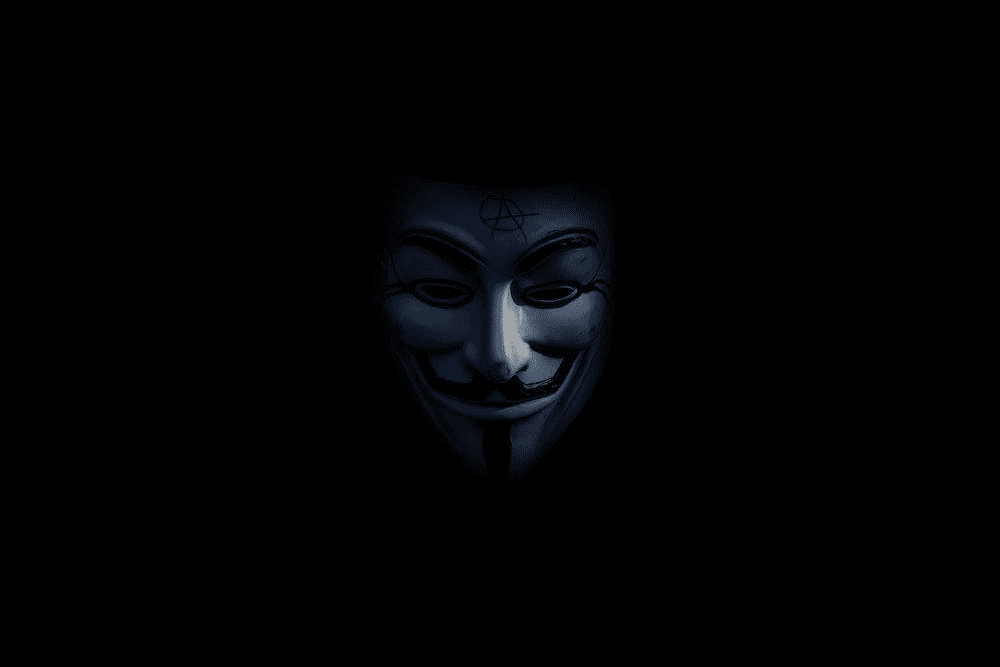

# 詹姆斯·钟和第二大加密货币缴获案

> 原文：<https://medium.com/coinmonks/james-zhong-and-the-second-largest-seizure-of-cryptocurrency-cf6adac24ffd?source=collection_archive---------4----------------------->

美国司法部周一宣布，已从詹姆斯·钟(James Zhong)手中查获约 33.6 亿美元的被盗比特币。这是司法部的一个重大胜利，它传达了一个明确的信息:犯罪是不值得的。钟被指控从几个不同的交易所窃取比特币，他目前面临洗钱、电信欺诈和其他指控