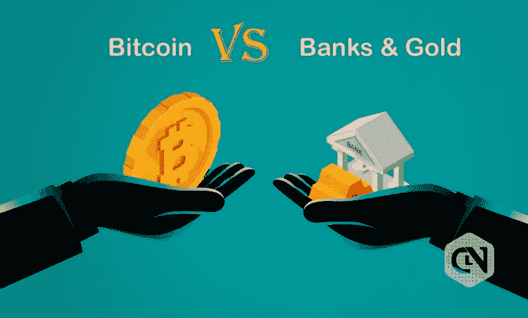

# 杰米·戴蒙在比特币上的反复无常可能是一种长期策略

> 原文：<https://medium.com/coinmonks/jamie-dimons-fickleness-on-bitcoin-might-be-a-long-term-strategy-in-play-a1cf6092e328?source=collection_archive---------47----------------------->

Does Jamie Dimon, the CEO of the largest, most powerful bank in the world, hates or loves bitcoin?

杰米·戴蒙为什么对比特币如此善变？

你曾经对某些事情变化无常吗？

有没有犹豫不决的时候？

有没有过对某件事说好，但又说不，然后不知何故又说好的经历？

别担心，你并不孤单。

这似乎影响到每个人，即使你是摩根大通，一家价值超过 3000 亿美元的投资银行的王者。

你必须明白的一件事是，摩根大通的首席执行官杰米·戴蒙绝对是一位野兽般的首席执行官。

他一直被认为是我们这一代最优秀的领导人之一，也是金融界的一个强有力的人物。

JPMorgan Chase, with a market cap of $360B, is one of the largest and most powerful bank in the world.

凭借 2.87 亿美元的资产负债表，你可以说杰米是继总统之后世界上最强大的领导人之一。

有着如此巨大的影响力和力量，你的话有着非凡的效果。

因此，人们应该预计杰米会非常小心自己的言辞，特别是在涉及加密和比特币等敏感话题时。

天啊，杰米对#BTC 的爱恨情仇变化无常。

我没有时间去跟踪杰米说的每一句话，但这里有一个简单的例子:

2014 年:他告诉美国消费者新闻与商业频道，比特币是一种糟糕的价值储存手段。

2017 年:他说比特币是一个骗局，“比郁金香球根还糟糕。不会有好结果的。有人要被杀了，”。

2019 年:他推出了 JPM 硬币，一种与美元挂钩的稳定硬币。

2021 年:他说**比特币是‘一点点傻瓜的黄金’。**

2021 年:他宣布摩根大通客户现在可以购买比特币(万岁！)

2021 年:他参加了国际金融研究所的年会，并表示“他个人认为比特币一文不值”。

2022 年:他随后在股东信中写道，摩根大通处于这些加密创新的“前沿”。

Jamie Dimon vs BTC: who will win?

来吧杰米。

我喜欢你。

真的。

我尊重你的职业道德、敏锐的商业头脑和领导才能。

但是请你下定决心。

你到底爱不爱比特币？

你给我们的是混合信号，就像酒吧里的醉汉。

我确实明白为什么像摩根大通这样的银行会反对比特币。

比特币是专门用来对抗摩根大通这样的大银行，并可能推翻它们的。

BTC and Banks will always be in an eternal struggle.

银行讨厌比特币或者至少不支持比特币是很自然的。

但随着比特币变得更加主流，市场对它的需求越来越大，胃口越来越大，很快，没有人能够避免比特币的必然性。

回到杰米。

他是故意含糊其辞吗？

或者这可能是他一直以来的长期策略？

故意没有明确的立场。

拖延时间，巧妙安抚。

直到恰当的时机，他明确了自己的立场并宣布获胜。

可能是他正在部署的一个长期计划。

让我们看看好吗？

-

银行害怕比特币吗？

-

# startups # business # startupx # growth # success # social media # culture # entrepreneurs # strategy # eth # BTC # crypto # jp Morgan # markets # bear market # NFT # Jamie Dimon # Jamie # tulip # fools gold

> 交易新手？试试[加密交易机器人](/coinmonks/crypto-trading-bot-c2ffce8acb2a)或者[复制交易](/coinmonks/top-10-crypto-copy-trading-platforms-for-beginners-d0c37c7d698c)