# 日本烛台图案举例说明

> 原文：<https://medium.com/coinmonks/japanese-candlestick-patterns-explained-with-examples-5c7bc38e0bcc?source=collection_archive---------1----------------------->

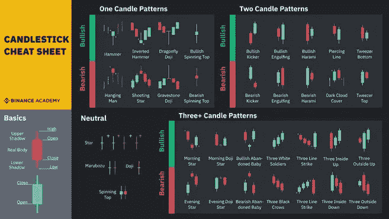

Candlestick cheat chart from Binance Academy

蜡烛图是分析价格趋势最常用的技术工具之一。

交易员和投资者使用蜡烛图寻找可能有助于预测价格走势的模式。

如果你还不熟悉烛台，你可以在这里学习如何阅读烛台。

在这篇文章中，我将用插图解释常用的烛台模式。

**吞没酒吧烛台图案**

当它完全吞噬掉面前的烛台时，就会产生一个吞没的长条。

即使它可能吞噬几个烛台，只有当它消耗至少一个烛台时，它才被视为吞噬酒吧。

熊市吞没酒吧是最受欢迎的烛台模式之一。

这个烛台模式有两个主体(第一主体和第二主体，第二主体吞没第一主体)

请参见下图:

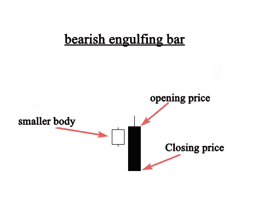

Image from Japanese Candlestick Bible

在你的图表上，一个熊市吞没形态出现了，就像这样。这个蜡烛图提供了市场多头和空头的有价值的信息。

空头吞没棒线表明卖方控制了市场。

这种模式表明，在上升趋势的顶峰，买家被卖家吞没，表明趋势反转。

这里有一个例子:

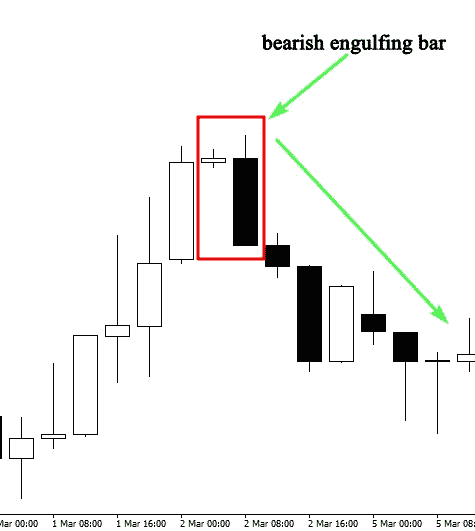

当这种价格行为模式在上升趋势中出现时，它表明趋势反转，因为卖方试图迫使市场下跌，因为买方不再控制市场。

不是你在图表上发现的每一个熊市烛台模式都是可以交易的；您必须使用额外的技术工具来验证您的输入。

在我随后的文章中，我将对此进行更深入的讨论。现在，我只想让你认识到你在烛台图表上发现的任何看跌烛台模式。

**多头吞没棒线形态**

牛气的吞没杆由两个烛台组成，第一个是微小的身体，第二个是吞没烛台。

请看这幅插图:

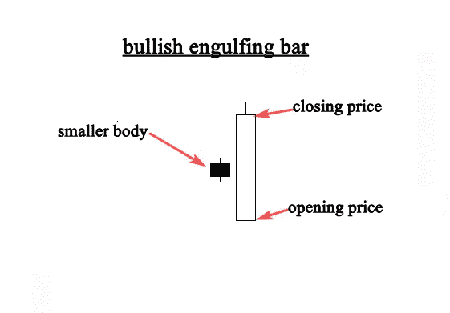

多头吞没棒线模式表明，买方将主导市场，因为卖方不再控制。

当一个看涨吞没烛台在上升趋势市场出现时，延续信号是值得注意的。

当牛市吞没烛台出现在下降趋势市场的底部时，反转明显更强，因为它也意味着投降底部。

这里有一个例子:

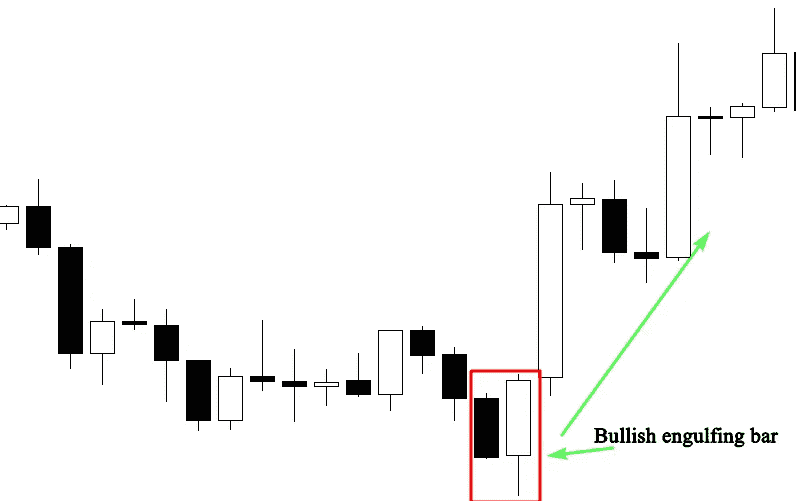

上图很清楚地显示了在多头吞没形态出现后市场是如何变化的。

代表购买力的大身体吞没了代表销售力的小身体。

尸体是什么颜色并不重要。重要的是第二个烛台完全吞没了较小的一个。

为了确定这个模式是否值得交易，你需要考虑其他的融合因素，所以不要单独使用这个价格行为设置进行交易。

我想让你现在学习的是如何在你的图表上识别看涨和看跌的吞没棒线。

**多奇烛台图案**

多奇烛台模式有助于日本烛台分析。当市场以相同的价格开盘和收盘时，这表明买方和卖方都没有控制市场，双方都同样犹豫不决。

这里有一个例子:

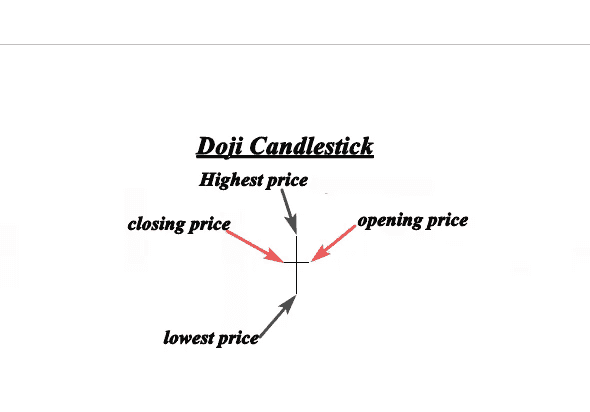

大家可以看到，开盘价和收盘价是一样的，说明市场还没有决定走哪个方向。

当这种模式出现在上升趋势或下降趋势时，它表明市场反转的可能性。

> 交易新手？试试[密码交易机器人](/coinmonks/crypto-trading-bot-c2ffce8acb2a)或者[复制交易](/coinmonks/top-10-crypto-copy-trading-platforms-for-beginners-d0c37c7d698c)

有关更多详细信息，请参见示例:

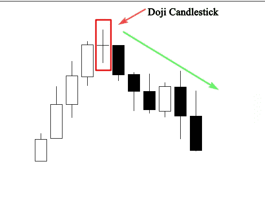

上面的图表描述了多奇蜡烛线形成后市场的变化趋势。

市场在上涨，表明买家在控制市场。

多奇烛台的出现表明，买家无法维持较高的价格，从而允许卖家将价格下调至开盘价。

这是趋势逆转可能发生的明显迹象。

请记住，多奇代表市场平等和犹豫不决；它通常出现在大幅上涨或下跌之后。

当它出现在趋势的底部或顶部时，它揭示了前面的市场趋势正在失去力量。

如果你已经在这个趋势上了，是时候获利了结了；但是，当它与其他技术分析工具结合使用时，也可以作为进场信号。

**蜻蜓多奇图案**

当开盘价、最高价和收盘价相同或相等时，就会出现蜻蜓多奇(看涨烛台模式)。

蜻蜓多奇长长的下影线描绘了买家的抵制和努力推动市场走高。

参见示例:

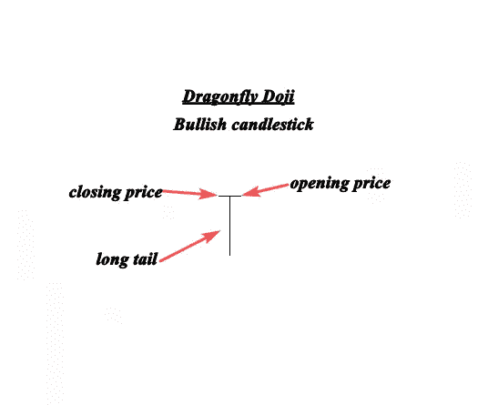

上图描绘了一只完美的蜻蜓多奇。

长长的下影线表明供求力量正在接近平衡，趋势的移动可能接近一个转折点。

下面的例子显示了蜻蜓多奇创造的看涨反转信号。

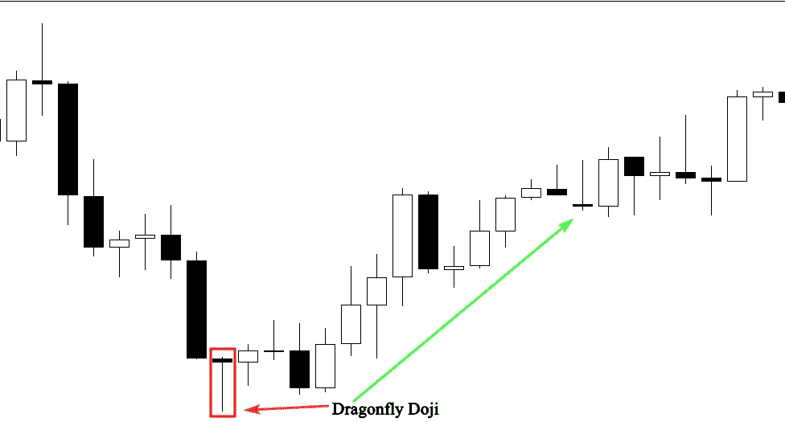

在上面的图表中，市场正在测试之前的支撑位，这导致了这个区域的强烈反弹。

长尾巴的蜻蜓多奇形态显示了该区域强大的买入压力。

如果你能认出这个烛台模式，你就能在你的图表上看到哪里有支持和需求。

当它在下跌趋势中出现时，被视为看涨反转信号。

然而，记住你不能单独交易烛台模式；你还需要其他指标和工具来识别市场中蜻蜓多奇信号的高可能性。

**多奇的墓碑**

墓碑多奇是蜻蜓多奇的看跌对手，当开盘价和收盘价相同或接近时形成。

多奇墓碑上长长的尾巴将它与多奇蜻蜓区别开来。

一条长长的上尾巴的出现表明市场正在接近一个供应区或阻力区。

请参见以下示例:

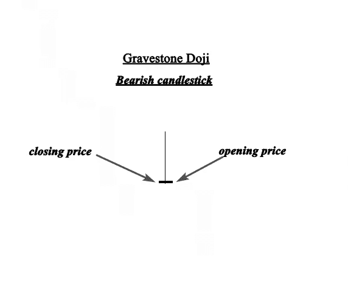

上图描绘了一个理想的多奇墓碑。它表明，买方推动价格明显高于公开。

后来卖家涌入市场，导致价格再次下跌。

这也是多头正在失去动力的迹象，市场正在为反转做准备。

参见下面的另一个例子:

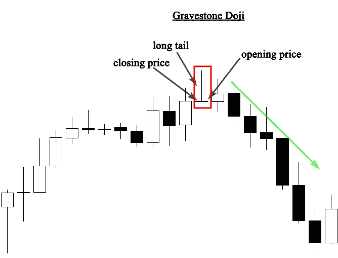

经过一段时间的大规模看涨活动，上面的图表显示了上升趋势顶部的墓碑多奇。

这种烛台模式的形成，说明买家已经失去了对市场的控制。

这个形态必须出现在阻力位附近，它才是可靠的。

**结论**

*作为一个交易者，要有效地解读墓碑多奇，你需要更多关于它的位置和背景的信息。*

我会在随后的帖子中写下这件事。

*如果你喜欢这篇文章，* [*关注*](http://medium.com/bukz_dwriter) *我并分享帮助其他人找到它。*