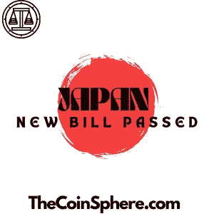

# 日本关于稳定资本的新法案

> 原文：<https://medium.com/coinmonks/japans-new-bill-regarding-stablecoins-3165eedba065?source=collection_archive---------24----------------------->

For the best Crypto News in the world, visit TheCoinSphere.com

据报道，日本金融厅(FSA)宣布，将于 2023 年解除对外国发行的 stablecoins 在日本发行的禁令。稳定币是一种加密货币，与美元等稳定资产挂钩，以降低价格波动。

> 从顶级交易者那里复制交易机器人。免费试用。