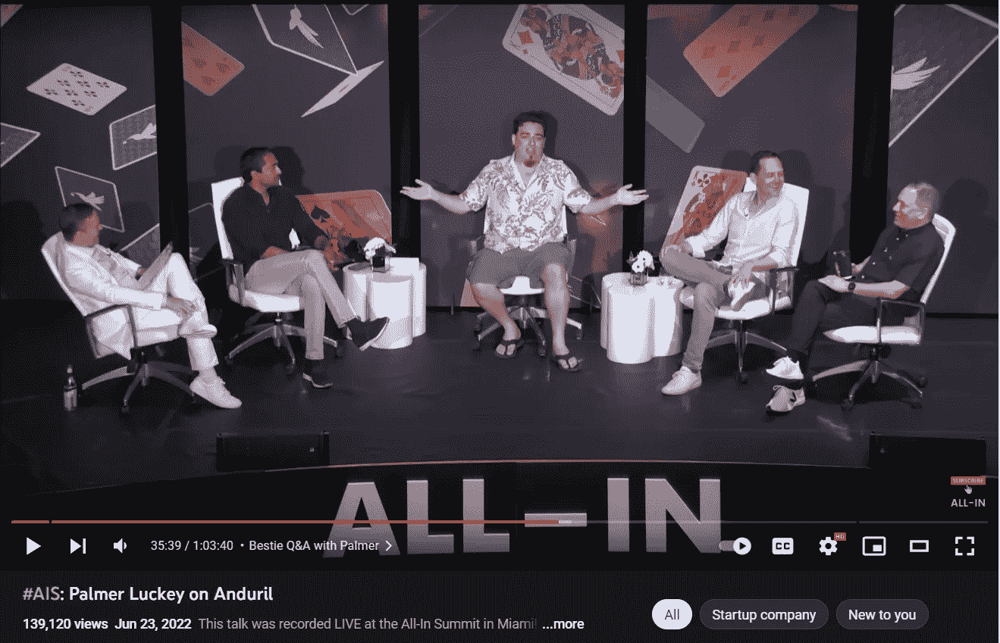
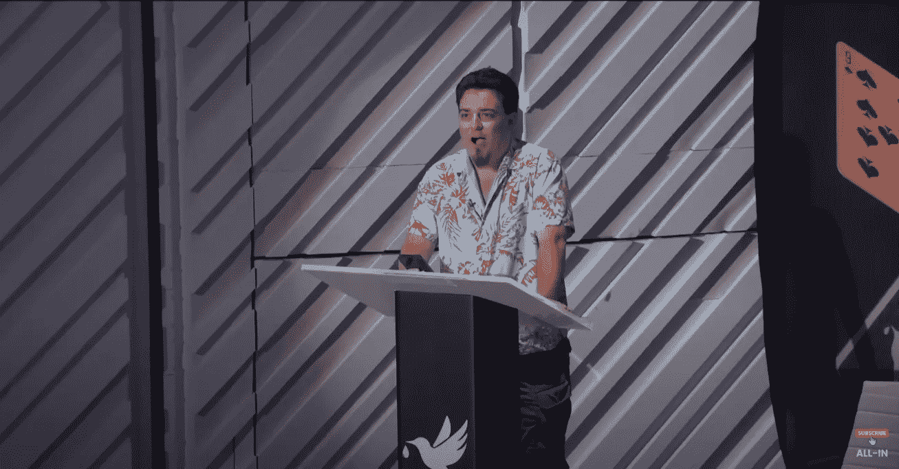

# 杰森对帕尔默教会了我无论发生什么都要专业

> 原文：<https://medium.com/coinmonks/jason-vs-palmer-taught-me-to-be-professional-no-matter-what-happens-f7c2b1aeb921?source=collection_archive---------3----------------------->

Palmer at the All-In Summit in Miami confronting Jason live on-stage.

你上一次经历如此美丽的故事，以至于不得不分享，是什么时候？

当我看到帕尔默·拉基在杰森自己的活动舞台上与杰森·卡拉卡尼斯现场对决时，我想我明白了。

我很少遇到美丽的故事。

但这是一个我觉得绝对丰富和值得分享的故事。

这是一个关于因果报应、谦逊和专业精神的故事。

这是一堂关于如何控制你的情绪、控制你的言辞以及成为处理迎面而来的争议的大师的课。

让我来给你描述一下，让你有一个更好的背景。

杰森·卡拉卡尼斯是一位受欢迎的天使投资人，他有一个非常成功的播客。

他经常对企业家世界的所有事情发表评论。

Palmer Luckey(是的，这是他的真名)在 2009 年成立了 Oculus Rift，当时他只有 16 岁。

FaceBook 在 2014 年以 1000 万美元的价格收购了 Oculus。

Zuckerberg might be ahead of the curve on the metaverse when they bought Oculus back in 2014.

我想你可以说他是个天才少年，很早就赚了钱。

争议始于他向一个支持唐纳德·特朗普的团体捐赠了 1 万美元。

杰森叫他出来，在他的播客上抨击他。

帕默说，杰森试图毒害他的职业生涯，他的话对他的生活产生了直接的负面影响。

帕尔默接着描述了杰森和其他许多人是如何试图毁掉他一生的工作，并让他被 Oculus 解雇的。

他是在杰森自己的活动中亲自上台说这些话的，在杰森亲自邀请之后，他是活动的主题发言人。

被点燃了，痛苦的，可恨的，好斗的。

这就是帕默在发表演讲时的感受，他很清楚杰森无法阻止他。

尴尬，痛苦，尴尬，受伤。

在帕默说话的时候，站在他身后几步远的地方，杰森一定是这样感觉的。

这种紧张是显而易见的，令人兴奋。

事情是如何发展的？

杰森是不是冲到舞台上阻截了帕默？

紧张突然爆发了吗？

帕尔默后来让步和杰森拥抱了吗？

其实是的！

接下来发生的事情简直就是一堂大师课，教你如何控制自己的情绪，做一个优雅、亲切的主人。

Watch the full clip here, it is quite nail-biting especially when it catches you off-guard: [https://www.youtube.com/watch?v=nK0NfL2M5L4](https://www.youtube.com/watch?v=nK0NfL2M5L4)

杰森拍拍帕默的背，和他握了握手，邀请他坐下来交谈。

他没有急于进行辩论。

他很有耐心，很和蔼，给了帕默很多机会来表达和澄清他的感受。

杰森的伙伴们都在舞台上，这确实有所帮助，稍微缓解了一下局面。

这是一堂真正的大师课，讲的是在如此困难的情况下该怎么做。

不要跳，冷静一下，专业一点。

不要急着还击，做个好运动员，让他们先发泄。

尽可能不要反驳、转移、按摩和重新措辞。

这是一种应对痛苦、激烈的局面的绝妙方式，这种局面显然会让任何人感到尴尬。

那天我学到了一些东西。

-

你会和你的敌人握手吗？

-

# startups # business # startupx # growth # success # social media # culture # entrepreneur # strategy # eth # bit coin # jasongalanis # plamerluckey # podcast # Miami # web 3 #对抗

> 交易新手？试试[加密交易机器人](/coinmonks/crypto-trading-bot-c2ffce8acb2a)或者[复制交易](/coinmonks/top-10-crypto-copy-trading-platforms-for-beginners-d0c37c7d698c)