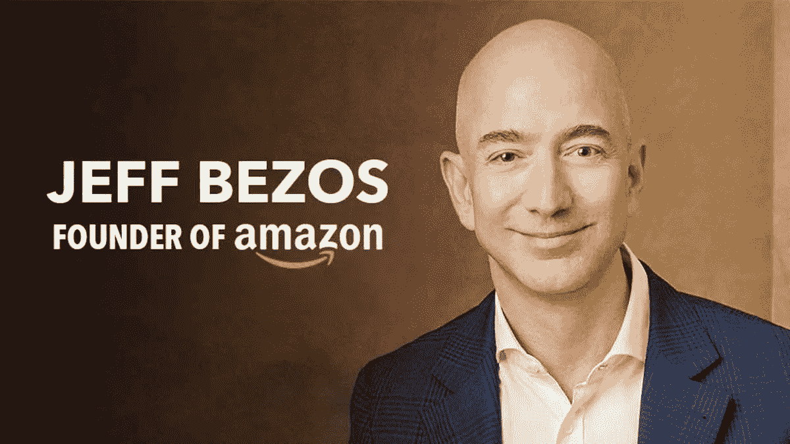
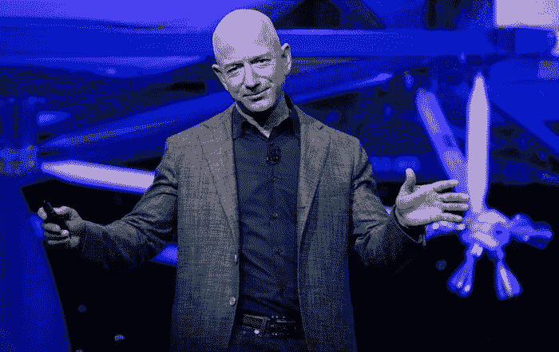
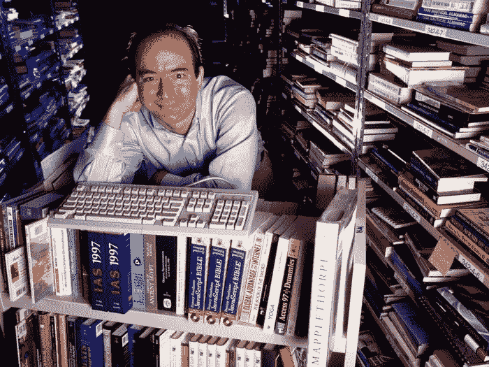
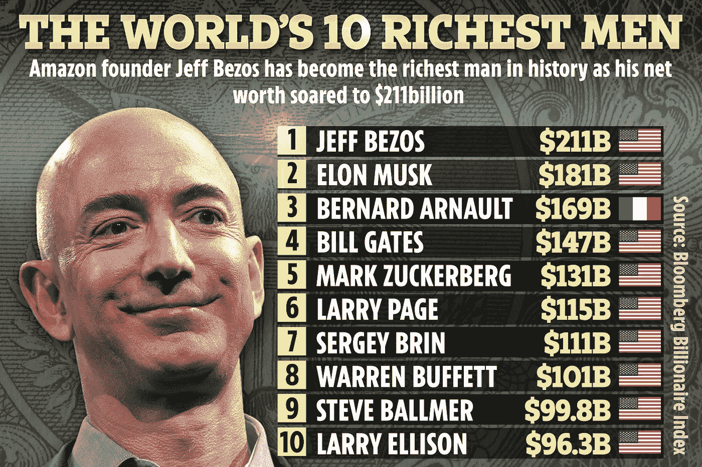

# 杰夫·贝索斯在当场雇用她之前只问了两个问题

> 原文：<https://medium.com/coinmonks/jeff-bezos-asked-just-2-questions-before-hiring-her-on-the-spot-92c1f3f986e8?source=collection_archive---------17----------------------->

Jeff Bezos, one of the richest man in the world, has some amazing hiring stories.

我读过一篇文章，详细介绍了杰夫·贝索斯在问了两个问题后是如何雇佣这位女士的。

我被迷住了。

不仅仅是因为这只是两个问题，而是背后的思考过程和意识形态。

贝佐斯在采访开始时承诺，他只会问两个问题，第一个问题会是一个“有趣”的脑筋急转弯。当他站起来，在白板墙上取下一支笔时，我深吸了一口气。“我来算算，”他说。我要你估计一下西雅图市有多少块玻璃。""

她深吸一口气，放慢速度，在开始之前仔细理解这个问题。

Every CEO has the insurmountable task of hiring the right talent for their business.

对于看似“不可完成”的任务，这是一种强有力的方法。

你冷静下来，集中精力，在把事情分解成小块来解决之前，了解所有的细节。

她从西雅图的人口开始，估计有多少房子，交通等等。

这是有条不紊的和合乎逻辑的。

这不是精确或准确的问题。

还会有下一次的。

它是关于观察一个人如何处理一个不可能的问题以及背后的思维过程。

他们会崩溃并跌入自我失败的深渊吗？

他们在压力下冷静吗？

他们的假设合乎逻辑和明智吗？

他们能够深思熟虑地证明和推理它吗？

不敢相信杰夫亲自在黑板上写字，和她一起计算。

Even a multi-billion dollar company like Amazon is built on the premise of hiring the right talent at the right time.

第二个问题是关于她的职业目标。

“我解释说，我不知道如何成为一名助理，但我知道不断跳出舒适区的重要性。我想跳进一条天文数字般的学习和成长曲线。”

有趣的是，仅仅两个问题就能揭示一个人这么多。

“面试结束时，我们都知道我会为成功做任何事，尽管我只是一个非常初级的候选人。然后我就完了。筋疲力尽，兴奋不已，完蛋了。贝佐斯最终当场聘用了我。他给了我一张离他自己的桌子只有三英尺远的桌子。这是公司里离他最近的一张桌子。”

他们的动机，他们对卓越的渴望，他们的思维过程和解决问题的态度。

我们真的需要重新思考我们处理这些问题的方法，并花一些时间对此进行更深入的思考。

Just a reminder that Bezos was once the richest man alive, before Elon Musk’s domination.

没有人对每件事都有答案，每天都会有新事物出现来挑战我们。

我们需要有克服困难的毅力，有深思熟虑地处理问题并从逻辑上解决问题的能力。

这些不是大学里教的，也不是通过看网飞学来的。

随着我们的成熟，我们必须突出并积极地获得这些技能。

哦，我不太确定如果你在自己的采访中开始问这样的问题，这将如何进行。

我是说杰夫在这方面做得很好，我不确定其他人能否复制这个结果。

-

现在很难找到好的人才吗？

-

#创业#商业# startupx #成长#成功#社交媒体#文化#创业#战略# jeffbezos #面试#亚马逊#未知# annrhiatt #问题#西雅图#创始人

> 交易新手？试试[加密交易机器人](/coinmonks/crypto-trading-bot-c2ffce8acb2a)或者[复制交易](/coinmonks/top-10-crypto-copy-trading-platforms-for-beginners-d0c37c7d698c)