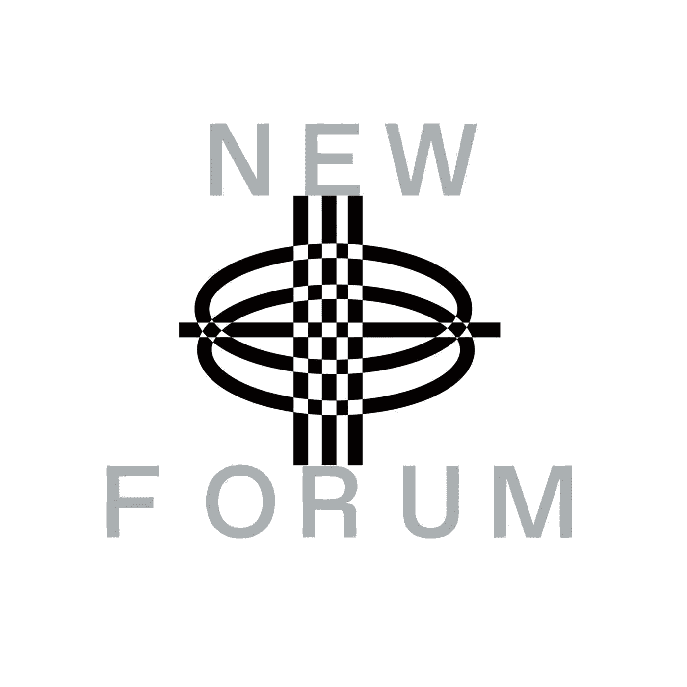

# Joey DeBruin 解释了伟大的 UX 设计的障碍&在 Web3 中建立支持者社区的本质

> 原文：<https://medium.com/coinmonks/joey-debruin-explains-the-barriers-to-great-ux-design-the-essence-of-building-a-community-of-24a98dfde323?source=collection_archive---------48----------------------->

Joey DeBruin | Former Neuroscientist | Co-Founder & CEO Of [Backdrop](https://twitter.com/withBackdrop)

Joey DeBruin 在 NEWFORUM 上加入我们，讨论他对 Web3 中伟大 UX 的障碍的见解，以及他如何帮助每个人参与 Web3 标记化社区。他还谈到学术界和 Web3 是知识社会的未来，并利用 Web3 建立一个支持者社区。乔伊是一名前神经科学家，他在过去的十年里致力于构建市场和网络产品。他是 background 的联合创始人，background 是一个帮助每个人参与 Web3 符号化社区的平台。此外，乔伊还为他的时事通讯《飞企鹅》撰写了关于同行制作的文章。

# 前神经科学家乔伊为什么转行到 Web3？

> “我离开了科学界，因为我对这个系统非常失望；这很官僚，很难向前推进，而且它与我的感觉或我认为它应该如何工作不一致……”—Joey

乔伊离开科学后，他最初的计划是开一家餐馆，因为他热爱烹饪。他决定在一家餐馆工作一段时间，并意识到这是一个坏主意。

乔伊的一个朋友说服他接受了旧金山一家名为 Growth 的小公司的一个空缺职位。他的朋友是怎么做到的？他的朋友向乔伊解释说，他会像一个科学家，但不是产品，他可以运行一个没有官僚作风的实验，并尽可能有创造力。

乔伊表示，这是在正确的时间进行的正确的推介，这就是他进入科技行业的方式。

乔伊后来有机会在一个名为 Research Gate 的社区工作，这是科学家或学者发现科学知识并与科学界保持联系的最大专业网络。在那里工作让他结合了自己的大部分兴趣，他开始研究一些他作为神经科学家在实验室亲身经历过的问题。这条路最终让他涉足 Web3。乔伊告诉我们，对他来说，这种联系来自学术界。

> “我的整个职业生涯都在为创造者、企业家和需要思考的人服务；你明天如何赚钱，这样你就可以支付你的账单，继续做你想做的事情，所以很明显，很多有趣的实验正在 Web3 中进行，尤其是围绕过去通常很难赚钱的东西，我认为对我来说，科学是一个经典的例子，就像对世界如此有价值的东西一样，很难从数字产品中获取价值，而数字产品本质上就是今天的科学，所以这就是我如何进入 Web3 的。”乔伊

当 Joey 进入 Web3 时，他开始为一些 Dao 兼职工作，他对建筑的渴望使他与他的联合创始人 Rapha 共同创建了 background。在他的完整采访中，他分享了更多关于这段经历的信息。

# Joey 如何创建一个社区，为什么他认为社区建设在 Web3 中是必不可少的？

> 你知道，如果有人关心你在做什么，他们可能不会全职为你工作，甚至不会提供奖金或诸如此类的东西，但他们是你的支持者，你的粉丝，也许是你未来的投资者或合作者。我们只是觉得社区人口没有得到真正的关注，或者他们没有很好的体验，因为他们的行为与众不同……”—Joey

乔伊用不同层次的洋葱类比，以最精彩和最有意义的方式定义了社区。他解释说，这不是为了更接近洋葱的核心，而是本质上一个健康的社区有所有这些不同的层，它们以不同的方式行事。观看他的完整采访，听听他对健康社区的理念，以及为什么社区建设在 Web3 中很重要。

# **这是本期 NewForum 节目中与乔伊讨论的其他话题的概述！**

*   投机性和非投机性令牌之间的区别，以及非投机性令牌建立社区所有权的机会。

> “在这一点上变得很明显，社区所有权是帮助实现生活的魔法，所以作为一个创造者或企业家，在世界上通常很难建立和追随你的梦想，我认为社区所有权是一种神奇的工具，可以在许多方面帮助你。”——Joey

*   降低构建符号化社区的摩擦
*   Joey 在 web3 中解释了 UX 设计师面临的最大挑战，以及我们要实现伟大的 UX 设计必须克服的障碍。
*   知识的历史和知识社会的未来，web3 对此有影响吗？观看完整的采访，听听乔伊的精彩回应。

✨Don't 怀念 Joey✨这段有意义又有见地的插曲

[加入社区](https://twitter.com/newforum_nco)了解 [@joey_debruin](https://twitter.com/joey_debruin) 并在 web3 社区中发现其他创始人！

✨follow·奥沃·阿尼提！推特:[@ joey _ debruin](https://twitter.com/joey_debruin)|[@ with background](https://twitter.com/withBackdrop)网站:[background . so](https://backdrop.so/)

# new forum # web 3 # community # creator economy # token # UX design

爱 x 新论坛

# Twitter @newforum_nco

不和谐[@加入](https://discord.gg/2K8tvVh8tM)

# 新论坛

[NEWFORUM](https://newforum.notion.site/newforum/Welcome-to-NEWFORUM-48f9661398ec4ec6a1af37fcc96dc926) 由 [Newcoin Foundation](https://newcoin.org/) 提供支持，专注于促进去中心化社交应用的扩展，也被称为 Social 3.0，形成一个生态系统和一个由远见者、创造者和投资者组成的社区。它为思想者提供了一个安全的交流、传播和分享思想的空间，以确保一个新网络的自觉和道德发展，嵌入关怀、自由和创造力的价值观。✨每周新集！在 [Twitter](https://twitter.com/newforum_nco) 、 [Newlife](https://newlife.io/) 、 [Youtube](https://www.youtube.com/channel/UCWvHyau1nIJBffmaaj6FmbQ) 和 [LinkedIn](https://www.linkedin.com/showcase/newforum/) 上关注我们，了解 web3 的更多信息，认识生态系统！加入生态系统[不和](https://discord.gg/DHepA4WTkN)！

> 加入 Coinmonks [电报频道](https://t.me/coincodecap)和 [Youtube 频道](https://www.youtube.com/c/coinmonks/videos)了解加密交易和投资

# 另外，阅读

*   [火币的加密交易信号](https://coincodecap.com/huobi-crypto-trading-signals) | [Swapzone 审查](/coinmonks/swapzone-review-crypto-exchange-data-aggregator-e0ad78e55ed7)
*   [最佳加密交易机器人](/coinmonks/crypto-trading-bot-c2ffce8acb2a) | [购买索拉纳](https://coincodecap.com/buy-solana) | [矩阵导出评论](https://coincodecap.com/matrixport-review)
*   [Coldcard 评论](https://coincodecap.com/coldcard-review) | [BOXtradEX 评论](https://coincodecap.com/boxtradex-review)|[unis WAP 指南](https://coincodecap.com/uniswap)
*   [比特币基地评论](/coinmonks/coinbase-review-6ef4e0f56064) | [德里比特评论](/coinmonks/deribit-review-options-fees-apis-and-testnet-2ca16c4bbdb2) | [FTX 评论](/coinmonks/ftx-crypto-exchange-review-53664ac1198f)
*   [Coinmetro 评论](https://coincodecap.com/coinmetro-review) | [VirgoCX 评论](https://coincodecap.com/virgocx-review)