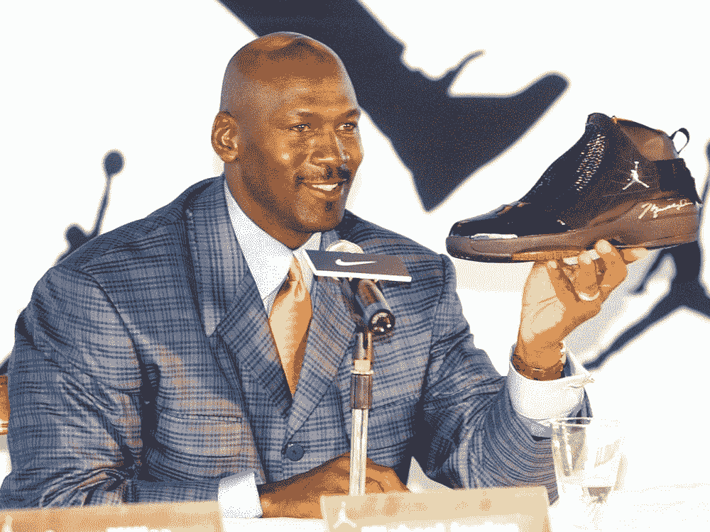
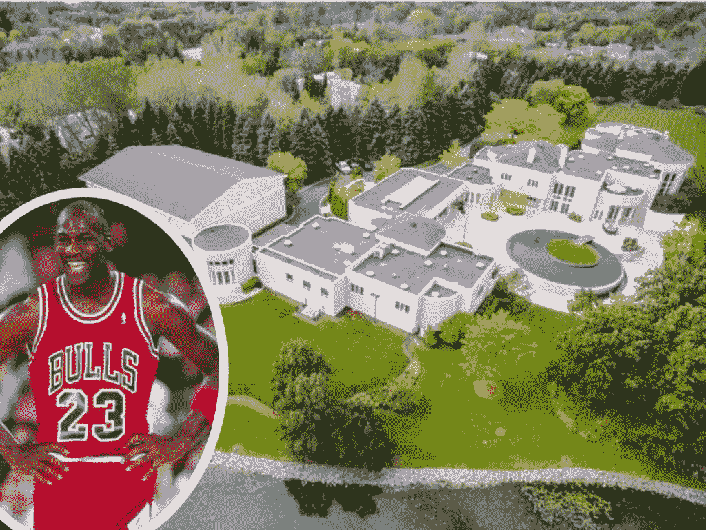
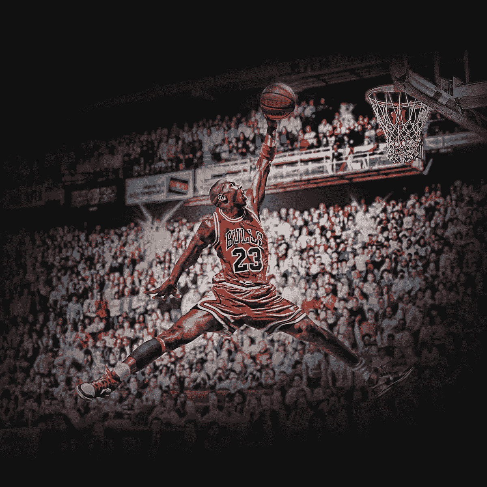
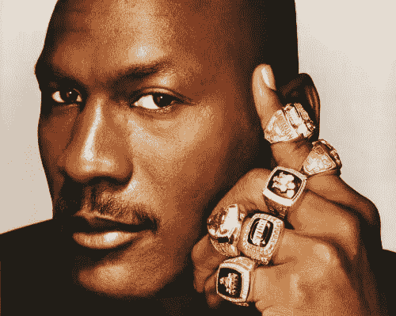

# 乔丹是有史以来最伟大的球员，但勒布朗可能是王位继承人

> 原文：<https://medium.com/coinmonks/jordan-is-the-greatest-of-all-time-but-lebron-might-be-heir-to-the-throne-6db0b04bba37?source=collection_archive---------25----------------------->

In 2016, Jordan became the first billionaire player in NBA history . Also in 2016, President Barack Obama awarded him the Presidential Medal of Freedom. As of 2022, Jordan’s net worth is estimated at $1.7 billion.

迈克尔·乔丹。

基本上是有史以来最伟大的篮球运动员。

在他为 NBA 效力的 15 年中，他获得了 6 次 NBA 总冠军(两次三连冠，不少于两次)，并单枪匹马地改变了未来几代人的篮球运动。

他在 NBA 官方网站上的传记写道:“毫无疑问，迈克尔·乔丹是有史以来最伟大的篮球运动员。”真的。

我想知道为什么他背着整个 NBA 这么多年了还没有任何严重的背部问题！

80 年代和 90 年代的粉丝被他的运动能力、技巧和高度竞争的心态所感染和迷恋。

几代人之后，他的遗产继续流传。

比如尼奥宠物，口袋妖怪，马里奥。

好的品牌永远不会消失。

你可能听说过他作为一个著名的篮球运动员或亿万富翁运动员。

或者他在芝加哥有一座疯狂的豪宅，十年后仍未售出。

Wanna buy MJ’s Chicago mansion?

我无法理解这一点。

把它变成约旦博物馆什么的。

很肯定，这将带来一些现金，而不是让它随着时间的推移而贬值。

但是你明白了。

他基本上是世界上最有竞争力的选手。

他想赢。

不管是什么。

他只想赢。

无论是在 40 岁重新加入 NBA，钓鱼，拥有另一支 NBA 球队还是纳斯卡。

他只是痴迷于胜利。

无论他在 NBA 多么强大，他真正的胜利来自于球场之外。

Few athlete will ever be as iconic as MJ’s time-stopping aerial display of incredible acrobatics.

在廷克·哈特菲尔德决定违背菲尔·奈特的意愿，为 MJ 设计了一款带有臭名昭著的飞人标志而不是典型的耐克标志的鞋子后，他与耐克合作。

结果呢？

MJ 现在已经从耐克那里赚了超过 100 万美元的 1B，并且每年收取 1 . 5 亿美元的版税。

耐克股票从 1988 年到 2020 年的回报率为+42，000%。

努夫说。

耐克售出的每双乔丹鞋中有 5%是由乔丹制造的。

这就是他今天身价 17 亿美元的原因。

The man has 6 NBA Championships rings. He went to the NBA finals 6 times and won all 6 of them.

但你猜怎么着，勒布朗·詹姆斯在最近成为亿万富翁后，就快成功了。

他是第一个成为亿万富翁的现役 NBA 球员。

这也令人印象深刻。

MJ 退役后花了 11 年才加入亿万富翁俱乐部。

乔丹可能是只山羊，但勒布朗将来可能会更富有。

-

迈克尔·乔丹是有史以来最好的篮球运动员吗？

-

#商业#创业#成长#成功#社交媒体#文化#创业#战略# eth # btc #加密# nft # nike #品牌#营销# nikenft # michaelmjordan #勒布朗詹姆斯# nba #篮球#乔丹#耐克鞋

> 交易新手？试试[加密交易机器人](/coinmonks/crypto-trading-bot-c2ffce8acb2a)或者[复制交易](/coinmonks/top-10-crypto-copy-trading-platforms-for-beginners-d0c37c7d698c)