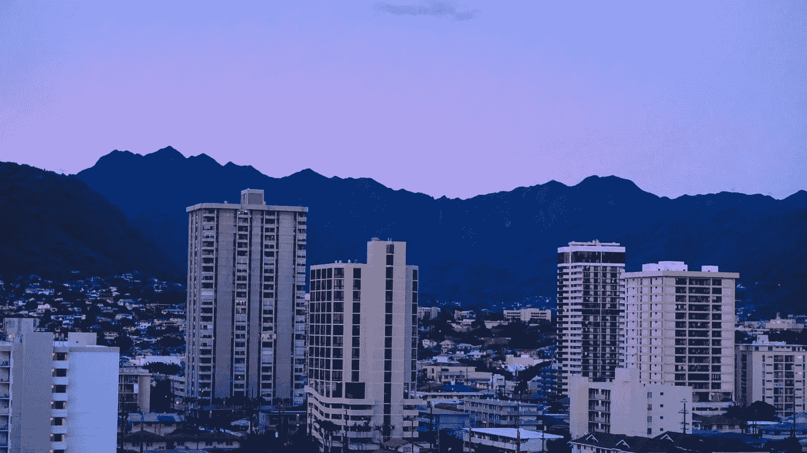

# 比特币之旅——第 1 部分:开始对话

> 原文：<https://medium.com/coinmonks/journey-in-bitcoin-starting-the-conversation-c2aec8c1de02?source=collection_archive---------6----------------------->

## 我的比特币时刻

The view from my apartment in Honolulu, c. 2021

*是 2021 年 4 月。在檀香山。傍晚时分，太阳将在阿拉海洋奇缘海滩落山。我的公寓在 11 楼，可以俯瞰麦卡利街角的阿拉威运河。阳台的推拉门和百叶窗都是开着的，当低低的太阳在远处的科奥劳山和前方的檀香山的南面投射出金色的光芒时，咸咸的微风吹了进来。但此时此刻，我正俯身在我的笔记本电脑上，专注地看着我面前打开的经纪页面。我按下“确认”，立即卖掉我个人投资账户中的所有股票，然后我把它们全部转换成比特币，并转移到冷库中。我已经成了比特币制造者。*

这是我的“比特币时刻”那一刻，我意识到，即使是最保守的展望，我也基本上没有其他“投资”可以在未来 20-30 年内提供任何接近我对比特币的预期回报。这是我跨过门槛的时刻。出售几乎所有人——从我最有教养、最有成就的朋友，到我的母亲，再到怀基基海滩上来自奥马哈的随机春假者——都会(也确实)告诉我持有的资产，以便增加对一项他们认为风险不可接受、不确定(如果不是彻头彻尾的骗局的话)的资产的敞口。

今天，从那一刻起，我的观点有了进一步的发展。我不再把比特币当成投资，我把它当成*储蓄*(感谢天鹅！).我不再考虑比特币的美元回报，因为这意味着出售的意图。我现在考虑的是*价值捕获*，或者每单位比特币的购买力，或者 *satoshi* (因为一美元有 100 个便士，一个比特币有 1 亿个 satoshi)。但是我们会在适当的时候谈到这些。

现在的核心问题是，“我最初是如何到达上述时刻的？”在过去的几个月里，我一直在思考这个问题。回顾 2021 年 4 月的那个时刻，那时我完全成为了一名比特币制造者——但是，也许这并不完全正确，那时我成为了比特币制造者吗？我在许多核心方面已经是其中之一，只是在那一刻才发现吗？这是一种成为或者更确切地说是一种承诺成为比特币制造者的行为吗？成为一个比特币制造者到底意味着什么，这个问题问起来合适吗？

> 我不再认为比特币是一种投资，我认为它是储蓄

试图回答，或者至少是*与*接触，这些问题开启了一场深刻内省的实验，一场剥洋葱的练习，解开我自己到目前为止的生活脉络。它需要自我反思童年的基础课程，解构思维习惯(和*思维习惯*，从我的教育和成长经历、对职业经历和团体协会的考察、身份问题，特别是作为一个全球化世界中的非裔美国人，从国外和国内(美国)的长途旅行中获得的见解，以及对如此多的侥幸心理的反思——如果当时比特币存在或者我对事物的看法被改变，我可能会更早“得到”比特币

在我进入比特币的旅程中，特别是在 2021 年初捕捉到“俱乐部时刻”时，我接触到了我有幸交往过的最多样化、最有才华、最足智多谋、最有趣的一群人。聪明到狂妄的程度，研究到古怪的程度，旅行到怀疑的程度，见解深刻到不安的程度，被定罪到宗教狂热的程度，成就到虚构的程度，诚实到被弄得离奇的程度，边缘到边缘的程度。

我并没有批评或侮辱的意思，事实上恰恰相反。在 9 盒排列系统图上，比特币是混乱的一列……通常是“混乱的好东西”。如果有一个比特币创造者的口头禅，那应该是类似于“**不要造成伤害……除非他们罪有应得。**“有了比特币，你会发现独特的、甚至是畸形的个人陌生感与同样奇怪(与“正常社会”相比)但广泛共享的积极道德标准的矛盾结合，这使得所有交易对手之间的分布式甚至匿名信任成为可能——无论是在经济上，还是越来越多地在社会上。总的来说，我认为我遇到的每个真正“得到”比特币的人，在某些特征上，都有 3-5 个标准偏差……同样，*通常是好的方面。*

这是一个非常吸引人的模式，不容忽视。这是激励我开始写作的原因。尽管比特币已经有超过 13 年的历史，但今天对比特币有任何真正的理解本身就令人难以置信地奇怪。如此多的人已经获得了这种仍然极端小众的理解，却还如此不正常，以至于出类拔萃，这向我表明，这两者可能以某种方式联系在一起。我真的相信，未来的社会会回顾过去，并认为对比特币大规模采用或“超级比特币化”的理解是值得研究的。我当然相信这一点。现在，今天。也就是说，我既没有办法也没有进入疯狂的埃舍尔斯克之口的一般倾向，这是对当今比特币人进行广泛的心理研究所必需的，然而，我能做的是对我自己的故事进行一次公开的检查。*我的比特币之旅*。

像蝙蝠侠或小丑一样，每个比特币都有一个“起源故事”这在社区中是一个如此常见的比喻，以至于许多比特币会议都会有一个专门的小组，由 4 到 5 个人分享他们的起源故事，同时实时分享彼此的新见解。如果你已经是一个比特币制造者，那你就非常非常幸运了。不管你是在 2010 年、2017 年、2021 年还是 10 分钟前成为比特币制造者。我们还处于不可思议的早期，生活中一系列近乎神奇、近乎玄学的事件让我们对比特币有了一个基本的理解。如果你理解今天的比特币，你就经历过一个巨大的普林科游戏，在这个游戏中，一切都必须完全正确*，才能达到极限。这就是为什么当许多比特币创造者说“比特币找到了我，而不是相反”时，这并不是完全不合理，也不是完全精神错乱我个人绝对有这种感觉。*

> *如此多的人获得了这种仍然极端小众的理解，也应该如此反常，以至于出类拔萃，这向我表明，这两者可能以某种方式联系在一起*

*我们中的许多人(比特币创造者)会说，未来 10-20 年必须做的最重要的事情就是“hodling”(即获得比特币，安全地自我保管，不出售)。然而，如果我们打算成功地做到这一点，理解我们每个人是如何走到这一步，参与到现在的对话中来的也是至关重要的。自我发现、自我意识、自信以及随之而来的自我实现是自我主权的核心贡献者。个人自我主权是主权家庭和主权社区的基础，如果我们想要比特币，更迫切的是，想要个人权利和自由的概念在我们日益原子化和数字化控制的未来有任何意义，我们就必须着手创建这些基础。*

*如果我们不了解，并且在必要的时候，修复和加强我们自己的基础，我们怎么能建立呢？*

*受到 Cryptograffti 和 Brekkie von Bitcoin 等艺术家的启发，他们与 BT(比特币 Twitter)分享了他们的艺术过程，我希望让这种写作练习成为一种开放的体验。我期待着来自其他比特币创造者或任何有兴趣阅读和参与的人的评论和反馈，不管是不是比特币创造者。最重要的是，我希望对我的故事的研究可以激励其他人分享他们的故事，并通过比特币和比特币社区如何影响他们的生活的镜头，更深入地进行自我发现。*

*谢谢你能走到这一步，我真的很谦卑。这仅仅是开始。更多即将推出！*

*在 twitter 上关注我:Michaelyouknow*

*后记/侧边栏:本着跨学科的精神，这里有一些我想到的顶级建议。很想听听你的想法！*

***音乐:** *Plantasy* ，Resavior *Esc(憋着)*，模男；*乖乖*，Esbe*

***书籍:** *第七地产*，埃里克·牦牛；*刘宇昆的纸动物园*；*炼金术士*，科埃略*

***如果你曾经在檀香山:**霍奥马鲁希亚植物园、寺庙之谷、Tane 素食居酒屋、盲牛、拉尼凯海滩*

> *交易新手？在[最佳加密交易](/coinmonks/crypto-exchange-dd2f9d6f3769)上尝试[加密交易机器人](/coinmonks/crypto-trading-bot-c2ffce8acb2a)或[复制交易](/coinmonks/top-10-crypto-copy-trading-platforms-for-beginners-d0c37c7d698c)*