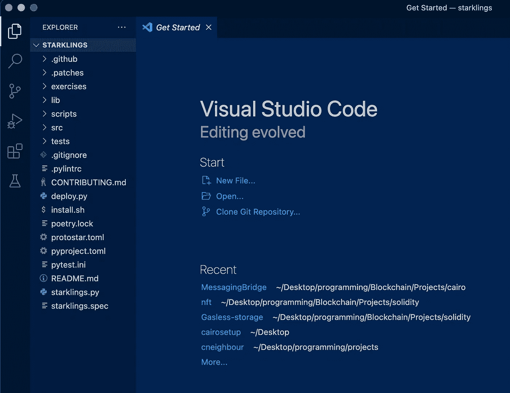

# 开罗之旅 2——用星语掌握开罗的语法

> 原文：<https://medium.com/coinmonks/journey-through-cairo-ii-mastering-cairos-syntaxes-with-starklings-8d3cbad6946?source=collection_archive---------4----------------------->


Let’s journey through Cairo

在上一篇文章中，我们用 Protostar、ArgentX 和 Voyager 为 Cairo 设置了一个本地开发环境，今天我们将开始了解 Cairo 的基本原理。

如果你是刚刚加入飞行中途欢迎！在这一系列名为“**开罗之旅**”的博客文章中，我们将从最基本的要素出发，畅游开罗的世界。我还建议你回去看看我们以前的文章，因为我们大部分是从上一个检查点继续的！

在试图想出一个好方法来解释 Cairo 在引擎盖下如何运行的基本原理时，我尝试了几种方法，最终解决了**星。**

# 仅由尘埃形成的恒星

对于一般人来说，从官方文件中学习开罗有点复杂。刚开始的时候，我为理解这些基本原理挣扎了很久，直到我遇到了[](https://github.com/onlydustxyz/starklings)**。**

**Starklings 是由 OnlyDust 的团队制作的一个互动教程，它模仿了流行的 Rustlings 学习 Rust 的渐进和互动教程的精彩概念。今天我们将通过解决来自 Starklings 的挑战来开始[Cairo 是如何工作的](https://www.cairo-lang.org/docs/how_cairo_works/index.html)。**

# **安装**

**为了有效地跟进本教程，您需要提前设置您的环境。为此:**

1.  **访问官方 Starklings Github repo [这里](https://github.com/onlydustxyz/starklings)。**
2.  **通过运行 git clone 命令，将存储库克隆到您的本地计算机上。**

```
git clone --branch stable --single-branch [https://github.com/onlydustxyz/starklings.git](https://github.com/onlydustxyz/starklings.git)
```

**3.通过运行以下命令安装必要的工具:**

```
curl -L [https://raw.githubusercontent.com/onlydustxyz/starklings/master/install.sh](https://raw.githubusercontent.com/onlydustxyz/starklings/master/install.sh) | bash
```

**4.导航到 repo 并在代码编辑器中打开它。您应该有类似的东西:**

****

*****NB*** *:我们只打算摆弄一下* ***练习*** *文件夹的内容。建议你不要碰任何其他文件或文件夹。***

**5.要开始练习，请在您的终端中运行:**

```
starklings --watch
```

****

**Voila! we’ve got our environment ready**

# **命令和资源**

**现在我们已经准备好了我们的开发环境，在我们开始编写 Cairo 之前，这里有一些必要的命令和资源可以帮助我们的旅程变得更容易！**

1.  **要在无观察模式下手动验证练习，请运行:**

```
starklings --verify relative_path_to_the_exercise_file
```

**2.如果您连接上了，要显示给定练习的解决方案，请运行:**

```
starklings --solution relative_path_to_the_exercise_file
```

**3.想四处游玩，尝试新事物？点击这里查看开罗的游乐场，类似于 remix for Solidity [。](https://www.cairo-lang.org/playground/)**

****附注**你可以在这里找到我对这篇文章的所有解决方案[。](https://github.com/Darlington02/starklings-article-solutions)**

# **理解 CAIRO 的语法**

1.  ****syntax01.cairo —开始 cairo 合同****

****

**开始使用 Cairo，最初让我困惑的几件事之一是区分 Cairo 程序和 Cairo 合同。我不希望你对此也有混淆，所以这里是两者的快速定义:**

**Cairo 程序 : Cairo 程序可以说是一种无状态契约，也就是说，在编写程序时，你不能访问存储器，也不能与其他 Cairo 程序甚至 L1 链进行交互。**

****Cairo contracts** :用非常简单的话来说就是在 Starknet 虚拟机上运行的程序。由于它们运行在虚拟机上，它们可以访问 Starknet 的持久状态，可以改变或修改 Starknet 状态中的变量，与其他合同通信，并与底层 L1 无缝交互。**

**清楚这一点后，要开始编写 Cairo 契约，您必须通过在最上面一行写下以下内容来指定它是一个契约:**

```
%lang starknet
```

**现在让我们在 Starklings， **Syntax01.cairo** 中这样做，并检查它是否通过。**

****

**还有呀！确实如此。**

****

**现在我们进入下一个挑战。还要记得去掉**#我还没完成**，这样 Starklings 就知道你已经完成了挑战并进入下一个挑战！**

**2.s**yntax 02 . Cairo—Cairo 的模块化****

****

**对于几乎所有现存的编程语言来说，将所有的程序代码保存在一个文件中是非常不好的做法。您可能还需要使用其他人的代码，而不是重新发明轮子，所以每种语言都试图鼓励代码模块化，Cairo 也不例外。**

**在这个挑战中，我们需要研究 **test_ok** 函数，并导入每一个需要的文件以使函数工作。**

**在 Cairo 中，导入文件看起来像这样:**

```
from starkware.starknet.common.syscalls import get_contract_address
```

**当你这样做时，Cairo 在当前目录和相对于编译器路径的标准库目录中搜索文件***syscall . Cairo***，并从中导入***get _ contract _ address***函数。**

**我们的函数 **test_ok** 接受三个隐式参数: ***syscall_ptr*** 、 ***pedersen_ptr*** 和***range _ check _ ptr***(我们将在后续文章中介绍隐式参数)，但是我们可以注意到，允许我们计算 pedersen 散列函数的 ***pedersen_ptr*** 需要一个 HashBuiltin 为此，我们将在代码中添加以下代码行:**

```
from starkware.cairo.common.cairo_builtins import HashBuiltin
```

****

**现在让我们检查一下我们是否通过了挑战。**

****

**啊哈！我们做到了。**

*****PS*** *:如果你的* ***starklings —手表*** *仍然指回****syntax01.cairo****，确保交叉检查你从 syntax 01 . cairo 中删除了****# I NOT DONE****。***

**3. **syntax03.cairo —函数参数****

****

**函数是可重用的代码单元，接受某些参数并返回值。**

**在 Cairo 中，您可以将不同的参数传递给一个函数，并获得一个返回值。我们这里的练习要求我们将正确的参数传递给使测试通过的函数！**

**类似于 Typescript 这样的强类型语言，您需要指定参数的数据类型。我们需要编辑我们的函数，如下所示:**

```
func takes_two_arguments_and_returns_one(a: felt, b: felt) -> (c: felt):return (a + b)  # Do not changeend
```

**正如你所看到的，我们将一个奇怪的数据类型**传递给了 **a** 、 **b** 、 **c** 参数……是的，没错。与 Solidity 不同，Solidity 有许多数据类型，如 uint256、strings 等，Cairo 使用一种称为 felt 的数据类型。(我们将在后续文章中对此进行更深入的探讨)。****

**从我们的函数签名中，你会注意到我们传入了某个函数没有使用的 **c** 参数。这个参数是函数的返回值。您的返回值应该使用- >指定**

**现在编辑，你的 **syntax03.cairo** 传入我们在这里做的各种论点，让我们检查我们是否通过了挑战。**

****

**啊啊。我们做到了。**

**4.**syntax 04 . Cairo—Cairo 中的名称空间****

****

**Cairo 名称空间是在契约中使用模块的一种非常强大的方式。当从多个模块导入时，它允许您在一个标识符下限定函数标识符的范围，有助于防止冲突。它对提高代码可读性也有很大帮助。**

**要在 cairo 中实现名称空间，我们需要使用 namespace 关键字，然后为名称空间指定一个名称，如下所示:**

```
namespace starklings
    func starkling_exercise(a: felt, b:felt) -> (c: felt):
       return (a+b)
    end
end
```

**为了在一个文件中使用我们的命名空间中的函数，我们应该这样做:**

```
starklings.starkling_exercise(3, 5)
```

**本练习实现了一个名称空间，我们需要通过编辑测试来调用名称空间 ***my_namespace*** 内的***returns _ something***函数，从而使测试通过。**

**为此，我们将实施我们刚刚学到的内容。编辑您的测试函数，不要只调用***returns _ something()***，而是调用***my _ namespace . returns _ something()。*****

****

**现在让我们检查一下我们是否通过了挑战。**

****

**耶！我们有。**

**5.**syntax 05 . Cairo—Cairo 中的结构****

****

**Cairo 中 struct 的概念和我们所知道的 Solidity 非常相似。**

**我们首先用关键字 **struct** 定义它，然后用关键字 **member** 指定它的属性。但与 solidity 不同，Cairo 中的 struct 也有一个 size 属性，它是其成员大小的总和。**

**Cairo 中的 struct 通常是这样的:**

```
struct Starklings:
   member first: felt
   member second: felt
end
```

**在本练习中，我们需要实现一个 Currency 结构，以通过测试。**

**为了通过这个练习，我们需要检查测试，找出结构的成员。下面是调用该结构的练习的第 13 行:**

```
local euro : Currency = Currency('Euro', 2)
```

**从这里，我们会注意到我们的结构有两个成员，可能是一个名字和一个 ID。但是请注意第 14 行中的断言函数:**

```
assert euro.name = 'Euro'
```

**assert 函数调用一个名为 的 ***，假设它是我们结构中的一个成员。这一行间接告诉我们，我们的结构必须包含一个名为 ***name*** 的成员，否则，我们会遇到这样的错误:*****

****

**要通过这个挑战，我们的结构必须如下所示:**

```
struct Currency: member name: felt member id: feltend
```

****

**现在让我们检查一下我们是否通过了挑战。**

****

**是的，我们做到了！**

# **结论**

**如果您已经理解了这一点，我想您现在已经对 Cairo 的基本语法有了很好的理解，从函数参数到名称空间、结构等等。**

**请记住，如果你遇到了什么困难，我在我的报告[这里](https://github.com/Darlington02/starklings-article-solutions)中有这些练习的解决方案。**

**在我们的下一篇文章中，我们将进行**弦乐**练习，并利用这个机会深入探究**感觉**是什么。**

**如果你从这篇文章中得到了价值，请与他人分享。**

**你也可以在以下社交活动中与我联系，尤其是在 Twitter 上，我在那里分享我在开罗的小发现！**

**推特:[https://twitter.com/0xdarlington](https://twitter.com/0xdarlington?source=about_page-------------------------------------)**

**领英:[https://www.linkedin.com/in/nnamdarlington](https://www.linkedin.com/in/nnamdarlington?source=about_page-------------------------------------)**

**github:【https://github.com/Darlington02 **

> **交易新手？试试[密码交易机器人](/coinmonks/crypto-trading-bot-c2ffce8acb2a)或[复制交易](/coinmonks/top-10-crypto-copy-trading-platforms-for-beginners-d0c37c7d698c)**