# 开罗三号之旅——与星人一起深入探究琴弦和毛毡

> 原文：<https://medium.com/coinmonks/journey-through-cairo-iii-a-deep-dive-into-strings-and-felts-with-starklings-2bb6abff2d83?source=collection_archive---------3----------------------->


欢迎来到我们系列的第三部分，**开罗之旅**！在我们的上一篇文章中，我们仔细研究了 Cairo 的一些基础知识，包括名称空间、结构等，今天我们将深入研究 Strings 和 Felts。

像往常一样，如果你只是中途加入我们，最好检查一下以前的文章，因为我们将从最后一个检查点开始！

上周，我们完成了语法部分下的 Starklings 挑战，今天我们将尝试字符串文件夹中的挑战，但在此之前，我需要我们了解一个非常重要的概念，在开罗，**毡**。

# 毛毡

与 Solidity 不同，在 Solidity 中有许多不同的数据类型，如 uints、strings、bools 等，Cairo 只有一种数据类型。**毛毡。**

Felts 代表字段元素。简单来说，它们是最多 76 位小数的无符号整数。

虽然使用毛毡有很多优点，但我觉得它们也有一些令人讨厌的缺点。例如:

1.  它们是一个 252 位的整数，当我们想要将一个 uint256 值放入其中时，就会出现问题。我们可以把毛毡放在一起组成元组来解决这个问题。
2.  根据[官方 Cairo 文档](https://www.cairo-lang.org/docs/how_cairo_works/cairo_intro.html#field-elements)，在 Cairo 中，基本数据类型是 0≤x < P 范围内的整数，其中 P 是一个质数。所有计算都是以 p 为模进行的，这可能会给除法带来一些非常严重的问题，因为所有除法运算(x/y)都必须满足以下条件:

```
(x / y) * y == x
```

对于没有数学背景的人来说，上面的等式意味着，如果我们用 **10** 除以 **5** ，其中 **x** = **10** ，以及 **y** = **5** ，那么无论我们得到什么答案，当乘以 y(5)时，都必须返回 x(10)。所以 10/5 = 2，2 * 5 = 10。

但是如果我们要做 10/3 呢？在其他 CPU 中，这个应该要么是 **3** (忽略余数)，要么是 **3.33333333333** 。但是记住它不满足我们上面的等式，所以这是开罗的结果..一串奇怪的数字..

```
1206167596222043737899107594365023368541035738443865566657697352045290673497
```

为了解决这个问题，Cairo 提供了一个包含一组预写的 Cairo 代码的库，我们可以导入这些代码并直接在代码中使用。这些预写函数的一个例子是 unsigned _ div _ rem found[here](https://github.com/starkware-libs/cairo-lang/blob/master/src/starkware/cairo/common/math.cairo#L297)，它可以用于安全除法，返回整数和除法后的余数。

如果你想深入了解毛毡是如何在引擎盖下工作的，你可以在这里查看文件。但是已经了解了毛毡的一般功能，让我们来深入研究一下**琴弦！**

# 开罗的琴弦

虽然我们称之为字符串，但 Cairo 目前一般不支持字符串。Cairo 更支持我们所说的**短字符串。**

短字符串是长度最多为 31 个字符的字符串，因此可以放入单个字段元素中。虽然它们可能看起来像字符串，但它们被编码为 ASCII，因此可以用毛毡来表示。

1.  **strings00.cairo**

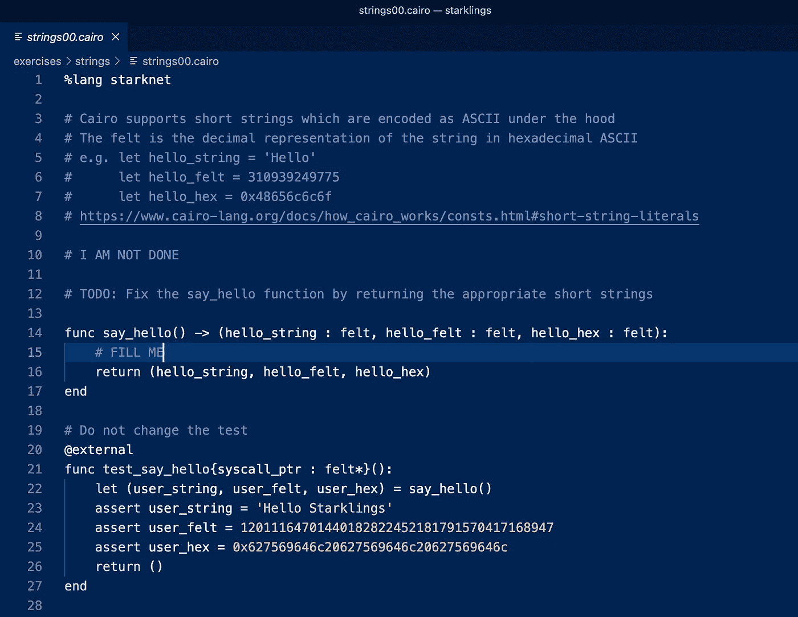

这个练习返回一系列变量，我们应该给这些变量分配必要的短字符串来传递。

通过这个练习非常简单，因为我们可以通过复制和粘贴测试中的短字符串来完成，就像这样。

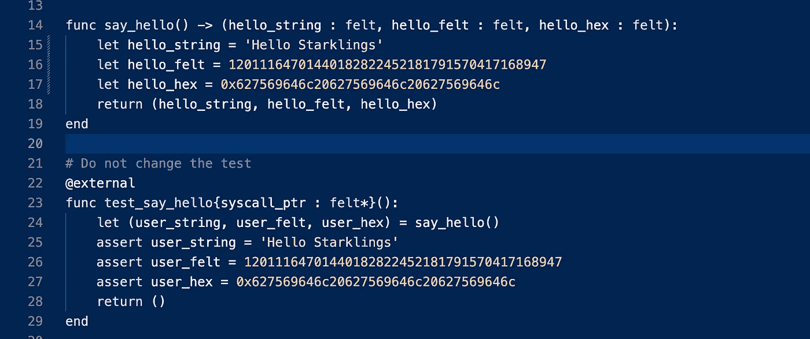

瞧啊。我们通过了。

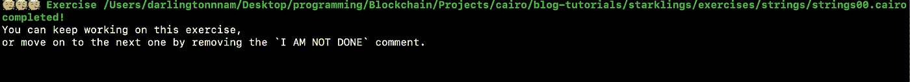

但是那样我们会错过一些重要的要点。我们更愿意做的是创建一个 python 脚本，将 felts 转换为字符串，将 hex 转换为字符串，这样我们就可以看到结果短字符串。

要进行这些转换:

1.  确保您的设备中安装了 python3。
2.  创建一个名为 utils.py 的文件，并将下面的代码粘贴到其中。

```
MAX_LEN_FELT = 31

def str_to_felt(text):
    if len(text) > MAX_LEN_FELT:
        raise Exception("Text length too long to convert to felt.")
    return int.from_bytes(text.encode(), "big")

def felt_to_str(felt):
    length = (felt.bit_length() + 7) // 8
    return felt.to_bytes(length, byteorder="big").decode("utf-8")

def str_to_felt_array(text):
    return [str_to_felt(text[i:i+MAX_LEN_FELT]) for i in range(0, len(text), MAX_LEN_FELT)]

def uint256_to_int(uint256):
    return uint256[0] + uint256[1]*2**128

def uint256(val):
    return (val & 2**128-1, (val & (2**256-2**128)) >> 128)

def hex_to_felt(val):
    return int(val, 16)
```

3.打开你的终端运行

```
python3 -i utils.py
```

您的终端应该是这样的:

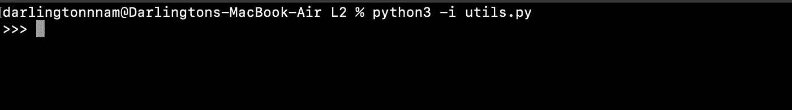

接下来，我们将尝试转换给定的短字符串，以查看结果。为此，运行

```
str_to_felt("Hello Starklings")
```

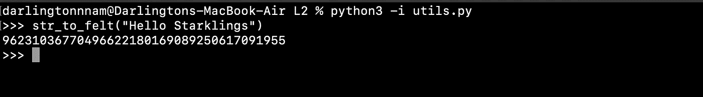

你可以看到短弦很容易用毡来表现！

接下来，让我们尝试将毛毡转换为短弦:

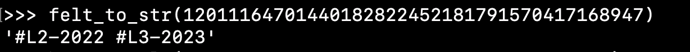

酷！最后，让我们尝试将十六进制转换为短字符串..为此，我们需要首先转换成十六进制，然后转换成短字符串。

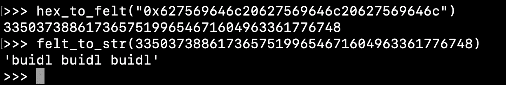

厉害！

这证明了短字符串只是编码为 ASCIIs 码，因此可以与等价的 felts 和 hex 互换。

2. **strings01.cairo**

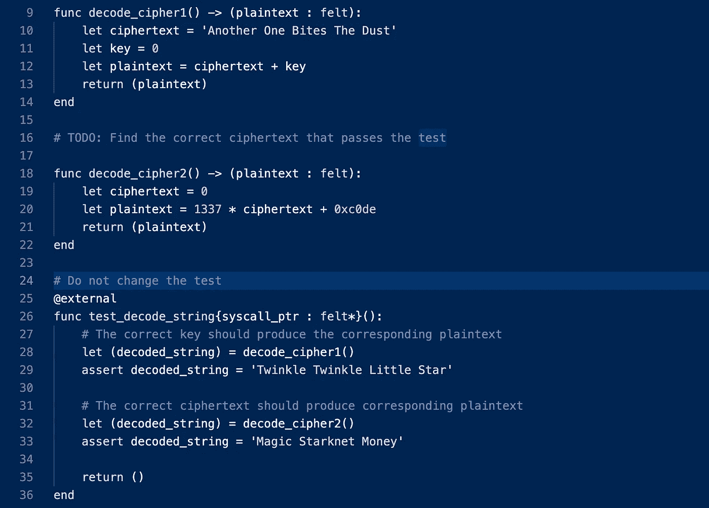

你知道你可以对短字符串进行数学运算吗？狂野对吗？但是请记住，它们只是编码为 ASCIIs 码，因此你可以用它们做任何你可以用毛毡做的事情！

现在让我们做一些短字符串数学运算，以传递 **decode_cipher1** 函数:

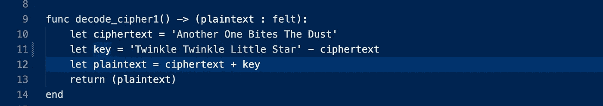

如果这看起来很奇怪，我希望你首先忘记这些是短字符串，而是把它们当成数字。

使用流行的 BODMAS 规则，如果:

```
plaintext = ciphertext + key
```

然后:

```
key = plaintext - ciphertext
```

并且明文(或者测试中称为 decoded_string)已经在测试中给出为' **Twinkle Twinkle Little Star '。**

因此:

```
key = 'Twinkle Twinkle Little Star' - ciphertext
```

现在转到 **decode_cipher2** 函数:

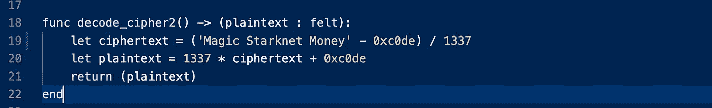

这里，我们需要求解密文。

请记住，给出的明文是:

```
plaintext = 1337 * ciphertext + 0xc0de
```

再次使用 BODMAS 法则:

```
ciphertext = (plaintext - 0xc0de) / 1337
```

明文(或者在测试中被称为 decoded_string)已经在测试中作为'**魔法 Starknet Money '给出。**

因此，密文可以说是:

```
ciphertext = ('Magic Starknet Money' - 0xc0de) / 1337
```

手指交叉，现在让我们看看我们的测试是否通过。

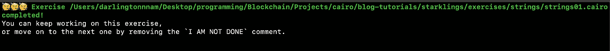

耶！确实如此。

# 结论

如果你到了这一步，那么恭喜你！您在成为开罗专家的道路上取得了重大进步！

我们将每两天继续这个系列，所以我建议不要等到下一个系列，你可以继续尝试 Starklings 教程的其他部分，期待我们的下一篇文章。

请记住，如果你遇到了什么困难，我在这里有这些练习的解决方案。

在下一篇文章中，我们将完成**存储**练习。

如果你从这篇文章中得到了价值，请与他人分享。

**你也可以** **在以下社交活动中与我联系，尤其是在 Twitter 上，我在那里分享我在开罗的小发现！**

推特:[https://twitter.com/0xdarlington](https://twitter.com/0xdarlington?source=about_page-------------------------------------)

领英:[https://www.linkedin.com/in/nnamdarlington](https://www.linkedin.com/in/nnamdarlington?source=about_page-------------------------------------)

github:[https://github.com/Darlington02](https://github.com/Darlington02?source=about_page-------------------------------------)

> 交易新手？试试[加密交易机器人](/coinmonks/crypto-trading-bot-c2ffce8acb2a)或者[复制交易](/coinmonks/top-10-crypto-copy-trading-platforms-for-beginners-d0c37c7d698c)