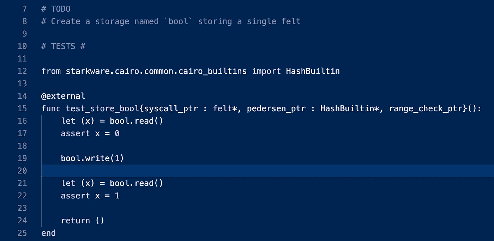
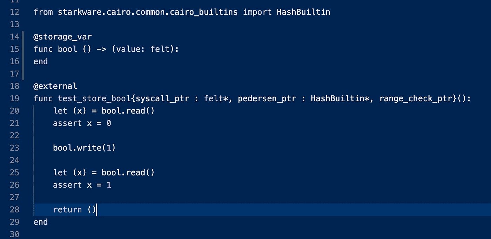
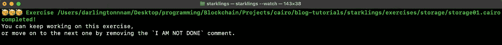
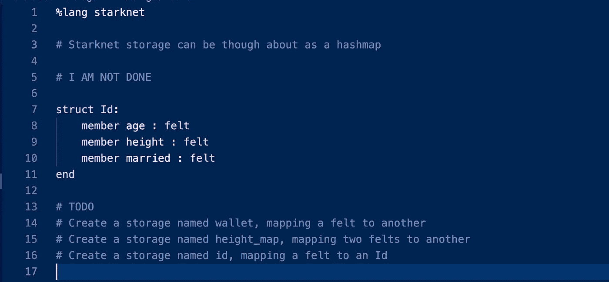
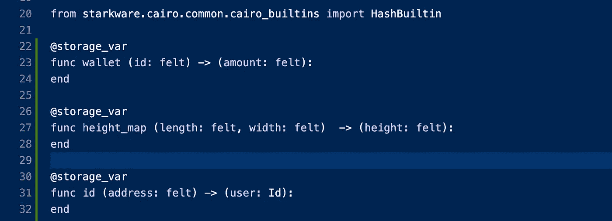
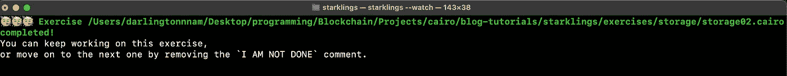
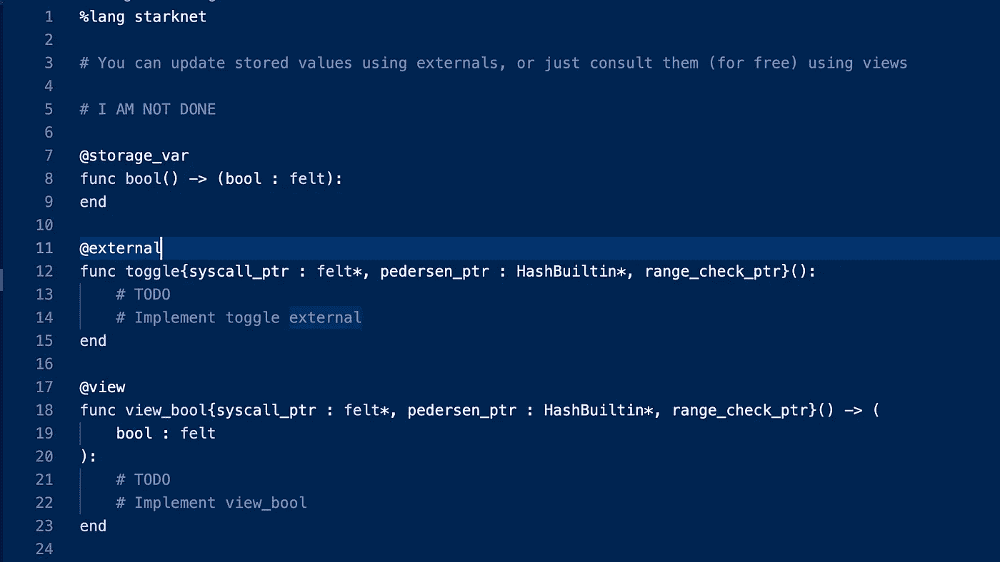
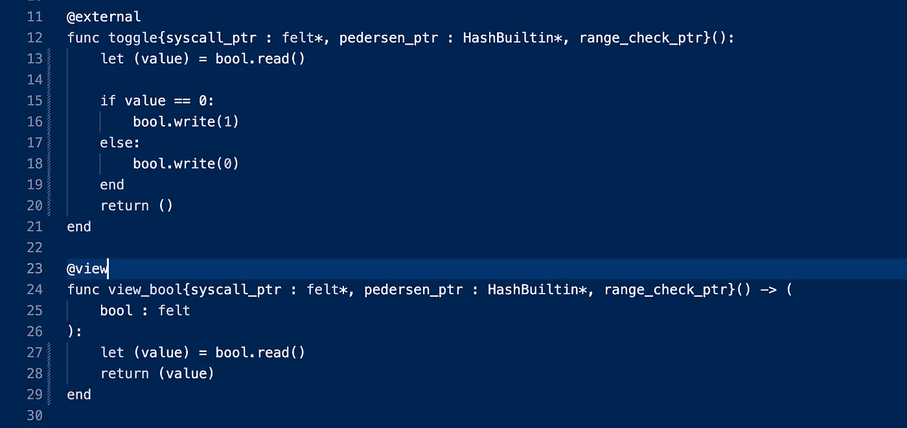

# 开罗四号之旅——与星人一起深入探索开罗的仓库

> 原文：<https://medium.com/coinmonks/journey-through-cairo-iv-a-deep-dive-into-cairos-storage-with-starklings-d7e3549470ff?source=collection_archive---------3----------------------->


欢迎来到我们系列的第四集，“穿越开罗的旅程”。在我们的上一篇文章中，你可以在这里找到，我们仔细看了一下 felt 数据类型，以及 Cairo 中的短字符串。

像往常一样，如果你刚刚加入飞行中，我建议你检查以前的文章，因为我们将从我们的最后一个检查站开始。

*注:本教程中使用的所有代码片段都使用了 Cairo-lang v0.9.0 中的旧 Cairo 语法，因为在撰写本文时，我们的 Starklings 练习中也使用了这些语法。*

# 开罗的仓库

在本系列的第二部分中，我们区分了 Cairo 程序和 Cairo 契约，注意到程序是无状态的，而契约运行在 Starknet VM 上，因此具有持久状态(存储)。

契约存储是一个持久的存储空间，你可以在这里写、读和修改数据。根据官方文件，这是一个具有 2^251 槽的地图，其中每个槽是一个被初始化为 0 的毛毡。

Cairo 中的存储变量如下所示:

```
@storage_varfunc id() -> (number: felt):end
```

其中 **@storage_var** 被称为装饰器，用于指定存储变量。

# **装修工**

与 solidity 不同，Cairo 中的所有函数执行都是由关键字 **func** 指定的，很难区分。为了解决这个问题，Cairo 使用了我们称之为 decorators 的东西来区分这些功能。所有的装饰者都以@开头。

以下是你在开罗会遇到的最常见的装修工:

1.  @storage_var —用于指定状态变量。
2.  @constructor —用于指定构造函数。
3.  @external —用于指定写入状态变量的函数。
4.  @view —用于指定从状态变量读取的函数。
5.  @event —用于指定事件
6.  @l1_handler —用于指定处理从消息传递桥中的 l1 协定发送的消息的函数。

# **如何读写合同存储器**

**写入存储器**

如前所述，写入状态变量的函数必须用@external decorator 指定。下面是一个 Cairo 函数的示例，它更新了前面的存储变量:

***PS*** *:如果你不明白这里的一切，不要担心，因为我们还没有处理 Cairo 函数*

```
@externalfunc update_id{ syscall_ptr : felt*, pedersen_ptr : HashBuiltin*, range_check_ptr }(_number: felt): id.write(_number)end
```

这里主要关注的，是 **id.write(_number)** 。

为了写或更新状态变量，我们使用 variablename.write()。

**从存储器中读取数据**

读取状态变量的值非常容易。如前所述，读取状态变量的函数必须用@view decorator 指定。下面是一个从 **id** 状态变量读取的示例函数:

```
@viewfunc read_id{ syscall_ptr : felt*, pedersen_ptr : HashBuiltin*, range_check_ptr }(_number: felt): id.read()end
```

重点关注 **id.read()** ，我们可以看到，与写入存储类似，读取只需要使用 variablename.read()。

# 存储映射

与 Solidity 不同，映射有自己的特殊关键字，Cairo 也使用存储变量进行映射。

在我们前面的 id 示例中，我们有一个状态变量只存储一个值，但是我们也可以创建更复杂的状态变量，它们有 **key - > value** 对。这里有一个例子:

```
@storage_varfunc balance(address: felt) -> (amount: felt):end
```

在这里，状态变量 **balance** ，是地址到它们持有的数量的映射。

**写入这种类型的状态变量**:

我们需要提供键(地址)和值(金额)，如下所示:

```
@externalfunc update_balance{ syscall_ptr : felt*, pedersen_ptr : HashBuiltin*, range_check_ptr }(_address: felt, _amount: felt): balance.write(_address, _amount)end
```

如您所见，我们提供了写括号内的键和值，因为我们需要指定要更新其值的键。

**并从该状态变量**中读取:

我们只需要这样的地址:

```
@viewfunc read_balance{ syscall_ptr : felt*, pedersen_ptr : HashBuiltin*, range_check_ptr }(_address: felt, _amount: felt): balance.read(_address)
end
```

我们在这里只使用了键(地址),因为我们只想获得特定键的值，而不是更新或改变它。所以使用 **balance.read(_address)** ，向我们返回该特定地址的金额或余额。

理解了这一切之后，让我们直接投入到一些与 Starklings 相关的实际工作中吧！

**storage01.cairo**



在这里，我们被期望创建一个名为 **bool** 的存储，存储一个毛毡。

这非常简单，因为它类似于我们的第一个 id 为的存储示例。这就是我们想要创建 bool 状态变量的方式:

```
@storage_varfunc bool () -> (value: felt):end
```



现在让我们看看我们是否通过了挑战..



耶！我们做到了。进入下一个挑战

**storage02.cairo**

你知道我们也可以存储结构体吗？这就是我们在本练习中要探讨的内容。



所以我们有三个目标。

1.  我们预计将创建一个名为**钱包**的存储，将一种感觉映射到另一种感觉。

此挑战所需的存储变量与我们使用**平衡**状态变量(值映射的关键)时所做的非常相似:

```
@storage_varfunc wallet (id: felt) -> (amount: felt):end
```

2.我们需要创建一个名为 **height_map** 的存储，将两个毛毡映射到另一个毛毡。

这也类似于我们对 **balance** 状态变量所做的，但是这一次，我们将 2 个键映射到 1 个值:

```
@storage_varfunc height_map (length: felt, width: felt)  -> (height: felt):end
```

3.这是最后也是最强大的挑战！我们需要将一个毛毡映射到一个 Id(结构)。如您所见，用户值是一个 Id 类型的结构。

```
@storage_varfunc id (address: felt) -> (user: Id):end
```



让我们祈祷，看看我们是否通过了测试。



是啊。我们做到了。

**storage03.cairo**



在这里，我们期望实现外部和视图函数来读写 **bool** 状态变量。

正如我们之前所说，当一个函数写入存储变量时，它是一个外部函数，应该用 **@external** decorator 指定，而如果它从存储变量读取，它是一个视图函数，应该用 **@view** decorator 指定。

我们要修复的第一个函数是**切换函数**，它应该在被调用时更新 **bool** 状态变量，但是这里有一个问题..

布尔值只能是 0 或 1，所以我们要以这样一种方式实现它，即每次调用 **toggle** 函数时，如果布尔值是 0，我们就将其更新为 1，如果是 1，我们就将其更新为 0。为此，我们恳求使用**条件句:**

```
@externalfunc toggle{syscall_ptr : felt*, pedersen_ptr : HashBuiltin*, range_check_ptr}(): let (value) = bool.read() if value == 0: bool.write(1) else: bool.write(0) end return () end
```

接下来，我们需要修复 **view_bool** 函数，以便在调用时返回 **bool** 状态变量的值。

```
@viewfunc view_bool{syscall_ptr : felt*, pedersen_ptr : HashBuiltin*, range_check_ptr}() -> (bool : felt): let (value) = bool.read() return (value)end
```

这是完整的代码。



现在让我们来看看我们所做的是否足以通过挑战。

瞧啊。我们做到了。

# 结论

恭喜你！你刚刚掌握了 Cairo 的储物方式。

请记住，如果你遇到了什么困难，我在这里有这些练习的解决方案。

在我们的下一篇文章中，我们将详细研究**隐含论点**。

如果你从这篇文章中得到了价值，请与他人分享。

你也可以在以下社交网站上与我联系，尤其是在 Twitter 上，我在那里分享我在开罗的小发现！

推特:https://twitter.com/0xdarlington

领英:[https://www.linkedin.com/in/nnamdarlington](https://www.linkedin.com/in/nnamdarlington?source=about_page-------------------------------------)

github:[https://github.com/Darlington02](https://github.com/Darlington02?source=about_page-------------------------------------)

> 交易新手？尝试[加密交易机器人](/coinmonks/crypto-trading-bot-c2ffce8acb2a)或[复制交易](/coinmonks/top-10-crypto-copy-trading-platforms-for-beginners-d0c37c7d698c)