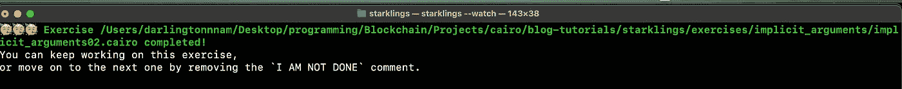
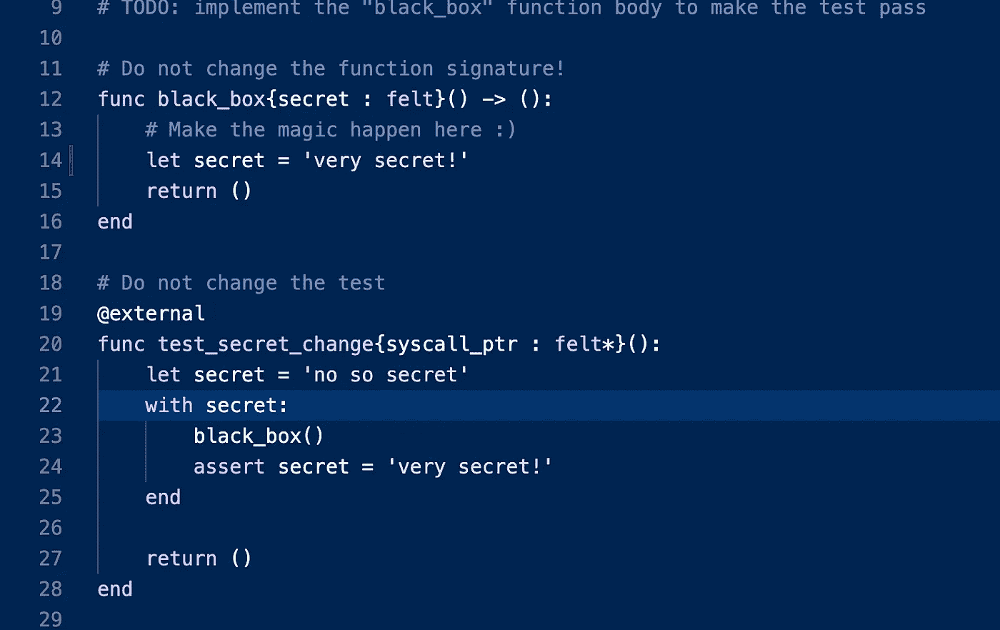

# 开罗之旅 V —隐含论点

> 原文：<https://medium.com/coinmonks/journey-through-cairo-v-implicit-arguments-fd8c3609b2?source=collection_archive---------5----------------------->


再次欢迎来到我们系列的第五篇文章**【开罗之旅】**。在我们的上一篇文章中，我们解释了 Cairo 中的存储，并详细介绍了如何使用 Cairo 的存储实现映射。

今天，我们将通过**隐性论点**走一走，看看它们在开罗是如何运作的。像往常一样，如果你只是中途加入，努力检查之前的文章，以更好地理解和流动这个系列。

本教程中使用的所有代码片段都使用了 Cairo-lang v0.9.0 中的旧 Cairo 语法，因为在撰写本文时，我们的 Starklings 练习中也使用了这些语法。

## 隐含的论点

Cairo 函数采用两种类型的参数:在 **`(`** 和 **`)`** 之间提供的显式参数，以及在 **`{`** 和 **`}`** 之间提供的隐式参数。

两者之间的主要区别在于，虽然显式参数在函数体内使用，并且不能在函数体外访问，但隐式参数会被需要它们的其他函数调用所继承。

让我们来看看我们上一篇关于[存储](/coinmonks/journey-through-cairo-iv-a-deep-dive-into-cairos-storage-with-starklings-d7e3549470ff)的文章中的这个函数:

```
@externalfunc update_id{ syscall_ptr : felt*, pedersen_ptr : HashBuiltin*, range_check_ptr }(_number: felt): id.write(_number)end
```

正如我们在这里看到的，这个函数接受三个隐式参数:

1.  syscall_ptr —该参数使 Cairo 函数能够进行系统启用的调用。
2.  pedersen_ptr —此参数用于计算 pedersen 哈希。
3.  range_check_ptr —该参数用于整数比较。

你可能想知道，当我们既不计算任何散列函数，甚至不进行任何整数比较时，为什么我们需要传递所有这些参数？这是因为我们试图写入的存储变量需要这些隐式参数来计算这个变量的实际内存地址。这在简单的变量中可能不需要，比如我们之前看到的`id`存储变量，但是对于像`balance`这样的存储映射，计算彼得森散列是`read()`和`write()`所做的一部分，这就是为什么调用这些存储变量的父函数必须清楚地声明这些隐式参数。

为了进一步理解这一点，让我们深入一些**starlings**练习！

**implicit _ arguments 01 . cairo**


这个练习要求我们修复 **implicit_sum** 函数以使测试通过。

从测试中我们可以看到， **test_sum** 函数调用了我们的 **implicit_sum** 函数，并向它传递了 **a** 和 **b** 参数，而是隐式地传递了它。

要使用这些参数，我们还必须在我们的 **implicit_sum** 函数中将它们指定为隐式参数，这样 Cairo 就会被告知这些参数可以在函数调用之间传递。

```
func implicit_sum{a: felt, b: felt}() -> (result: felt): return (a + b)end
```


在第 10 行完成了这些之后，让我们检查一下我们的测试是否通过。


是啊！确实如此

**隐式 _ 参数 02.cairo**


在本练习中，我们需要修复 **child_function_1** 和 **child_function_2** ，使测试通过，但不改变函数体。

从练习中我们可以看到，父函数有两个隐式参数 **a** 和 **b**

child_function_1 使用隐式参数 a，child_function_2 使用隐式参数 b。为了完成这个练习，我们需要在函数签名中指定每个函数使用的隐式参数。

对于**子功能 1** :

```
func child_function_1{a: felt}() -> (result : felt): return (2 * a)end
```

对于**子功能 2** :

```
func child_function_2{b: felt}() -> (result : felt): return (b + 3)end
```


现在让我们检查测试是否通过。



瞧啊。确实如此

**隐式 _ 参数 03.cairo**


根据 Starklings 的说法，隐式参数的真正好处是它们被任何使用它们的函数隐式返回，这是该语言的一个非常强大的功能，因为它有助于可读性，让开发人员在后续的函数调用中省略隐式参数。

在本练习中，我们需要修复**黑盒**函数以使测试通过。

这很容易做到，因为我们只需要分配参数， **secret** 来匹配单词“very secret！”Cairo 会自动返回参数，不需要显式返回。



现在让我们检查一下我们是否通过了测试。


是啊。我们做到了。

# 结论

我们已经走过了这段旅程的一半，现在我相信你已经熟悉了开罗在更广阔的视野中是如何运作的。

我们刚刚在开罗讨论了隐含的论点，以及它们在你写合同时对你的帮助。

和往常一样，如果你从这篇文章中获得了价值，请与他人分享。

你也可以在以下社交场合与我联系，尤其是在 Twitter 上，我在那里分享我在开罗的小发现！

推特:[https://twitter.com/0xdarlington](https://twitter.com/0xdarlington?source=about_page-------------------------------------)

领英:[https://www.linkedin.com/in/nnamdarlington](https://www.linkedin.com/in/nnamdarlington?source=about_page-------------------------------------)

github:【https://github.com/Darlington02 

> 交易新手？试试[密码交易机器人](/coinmonks/crypto-trading-bot-c2ffce8acb2a)或[复制交易](/coinmonks/top-10-crypto-copy-trading-platforms-for-beginners-d0c37c7d698c)