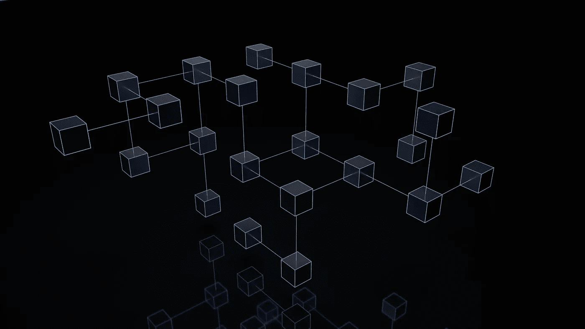

# 成为区块链开发者的旅程

> 原文：<https://medium.com/coinmonks/journey-to-become-a-blockchain-developer-ae31d062eb3a?source=collection_archive---------20----------------------->

## 成为区块链工程师开发去中心化应用(DApps)所需的技能

Photo by [Shubham Dhage](https://unsplash.com/es/@theshubhamdhage?utm_source=unsplash&utm_medium=referral&utm_content=creditCopyText) on [Unsplash](https://unsplash.com/s/photos/blockchain?utm_source=unsplash&utm_medium=referral&utm_content=creditCopyText)

最重要的是，要学习新的东西，你总是需要耐心和兴趣，学习一门全新的技术可能需要一些时间。