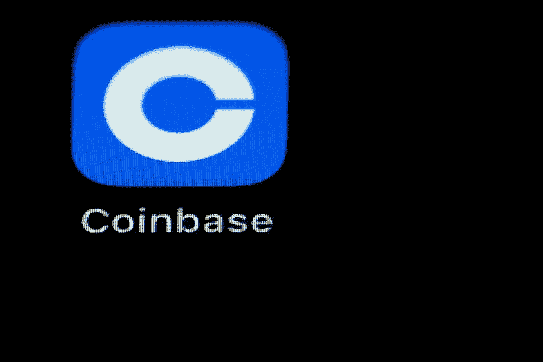

# 摩根大通:比特币基地的短期前景“仍然黯淡”

> 原文：<https://medium.com/coinmonks/jpmorgan-coinbases-short-term-outlook-is-still-bleak-cb5cffd05183?source=collection_archive---------17----------------------->

美国银行(Bank of America)在周二的一份报告中表示，比特币基地有能力成功度过加密货币市场即将到来的“冬天”，并占据市场份额。此外，在第二季度业绩公布后，该公司维持了买入建议。

报告称，这些结果证明了“隐含的股权反应”。净收入为 8.03 亿美元，低于银行和更广泛的市场预期，而调整后的利息、税收、折旧和摊销前亏损为 1.51 亿美元，好于预期。报告补充说，重要的是，该公司对实现全年调整后 PFA 损失不超过 5 亿美元的目标保持“谨慎乐观”。

比特币基地股价早盘下跌近 8%，至 80.74 美元。

美国银行指出，比特币基地没有暴露于第二季度加密货币市场的违约风险。该公司还“在融资活动中没有信用损失的历史，以 1:1 的比例维持客户资产，客户的任何加密货币借贷活动都由客户决定，需要 100%以上的抵押品。”该行表示，这些严格的风险管理实践将成为该股的“积极的长期分散因素”。

摩根大通表示，比特币基地经历了又一个艰难的季度，同时也看到了一些积极因素。

交易量和营收大幅下滑。它在周三的一份研究报告中表示，订阅收入也有所下降，但如果不是因为利率上升，情况会糟糕得多。

该报告称，该公司正在采取措施控制成本，除了在 6 月裁员之外，还在缩减营销和停止一些产品投资。

该银行表示，该公司的近期前景“仍然黯淡”，并指出该公司预计 2022 年第三季度月度交易用户(MTU)和交易量将继续下降，但表示如果加密货币价格进一步下跌，比特币基地可能会采取更多“削减成本的措施”。

摩根大通在短期内对该公司的乐观程度不如美国银行，称加密货币市场下跌对收入的压力将对股价产生负面影响。然而，它看到了一些积极因素，包括较高的利率，公司将从中产生收入。它还看到了利用近 60 亿美元现金扩大用户群的机会。他补充说，7 月份加密货币价格上涨和即将到来的以太坊合并也被视为积极的催化剂。

该行维持对该股的中性评级，并将目标价从 61 美元上调至 64 美元。

*原载于 2022 年 8 月 20 日*[*【https://bitnewsbot.com】*](https://bitnewsbot.com/jpmorgan-coinbases-short-term-outlook-is-still-bleak/)*。*

> 交易新手？试试[加密交易机器人](/coinmonks/crypto-trading-bot-c2ffce8acb2a)或者[复制交易](/coinmonks/top-10-crypto-copy-trading-platforms-for-beginners-d0c37c7d698c)