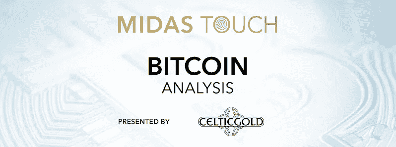
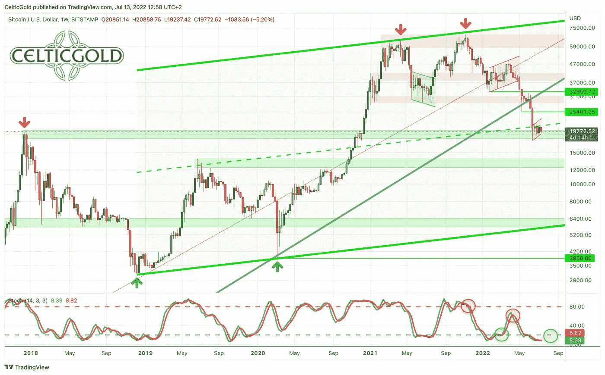
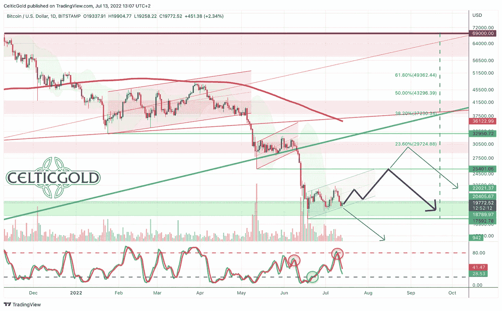
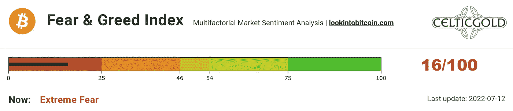
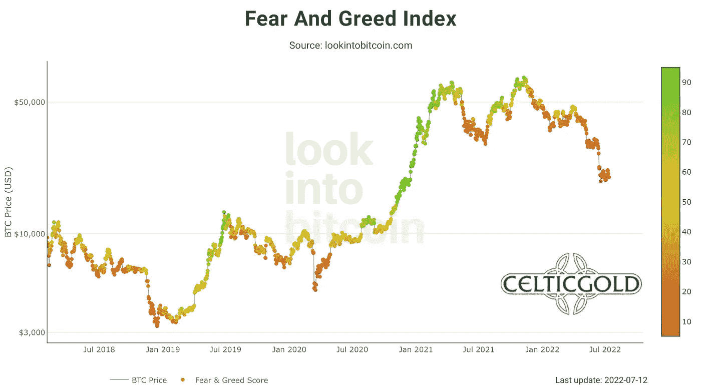
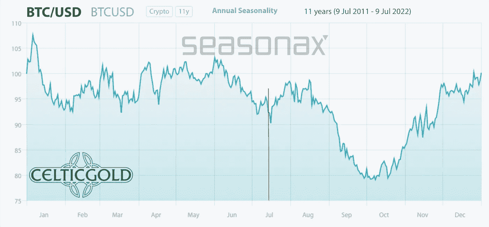
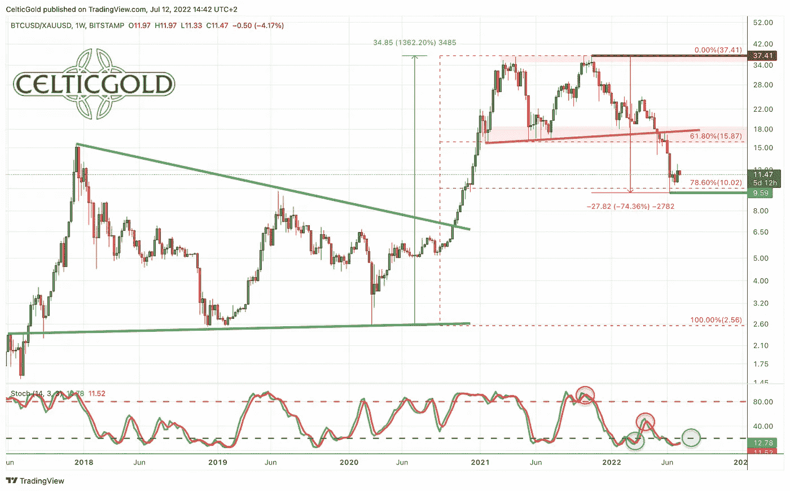
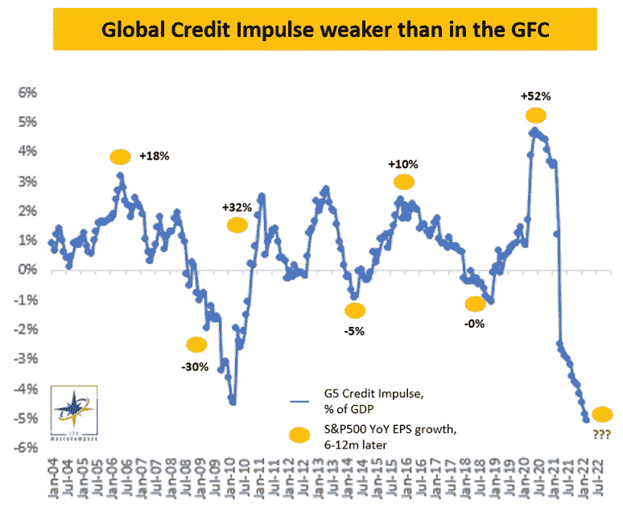
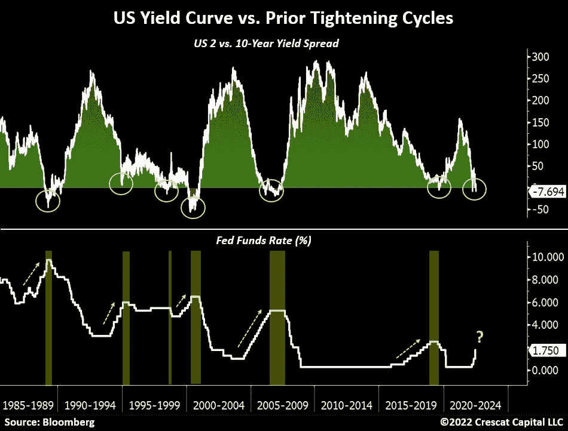
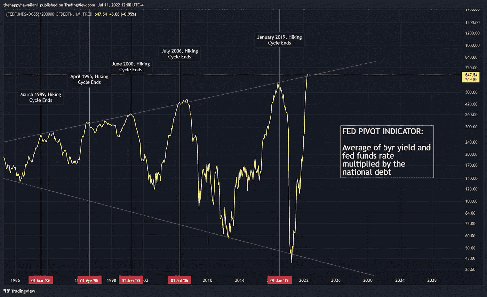

# 2022 年 7 月 14 日，比特币——夏天的救济集会？

> 原文：<https://medium.com/coinmonks/july-14th-2022-bitcoin-relief-rally-in-the-summer-c8a35dee3f7a?source=collection_archive---------34----------------------->

这些天来，全球资产价格的崩溃正在动摇所有投资者和交易者的头脑。似乎没有什么是安全的了，加密部门受到的打击最大。**比特币——夏天的救济集会？**

# 回顾

随着 37，500 美元附近支撑的明确突破，加密领域的抛售从 5 月初开始急剧加剧，比特币价格在短短一周内暴跌至 25，400 美元。尽管当时已经严重超卖，但后来只有一个试探性的恢复或反运动成功，已经在 32375 美元找到了它的终点。

从 6 月 6 日开始，空头直接进入攻击模式，在短短 12 天内将比特币价格推低至 17600 美元，这是自 2020 年 12 月以来的最低水平。这次崩盘之后，价格再次缓慢而试探性地回升。到目前为止，他们只设法恢复到 22，400 美元。底线是[比特币](https://www.midastouch-consulting.com/cryptocurrencies-info/bitcoin)已经从 2021 年 11 月 10 日 69000 美元左右的历史高点下跌了近 75%。

[以太坊](https://www.midastouch-consulting.com/cryptocurrencies-info/ethereum) (-81.9%)以及[索拉纳](https://www.midastouch-consulting.com/cryptocurrencies-info/solana) (-90%)、[多边形](https://www.midastouch-consulting.com/cryptocurrencies-info/polygon) (-89.2%)、Chainlink (-89.6%)、 [Cardano](https://www.midastouch-consulting.com/cryptocurrencies-info/cardano) (-87%)等更大的山寨币受到的惩罚更加严厉。然而，较小的替代硬币几乎全部损失了 90-99%。

# 残酷的破产浪潮

总体而言，随着[残酷的破产浪潮](https://www.zerohedge.com/crypto/crypto-dead-except-one-part) (Lunar，Celsius，[三箭资本](https://www.coindesk.com/business/2022/07/01/three-arrows-capital-files-for-bankruptcy-in-new-york-tied-to-british-virgin-islands-proceeding/)，[航海家数字](https://www.coindesk.com/layer2/2022/07/12/behind-voyagers-fall-crypto-broker-acted-like-a-bank-went-bankrupt/)，BlockFi，Babel Finance 等，加密行业受到了沉重打击。)一直在展开。混乱的动荡在短短几个月内抹去了超过 2 万亿美元的市值，损失了数千个工作岗位。由于该行业内部不透明的相互联系以及大量欺诈性投机者或缺乏经验的玩家，这场洗牌还看不到尽头。

当资产价格崩溃或一笔巨额贷款的交易对手违约时，贷方的资产负债表就会留下巨大的窟窿。抵押品的剩余变现会导致更多贷款到期，进而导致抵押品的进一步变现。因此，最近几周，许多交易场所限制或阻止用户提款，进一步导致流动性枯竭。

在某些情况下，曾相信这些贷款机构会保护自己资产、尤其是产生高回报的散户投资者，已经失去了一切。除此之外，人们还担心全球经济衰退，同时伴随着 40 多年来最严重的通货膨胀。因此，尽管损失巨大，这场风暴可能还没有结束。

# 美元比特币的技术分析

## 比特币周线图——复苏的机会

*Bitcoin in USD, weekly chart as of July 13th, 2022\. Source:* [*Tradingview*](https://www.tradingview.com/u/CelticGold/)

比特币已经经历了八个多月的剧烈调整。除了 2 月和 3 月的反弹时间有所延长之外，就阻力而言，多头几乎没有什么可提供的。即使是 10 年上升趋势线(深绿色)对空头来说也是一场轻松的游戏。现在，比特币价格紧贴着压倒性上升通道的中线。这与完全超卖的随机振荡器和 20，000 美元附近的前历史高点一起，形成了一定的支撑，目前似乎成立。

总的来说，周线图目前仍然看跌，但未来几周复苏的机会可能会超过悲观的前景。正如我们从过去所知道的，比特币的熊市反弹可能是极端的。现实的回收目标是 25，400 美元左右，也可能是 29，750 美元。

## 比特币日线图——布林线收紧

*Bitcoin in USD, daily chart as of July 13th, 2022\. Source:* [*Tradingview*](https://www.tradingview.com/u/CelticGold/)

在日线图上，自 6 月 18 日的低点以来，盘整再次出现，这可能是一个类似于之前的旗帜形态。在任何情况下，17，592 美元的低点在过去三周半内都没有被削弱。随机指标仍然有活跃的卖出信号，但是振荡指标几乎已经到了超卖区。

如果 20，000 美元附近的稳定同时成功，则有可能朝着布林带上轨(22，021 美元)的方向恢复，并达到 5 月低点 25，401 美元附近。

**综上所述，日线图目前依然看跌。同时，在 19，000 美元和 21，500 美元之间可以看到一些稳定趋势。加上与快速下跌的 200 天移动平均线(36，122 美元)的距离相对较大，有一些理由表明夏季会出现一波反弹。**

> 交易新手？试试[密码交易机器人](/coinmonks/crypto-trading-bot-c2ffce8acb2a)或者[复制交易](/coinmonks/top-10-crypto-copy-trading-platforms-for-beginners-d0c37c7d698c)

# 情绪比特币——夏天的救济反弹？

*Crypto Fear & Greed Index, as of July 12th, 2022\. Source:* [*Lookintobitcoin*](https://www.lookintobitcoin.com/charts/bitcoin-fear-and-greed-index/)

自 4 月初以来，加密的恐惧和贪婪指数一直在深红恐慌区交易，因此至今已有三个多月了。因此，对加密领域的恐惧根深蒂固。

*Crypto Fear & Greed Index long term, as of July 12th, 2022\. Source:* [*Lookintobitcoin*](https://www.lookintobitcoin.com/charts/bitcoin-fear-and-greed-index/)

在大图中，加密恐惧和贪婪指数中当前的暗红色情况类似于 2019 年 1 月的设置。当时，加密冬天也残酷地袭来，比特币花了近三个月的时间才开始大规模复苏。当时的筑底阶段没有出现新的低点。

总的来说，被击败的恐慌情绪提供了两年多来最好的反向买入信号！

# 季节性比特币

*Seasonality for bitcoin, as of July 11th, 2022\. Source:* [*Seasonax*](https://app.seasonax.com/assets/btc-usd-cc?h=eJyrVkpUsjI2MtBRKipWslIyMjA0NDAxMlMC8lPBfCMjKL9SySo6VkcpV8nKUEcpBUwmlylZGdQCAP58Dzw%3D)

由于今年上半年价格表现疲软，比特币仍然年轻的季节性模式已经明显减弱或变平。然而，根据统计数据，从 8 月底开始应该会有一波下跌，这可能与股票市场的另一次抛售同时发生。在那里，9 月也没有赢得好名声，但传统上被视为股市一年中最糟糕的月份。然而，直到 8 月中旬，季节性前景并不妨碍加密行业的小幅复苏。

**总体而言，季节性因素继续促使人们保持耐心和谨慎。从统计角度来看，情况应该要到 10 月中下旬才会好转。然而，未来几周可能会出现一次小型的夏季反弹。**

# 健全的货币:比特币与黄金

*Bitcoin/Gold-Ratio as of July 12th, 2022.Source:* [*Tradingview*](https://www.tradingview.com/u/CelticGold/)

类似于比特币的崩溃，**比特币/黄金比率**也在最近几个月下跌，目前交易在 11.5 左右。因此，自 2021 年 11 月以来，比特币对黄金的汇率几乎下跌了 75%！按照目前一个比特币约 20，000 美元和一金衡盎司黄金约 1，710 美元的价格，一个比特币需要支付近 11.5 盎司的黄金。换句话说，一盎司黄金目前的价格约为 0.085 比特币。

考虑到周线图在 78.6%回撤附近的严重超卖情况，目前反转或恢复的机会并不坏。在最好的情况下，回撤至 15-16 附近的破支撑是可能的。然而，如果比特币空头继续控制局面，这一比例也可能在未来几个月直接降至 5 比 6 左右。

## 合理货币的分配

一般来说，只有在平衡这两种资产类别的配置时，买卖比特币和黄金才有意义！一个人总资产的至少 10%到最多 25%应该投资于贵金属实物，而加密货币，尤其是比特币，应该至少持有 1%，但最多不超过 25%。5%.如果你对加密货币和比特币非常熟悉，你当然可以在个人基础上为比特币分配高得多的百分比。对于主要投资于股票和房地产的普通投资者来说，在仍然具有高度投机性和高度波动性的比特币中最多投资 5%是一个很好的指导方针！

> **总的来说，你想拥有黄金和比特币，因为对立面是互补的。在我们阴阳、身与心、上与下、暖与冷的二元世界里，我们被必然的对立吸引所束缚。从这个意义上来说，你可以把黄金和比特币看成这样一对实力。有了黄金的物理成分和比特币的原始数字特征，你就拥有了一个 21 世纪真正避风港的补充单元。你想两者都拥有！——**[**弗洛里安**](https://www.midastouch-consulting.com/about)

**总之，比特币/黄金比率表明未来几周比特币将出现复苏。考虑到总体形势的困难，人们不应抱太大希望，但升至 15%左右似乎是可能的。虽然黄金在 2020 年和 2021 年经常失利，但今年它能够充分发挥其保守特性，尽管价格略有下跌，但仍是投资组合中渴望的避风港。**

# 宏观更新——2022 年的恐慌和衰退

世界变化比以往任何时候都快。世界各地的政治格局正在迅速变化，变得日益不可预测。虽然技术正在改变我们所做的一切，但几乎在世界的每个地方，社会紧张局势都在加剧。然而，一盎司黄金仍然是一盎司黄金。同样，一个比特币仍然是一个比特币。

*Global Credit Impulse, as of July 7th, 2022\. ©*[*The Macro Compass & Alfonso Peccatiello*](https://themacrocompass.substack.com/)

在尼克松废除金本位制 50 多年后，货币政策陷入绝境，因为美联储对抗通胀的斗争可能很快让世界陷入萧条的深渊。在其量化紧缩计划开始仅两周之后，市场就已经表现得像一个戒瘾者。由于巨大的财政压力以及私营部门犹豫不决的再融资活动，我们现在正在目睹信贷创造的收缩，其速度甚至比 2008 年金融大危机期间还要快！

因此，美联储在不引发市场严重混乱的情况下对抗通胀的平衡之举注定要失败。刚刚开始的紧缩周期的激烈程度有可能将“一切泡沫”变成“一切崩溃”。

## 美联储何时结束紧缩周期？

*US Yield Curve vs. Prior Tightening Cycles, as of July 12, 2022\. ©*[*Crescat Capital & Tavi Costa*](https://twitter.com/TaviCosta/status/1546623253480742912)

因此，现实的预期是，美国货币政策将不得不尽早偏离当前的鹰派货币政策立场，并来个 180 度大转弯。然而，不能排除美联储将再次行动得太晚。目前，美国的收益率曲线已经开始转向。在过去的 30 年里，这个星座每次都迫使美联储结束紧缩周期。由于系统性风险现在比历史上任何时候都大，美联储再也不能做出错误的决定了。

*Fed pivot indicator, as of July 11th, 2022\. ©*[*TheHappyHawaiian*](https://twitter.com/ThHappyHawaiian/status/1546527570748899328)

事实上，一些迹象表明，美联储将不得不尽快做出反应。随着下一次加息，美联储可能会故意炸毁金融系统。因此，即便是加息将被暂停或至少放缓的口头暗示，目前也应足以引发所有市场的夏季宽慰反弹。同样，由于全球经济收缩，预计美国通胀数据将有所疲软，市场也将大大缓解这一局面。

此外，美元指数一路飙升，在过去 14 个月中几乎不间断地累计上涨了+21.25%。美元的喘息应该会给股票、大宗商品、贵金属和加密市场带来一丝宽慰。因此，总体而言，未来夏季几周所有市场复苏的可能性并不小。然而，最迟从 8 月中旬或 9 月开始，空头可能会卷土重来。

# 结论:比特币——夏天的救济反弹？

经过一个月的抛售，包括一波令人讨厌的破产，比特币目前的交易价格略低于 20，000 美元。八个月前，很少有人会想到这一点。然而，现在看涨的市场参与者很少了，许多专家都提出了新的更低的比特币价格目标。另一方面，比特币网络本身完全不受加密领域“雷曼时刻”的影响，继续通过平等计算机(点对点)的计算机网络处理任何加密合法的支付，没有任何问题。

**在股票市场的背景下，股票市场也经历了严重的调整，并在最近几个月与加密行业密切相关，由于严重超卖的情况，可以看出短期的复苏机会。事实上，夏季对 25，000 美元左右甚至接近 30，000 美元的救济反弹是可能的，特别是如果通胀略有下降，美联储采取稍微温和的语气。然而，加密冬天的结束可能还需要很长时间。无论如何，从长远来看，低于 20，000 美元的价格提供了一个很好的进入机会。但我们认为，未来 3 至 12 个月，底部更有可能在 10，000 美元左右。**

*分析主办，2022 年 6 月 13 日初版，作者*[*www . Celtic gold . eu*](https://celticgold.de/blog/gold-und-bitcoin-analysen-von-florian-grummes-32/bitcoin-erleichterungsrally-im-sommer-180)*。翻译成英文，2022 年 6 月 12 日部分更新。*

*随时加入我们的* [*我们的免费电报频道*](https://www.midastouch-consulting.com/services/newsletter-telegram) *获取每日实时数据和一个伟大的社区。如果您喜欢定期了解我们的黄金模型、贵金属、商品和加密货币，您还可以订阅我们的* [*免费简讯*](http://bit.ly/1EUdt2K) *。*

*声明:本文及其内容仅供参考，不包含投资建议或推荐。每一次投资和交易都有风险，读者在做决定时应该进行自己的研究。此处表达的观点、想法、看法，均为作者个人观点。它们不一定反映或代表 Midas Touch Consulting 的观点和意见。*

> 加入 Coinmonks [电报频道](https://t.me/coincodecap)和 [Youtube 频道](https://www.youtube.com/c/coinmonks/videos)了解加密交易和投资

# 此外，请阅读

*   [加拿大最佳加密交易机器人](https://coincodecap.com/5-best-crypto-trading-bots-in-canada) | [比特币点评](https://coincodecap.com/kucoin-review)
*   [霍比加密交易信号](https://coincodecap.com/huobi-crypto-trading-signals) | [HitBTC 回顾](/coinmonks/hitbtc-review-c5143c5d53c2)
*   [trade rwgon Review](https://coincodecap.com/traderwagon-review)|[北海巨妖 vs Gemini vs BitYard](https://coincodecap.com/kraken-vs-gemini-vs-bityard)
*   [如何在 FTX 交易所进行期货交易](https://coincodecap.com/ftx-futures-trading)
*   [OKEx vs ku 币](https://coincodecap.com/okex-kucoin) | [摄氏度替代能源](https://coincodecap.com/celsius-alternatives) | [如何购买 VeChain](https://coincodecap.com/buy-vechain)
*   [盈利农民回顾](https://coincodecap.com/profitfarmers-review) | [如何使用康沃尔交易机器人](https://coincodecap.com/cornix-trading-bot)