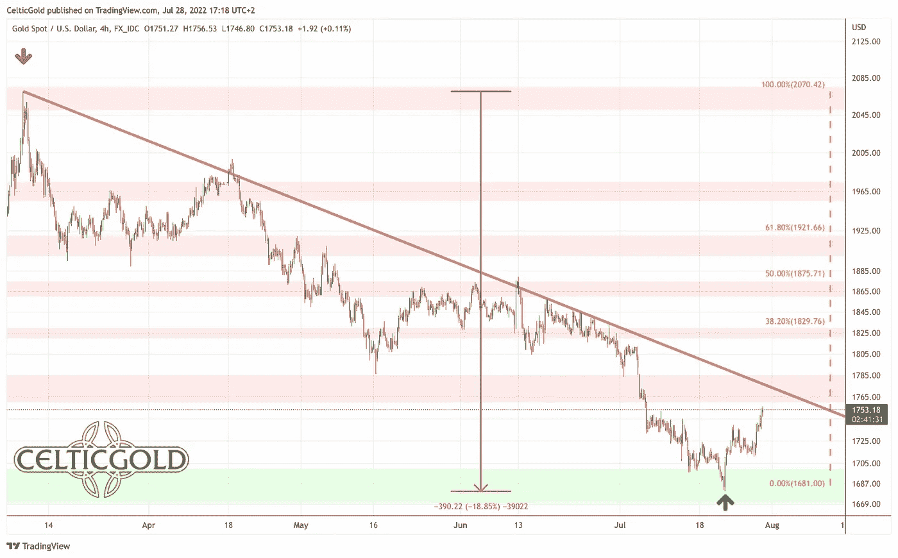
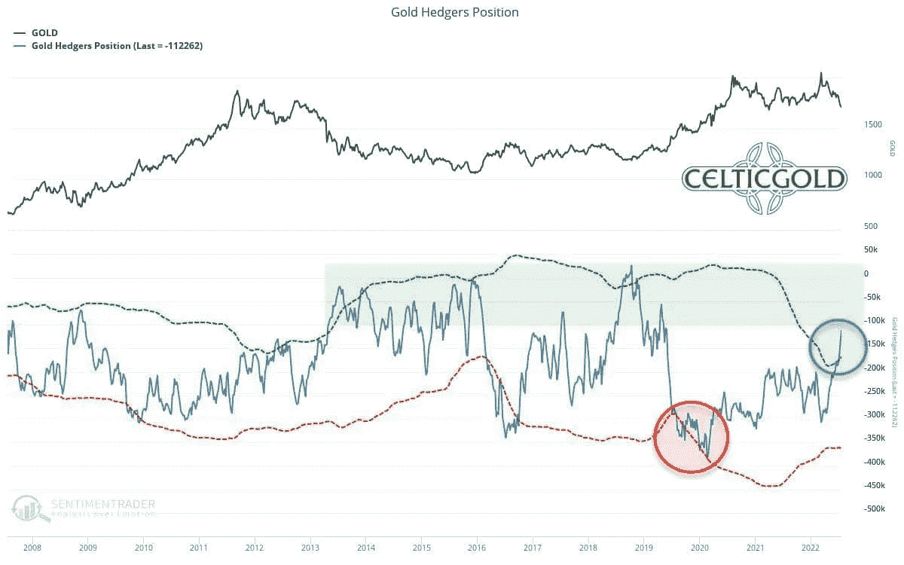
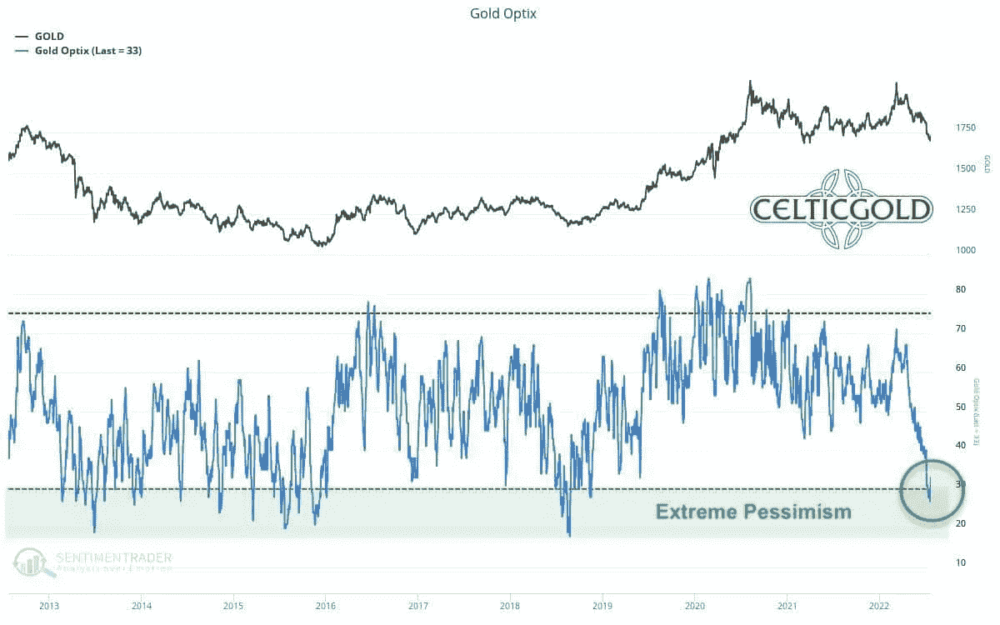

# 2022 年 7 月 28 日:黄金——夏季反弹已经开始

> 原文：<https://medium.com/coinmonks/july-28th-2022-gold-summer-rally-has-started-65957bd8ff9?source=collection_archive---------53----------------------->

对于黄金和白银投资者来说，这是艰难的三个半月。然而，自 2021 年 11 月以来，股票市场和密码投资者已经遭受损失。现在，在黄金市场经历了近 400 美元的大屠杀后，上周的逆转看起来很有希望。黄金——夏季反弹已经开始。

## 回顾

黄金价格在 2022 年 3 月 8 日达到重要高点，约为 2070 美元，此后在过去三个半月的时间里陷入了残酷的抛售。这波下跌的最后低点是在 7 月 21 日星期四，1681 美元。因此，黄金在相当短的时间内损失了近 400 美元或 18.8%。

*Gold in USD, 4-hour chart as of July 28th, 2022\. Source:* [*Tradingview*](https://www.tradingview.com/u/MidasTouchConsulting/)

除了明显超买的情况和 3 月份的乐观情绪，以及贵金属自 2020 年 8 月以来已经处于调整之中的事实，加息和美国货币政策量化收紧的有毒组合，以及高通胀数据和崩溃的股票和加密市场，以及由此引发的严重衰退，是黄金市场出现抛售压力和令人讨厌的螺旋式下降的主要原因。越来越多受到股票和密码崩溃困扰的投资者因此被迫出售他们持有的实物贵金属，以获得急需的流动性。

因此，我们所希望的“T2 夏季萧条”今年并没有出现。相反，黄金选择了我们的替代方案，即价格进一步下滑。然而，毕竟，黄金能够在上周相当冲动地恢复，并在今天早上触及 1750 美元。因此，昨日的 FOMC 会议似乎放大了黄金市场的一波空头回补。至少在未来一至三个月内，这很可能会发展成典型的夏季反弹。

## 技术分析:黄金以美元计价

**周线图——在 4 年上升通道的上边缘**

*Gold in US-Dollars, weekly chart as of July 28th, 2022\. Source:* [*Tradingview*](https://www.tradingview.com/u/MidasTouchConsulting/)

在周线图上，黄金在过去的三个半月里无情地修正。最后，价格甚至略低于 2018 年 8 月以来建立的平坦上升通道的上边缘(绿色)。只有在这里，在去年的三重底部(1678 美元)，黄金多头成功稳定了价格。从烛台的角度来看，最后两根绿色蜡烛预示着反转。最重要的是，强烈超卖的随机振荡指标看起来很有希望。振荡指标有很大的空间进行持续几周至几个月的强劲反弹。然而，周线振荡指标还没有明确的“买入信号”。

**整体来看，周线图仍处于下跌趋势。目前还没有明显的趋势逆转。但是稳定无疑是成功的。如果这确实是一个可持续的底部，反弹甚至强劲复苏应该会在未来两到三个月内占据相当大的空间。**

## 日线图——随机买入信号

*Gold in US-Dollars, daily chart as of July 28th, 2022\. Source:* [*Tradingview*](https://www.tradingview.com/u/MidasTouchConsulting/)

日线图上，趋势反转清晰可见。自低点 1681 美元以来，金价上涨了 70 多美元。这证实了我们的假设，即底部已经到位，黄金至少已经开始了某种形式的复苏。现在，下跌的 200 天移动平均线(1，842 美元)将像磁铁一样吸引价格接近。1830 美元。确切地说，这里也将等待自 3 月以来整个下跌波的 38.2%的回撤，这通常是逆势运动的最小目标。

**总而言之，日线图已经看涨一周了，仍然提供买入信号。然而，前进的道路充满了强大的阻力。在 1，755 至 1，760 美元附近，一条更老的下降趋势线正在等待。这里也是著名的阻力位 1，750-1，785 美元的起点。更强的阻力很可能来自过去三个半月的下降趋势线(目前在 1800 美元左右，并且正在快速下降)。低于 1700 美元，尤其是低于 1680 美元，但是，抛售仍在继续。在这种不太可能的情况下，价格应该在 1，625 美元左右。**

## 黄金交易商的承诺——夏季反弹已经开始

*Commitments of Traders for Gold as of July 25th, 2022\. Source: Sentimentrader*

过去四周，商业市场参与者的累计净空头头寸又减少了 66，307 份合约，至“仅”卖空 112，262 份黄金合约。因此，商业净空头头寸仅略高于 100，000 份空头合约的阈值，在该阈值时，可以说是积极或看涨的黄金成本报告。换句话说，专业市场参与者认为对冲金价下跌的需求越来越少，但由于金价较低，他们越来越多地转向买方。

**总之，CoT 报告可以归类为谨慎看涨。**

## 黄金人气——夏季反弹已经开始

*Sentiment Optix for Gold as of July 25th, 2022\. Source: Sentimentrader*

最新的黄金情绪数据自 2018 年秋季以来首次衡量出一种极度悲观的情绪！将近四年的时间里，耐心的黄金投资者不得不等待这个充满希望的反向操作！

*Gold & Silver future contracts held by managed money as of July 25th, 2022\. Source: Sentimentrader*

毫不奇怪，资产管理公司目前在其客户投资组合中持有的黄金和白银期货合约累计数量是 2018 年 8 月以来的最低水平，这是过去 16 年长期比较中的第二低位置。这种低配置证明了对贵金属价格非常负面的预期。

总的来说,“情绪交通灯”现在是绿色的，提供了一个逆势买入信号！

## 黄金的季节性——夏季反弹已经开始

*Seasonality for Gold over the last 53-years as of June 22nd, 2022\. Source: Seasonax*

从季节性角度来看，黄金即将开始其典型的夏季反弹，从统计数据来看，过去 54 年来，这通常会导致贵金属价格在 8 月和 9 月大幅上涨。

从现在起到 10 月初，黄金和白银的季节性非常强劲。

## 宏观更新:恐慌、衰退和滞胀

自 2008 年金融危机以来，所有央行一直在通过低利率和“量化宽松”逐步向银行体系乃至整个金融体系提供巨额额外流动性。这是为了对抗通货紧缩。自科罗纳危机开始以来，美国美联储再次以每月 1200 亿美元的速度大幅增持政府债券和抵押贷款债券。然而，在央行行长长期拒绝承认由此导致的通胀率大幅上升后，自今年年初官方通胀率突破 6——8%以来，再也没有借口了。

因此，美国美联储已于 2022 年 3 月结束债券购买，并宣布打算缩减其资产负债表，目前其资产负债表规模接近 9 万亿美元。除此之外，从 6 月 1 日起，每月从到期的政府债券中获得的高达 300 亿美元的收益和从到期的抵押贷款支持证券中获得的高达 175 亿美元的收益将不再进行再投资。

央行行长们是否会成功地从极度宽松的货币政策中谨慎而缓慢地退出，谁也说不准。迄今为止，无论如何，金融市场对过去 7 个月央行政策的变化反应就像一个“戒瘾者”。

*FED Balance Sheet Total as of July 13th , 2022, ©*[*Holger Zschaepitz*](https://twitter.com/Schuldensuehner/status/1548075194907967492)

根据截至 7 月 13 日公布的官方数据，美联储因此已经停止再次收缩资产负债表，因为截至 7 月 13 日总资产增加了 40 亿美元，达到 88.96 亿美元。美联储的资产负债表目前相当于美国 GDP 的 36.5%，而欧洲央行和日本央行分别为 82%和 135%。

*ECB Balance Sheet Total as of July 22nd , 2022, ©*[*Holger Zschaepitz*](https://twitter.com/Schuldensuehner/status/1552016047569600513)

在连续三周收缩后，欧洲央行的资产负债表最近也再次增长。总资产在上周增加了 26 亿欧元，达到 87，693 亿欧元。这意味着欧洲央行的资产负债表仍接近历史最高水平，目前相当于欧元区 GDP 的 82%。

无论如何，对全球经济的损害已经造成，并可能在未来几个月恶化，因为在经历了七个多月的股价下跌后，衰退越来越多地影响到实体经济。不仅几乎所有公司的估值都大幅下降，裁员人数也在增加，加薪、奖金和工作机会都被取消。此外，初创企业发现很难获得融资。

房地产市场也早已见顶，要价已经下降，抵押贷款需求低于 2000 年以来的任何时候。最便宜的房产的房屋销售目前下降得最厉害，因为这里的潜在买家对价格更敏感，通常受利率变化的影响更大。但 2 月至 5 月间，豪宅销售也下降了近 18%。

也就是说，在不彻底摧毁经济的情况下，美联储将很难在秋季进一步加息。但与此同时，通胀将保持高位，因此滞胀环境将继续收紧。这些都是金价上涨的绝佳条件。然而，在经济放缓的早期阶段，大宗商品和贵金属通常会面临巨大压力。这正是现在发生的情况。最晚，当美国美联储明年不得不回到宽松立场以及量化宽松和降息时，黄金价格很可能会创下新的历史新高。

## 结论:黄金-夏季反弹已经开始

随着日线图上的买入信号、情绪低落和非常有利的季节性因素，目前有三个强有力的理由表明黄金市场即将迎来夏季反弹。完全超卖的周线图和颇具建设性的 CoT 报告也支持了这个论点。然而，金融市场已经像 2008 年一样收缩了几个月，这拖累了所有资产类别。在这种环境下，过早预测底部可能是危险的。

**尽管如此，夏季反弹至 1830 美元附近的可能性非常大。更高的复苏目标也是可以想象的。从短期来看，重要的是底部得到确认，黄金可以继续向大约。1，770 至 1，775 美元，预计将有一至三周的喘息时间。**

*分析最初发表于 2022 年 7 月 27 日，作者*[www . Celtic gold . de](https://celticgold.de/blog/gold-und-bitcoin-analysen-von-florian-grummes-32/gold-sommerrally-kann-beginnen-184)*。翻译成英文，2022 年 7 月 28 日部分更新。*

*随时加入我们的* [*我们的免费电报频道*](https://www.midastouch-consulting.com/services/newsletter-telegram) *获取每日实时数据和一个伟大的社区。如果您喜欢定期了解我们的黄金模型、贵金属和加密货币，您还可以订阅我们的* [*免费简讯*](http://bit.ly/1EUdt2K) *。*

*声明:本文及其内容仅供参考，不包含投资建议或推荐。每一次投资和交易都有风险，读者在做决定时应该进行自己的研究。此处表达的观点、想法、看法，均为作者个人观点。它们不一定反映或代表 Midas Touch Consulting 的观点和意见。*

> 交易新手？试试[密码交易机器人](/coinmonks/crypto-trading-bot-c2ffce8acb2a)或者[复制交易](/coinmonks/top-10-crypto-copy-trading-platforms-for-beginners-d0c37c7d698c)