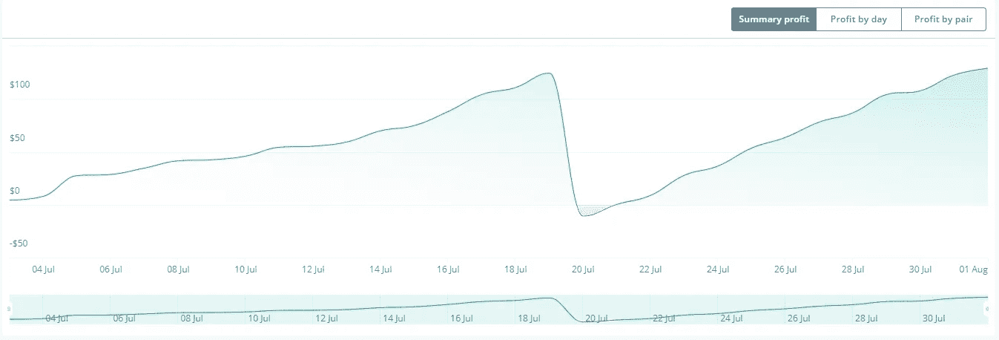
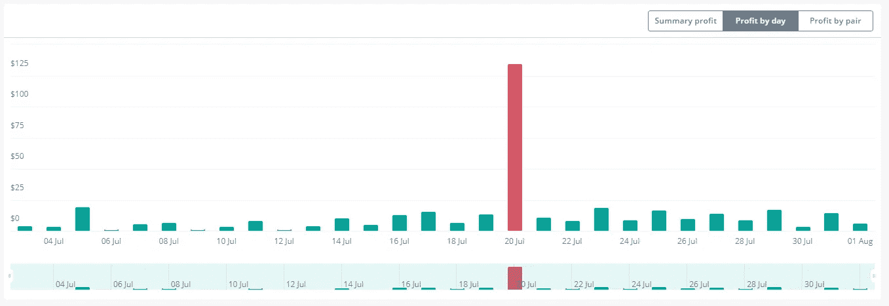
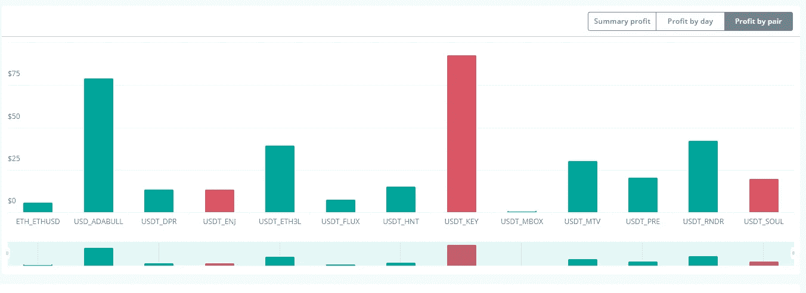

# 7 月:来自机器人、矿工和 Stepn 的 417 美元被动收入！

> 原文：<https://medium.com/coinmonks/july-417-in-passive-income-from-bots-miners-stepn-cb16e5e785df?source=collection_archive---------3----------------------->

时间去哪里了？？8 月已经到了，是时候更新 7 月的被动收入了..我会在下面留下一些前几个月更新的链接。

[4 月](/coinmonks/how-much-passive-income-have-i-made-with-my-crypto-miners-dca-bots-in-the-last-30-days-bcfb4c46a25a)——被动收入 705 美元

[五月](/coinmonks/may-1-400-in-passive-income-from-bots-miners-a-couple-of-new-projects-3c824d798f7b)——1400 美元的被动收入

[6 月](/coinmonks/june-1-099-in-passive-income-from-bots-miners-stepn-feaa4cf9a276)——1099 美元的被动收入

1.  **M2 职业矿工**

我有两个这样的矿工。这些矿工每人给我赚了 3945 MXC，按目前的价格计算，总共相当于 540 美元。如果我拿着这些去 ATH，这个月会涨到 1025 美元！

自从我在 2 月底和 5 月初购买了这些矿工，我已经开采了 6000 美元投资中的 2412 美元，总共支付了大约 5 美元的电费！

如果我等待 MXC 到达之前的 ATH 时卖出，我已经积累了 4712 美元，超过了 75%的投资回报率。

完整评论&优惠 50 美元[此处](https://realisticcrypto.medium.com/my-highest-paying-2-electric-per-month-plug-play-crypto-miner-makes-me-around-12-per-day-per-375ccc604988)

**2。氦矿工**

这个月又是令人失望的一个月但是被动收益还是被动收益！

我有 2 个 Sensecap M1 氦矿工设置了 5.8dbi 无线天线。我有 1 个山猫 300 矿工，我已经在 8 月份设置，另一个山猫 300，我正在为一个新家工作-希望我们可以增加 HNT 的收入，一旦所有 4 个在线。

总的来说，第一个赢得了 3.10 HNT，第二个赢得了 1.58 HNT，总计约 43 美元。

如果我等待 HNT 到达之前的 ATH 时卖出，这个月的总额将是 256.83 美元。

在投资方面，我在 miners & antennas 上花了大约 1700 美元，到目前为止，我总共赚了 19.45 HNT——今天的价格是 180 美元，或者以前的 ATH 是 1067 美元。

**3。步骤**

这个月有点令人失望。不仅商品及服务税的价格下跌，而且这个月我也没有出去慢跑，原因有很多，从热，到在办公室迟到和参加一些活动。

在最近一次更新中，我有一双 23 级的普通运动鞋，它在 6 月份获得了 660.68GST。运动鞋现在是一个水平 26 并且在七月产生了 398.31GST，相当于现在的价格 22.28 美元。

我不打算把它与历史最高水平进行比较，因为我不相信商品及服务税会回到接近历史最高水平的水平，但一旦我把运动鞋升到 28 级，我会把商品及服务税退回给 SOL，以收回一些初始投资。

**4。DCA 机器人**

总的来说，这个月我从 3 个商业机器人那里赚了 190 美元，与前几个月相比，这是令人失望的。我正在检查我所有的机器人。虽然下图显示了 110 美元的利润，但我在一个有风险的 5 倍杠杆 ETH bot 上被清算，这没有显示在统计数据中。我被清算了 300 美元，这使我这个月亏损了 190 美元。我还在 USDT 钥匙机器人上遭受了重大打击，这是我较大的仓位之一。

我仅用于机器人的账户总价值为 5589 美元，因此这个月大约损失了 3.4%。

正如我上面提到的，我目前正在审查我所有的机器人，特别是考虑到最近市场变化的短机器人。我的目标是让这些公司更好地应对更具侵略性的价格上涨行动，同时允许我通过从机器人运行的硬币(DPR、ENJ、FLUX、HNT、KEY、MBOX、MTV、PRE、RNDR & SOUL)中获取所有利润，继续在基础硬币中建立袋子。

我写了一篇关于一些 ADABULL 设置的文章，这些设置每天净收益约为 1%。这仍在运行，344 美元的 FTX 帐户，经过 26 天的运行，76.39 美元，使帐户达到 420.39 美元。我的目标是继续复合，直到我达到 100%,然后我会撤回我最初的 344 美元，让其余的运行。

鉴于目前的市场状况，我还在 7 月的一周内推出了一个 ETH3L 机器人。我给这个机器人分配了 230 美元，它在整个 7 月赚了 30 美元。

下个月，我将分享一些使用 [3c 工具](https://www.3c-tools.com/)的更好的统计数据。这个工具向你展示了一些惊人的细节，我计划在以后的更新中加入这些信息。

我如何设置机器人的指南可以在[这里](/coinmonks/dca-bots-do-they-actually-work-and-are-they-actually-passive-income-im-undecided-90846b04db2a)找到。

我的策略继续是积累和复合加密！

**5。SCPrime**

这是一个我非常看好的长期项目。一篇深入的文章可以在[这里](https://realisticcrypto.medium.com/scprime-long-term-investment-providing-your-own-storage-c2ab374c754a)找到。除了我赚了 10.7 SCP，没有更多的要说。按现价 2.93 美元。

总数

M2 专业版——540 美元

氦气——43 美元

stepn——22 美元

DCA 机器人——190 美元

2.93 美元

**总计:417 美元**

**总结**

虽然与其他月份相比，我觉得这是一个令人失望的月份，但从中可以得出一些积极的结果。首先，自从我开始在 Medium 上写作以来，我每个月都持续盈利。它还表明，当一个收入流不如另一个收入流时，拥有多个被动收入流可以真正实现平衡。

**即将推出**

RealisticCrypto 还有更多的内容——我正在想办法将一些机器人内容引入 YouTube。我也有一些其他矿工的订单，我希望在未来几个月内到达，我认为一旦我调整了我的机器人策略，机器人也应该有一些强大的利润，所以请确保你在未来的发展中跟随我。

**附属链接**

更多优惠还可以在这里找到:【https://linktr.ee/RealisticCrypto】T4

还有，如果你想请我喝杯咖啡或者啤酒:) :

BTC—BC 1 qaxaq 2 q 9 js 89 gyzhr 0202 sxt 6 hgchprqjga 5 px

基于 ETH、BNB、AVAX、SOL 和 FTM 的令牌—0 x3b 7b 843d 8125 Fe 7 EBA 541 e 1d 751 a4 a 73 f 0 cfad 4c

**免责声明**

这不是财务建议，我不是财务顾问或会计或税务专家。这是我对帮助过我的软件工具的体验，以及我使用它们的经历。

我在本指南中使用了推荐链接。使用这些工具有助于以后的文章，所以如果你觉得这篇文章有用，并且想看看我介绍的工具，请使用它们。我还会叫出你在哪里打折——双赢对吧？

> 加入 Coinmonks [电报频道](https://t.me/coincodecap)和 [Youtube 频道](https://www.youtube.com/c/coinmonks/videos)了解加密交易和投资

# 另外，阅读

*   [my constant Review](https://coincodecap.com/myconstant-review)|[8 款最佳摇摆交易机器人](https://coincodecap.com/best-swing-trading-bots)
*   [MXC 交易所评论](/coinmonks/mxc-exchange-review-3af0ec1cba8c) | [Pionex vs 币安](https://coincodecap.com/pionex-vs-binance) | [Pionex 套利机器人](https://coincodecap.com/pionex-arbitrage-bot)
*   [我的密码交易经验](/coinmonks/my-experience-with-crypto-copy-trading-d6feb2ce3ac5) | [《比特币基地评论》](/coinmonks/coinbase-review-6ef4e0f56064)
*   [CoinFLEX 评论](https://coincodecap.com/coinflex-review) | [AEX 交易所评论](https://coincodecap.com/aex-exchange-review) | [UPbit 评论](https://coincodecap.com/upbit-review)
*   [AscendEx 保证金交易](https://coincodecap.com/ascendex-margin-trading) | [Bitfinex 赌注](https://coincodecap.com/bitfinex-staking) | [bitFlyer 评论](https://coincodecap.com/bitflyer-review)