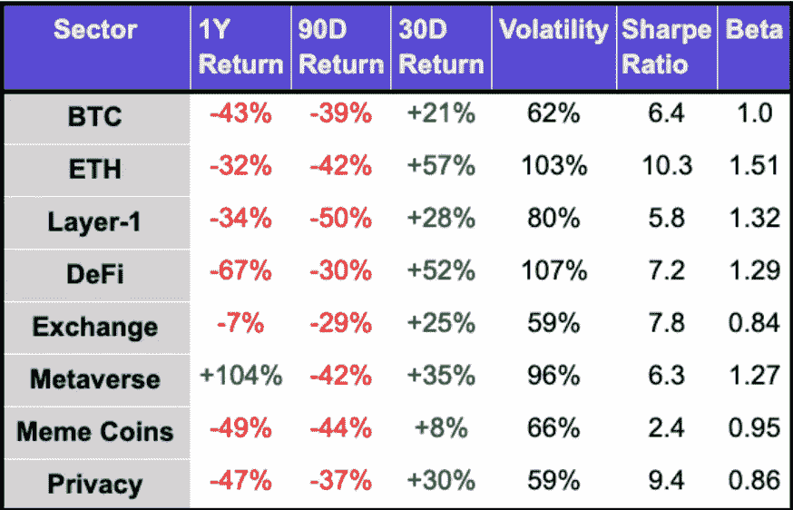
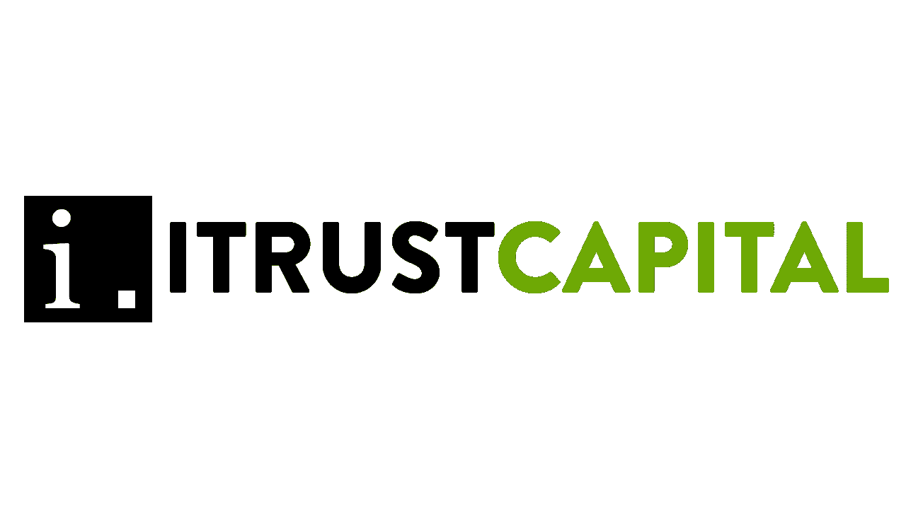

# 🤔七月市场和本周黑客。

> 原文：<https://medium.com/coinmonks/july-market-and-hacks-of-the-week-d5d776be8f8f?source=collection_archive---------45----------------------->

# 内容(3 分钟阅读):

*   🤔7 月份的密码市场怎么样？
*   👨‍👩‍👧‍👧Startupy——社区管理的搜索引擎
*   🐱‍💻本周黑客
*   🏖️个人退休帐户，避税帐户
*   📰热门阅读
*   🙏🏻感激…

# 🤔7 月份的密码市场怎么样？

很难相信我们已经在 2022 年 8 月的第二周了。夏天很快就要结束了，大多数学区将在下周开学。至于加密市场，我们已经看到了一些积极的迹象。

2022 年 7 月显示出加密资产整体复苏的迹象。 **BTC 股市上涨+19%，为 2021 年 10 月以来的最佳月度表现。**BTC 的波动率(61%)略高于其历史平均水平，但低于 2022 年 6 月(91%)。从历史上看，7 月份对 BTC 来说是一个积极的月份，回报率中值为+12%。

**以太坊在 2022 年 7 月上涨了+59%。7 月份，NFT 市场的活动也开始复苏。日均用户数和日均交易量环比分别增长+5.3%和+12.9%。NFT 日均成交量下降了 26.2%，略高于 2022 年 6 月的 68.7%。**

7 月份，BTC 与纳斯达克(0.71)和标准普尔 500 (0.81)保持正相关。BTC 与美国国债(0.37)和黄金(0.66)的相关性逐月下降。

Yaro on Tech、Blockchain 和 Web3 是一份读者支持的出版物。为了接收新帖子和支持我的工作，考虑成为一个免费或付费用户。

[现在就订阅](https://yarocelis.substack.com/subscribe?utm_medium=web&utm_source=subscribe-widget-preamble&utm_content=67641072)

> **结论:**密码市场似乎正在转危为安，以太坊向 PoS 的转型如果成功，可能会将估值推高到超出预期的水平。此外，尽管前几个月不景气，但我们已经看到企业对加密、NFT 和 web3 产品和服务的投资有所增加，这将导致更高的区块链技术采用率。

[启动-](https://beta.startupy.world/membership/?ref=yarocelis)

> *我很高兴地宣布，我已经成为 Startupy 的策展人和会员。一个社区管理的搜索引擎。零 SEO BS。* [***我邀请你加入这个为漫游、研究和思考而设计的知识和见解的令人愉快的图书馆。***](https://beta.startupy.world/membership/?ref=yarocelis)

# 🐱‍💻本周黑客

本周，数千名索拉纳用户登录他们的加密钱包应用程序，发现他们所有的资金都不见了。钱包连续几天被掏空，清空了[8000 多个个人账户的内容。](https://techcrunch.com/2022/08/07/theres-always-another-nightmarish-crypto-hack-around-the-corner/)

虽然各个钱包的用户都报告了这个问题，但问题归结于 [**Slope**](https://www.theverge.com/2022/8/4/23291180/solana-cryptocurrency-slope-phantom-wallet-theft-supply-chain-attack) 钱包中的一个漏洞，该漏洞在用户不知情的情况下，一直在后端记录他们的私钥，如果他们曾经将密钥导入移动应用程序，就会容易受到坏人的攻击。

一天前， [**Nomad bridge**](https://app.nomad.xyz/) 被黑了 1.9 亿美元。

> 当 Nomad 代码中的一个漏洞允许黑客偷走价值近 1.9 亿美元的代币时，盗窃事件发生了。自“免费开放”黑客攻击以来，已追回超过 2000 万美元，这是今年涉及加密桥的第七次重大入侵。

Nomad 起到了区块链桥的作用，允许用户将资产从一个区块链转移到另一个——比如从比特币转移到以太坊。但这也使他们容易受到安全专家所说的“两面”攻击，即区块链的弱点。

加密初创公司 Nomad 提供 10%的奖金，以找回本周在一次大规模黑客攻击中被扣押的高达 1.9 亿美元的数字货币。

> 该公司写道:“Nomad 正继续与社区、执法部门和区块链分析公司合作，以确保所有资金得到返还。”。

[分享](https://yarocelis.substack.com/p/-july-market-and-hacks-of-the-week?utm_source=substack&utm_medium=email&utm_content=share&action=share&token=eyJ1c2VyX2lkIjo4NzI4NzQyLCJpYXQiOjE2NTk5MTg2ODcsImlzcyI6InB1Yi0yODIwMjIiLCJzdWIiOiJwb3N0LXJlYWN0aW9uIn0.EF1vBJK2Dgp-2LQT51Z2P_7zKKZLxlkY0ApSW56153I)

> **结论:**我们将继续看到密码领域的黑客攻击，而且会越来越频繁。对于黑客来说，这是一个非常有利可图的空间，但仍然充满安全漏洞。此外，区块链技术的互操作性对开发即插即用产品的开发者来说非常有吸引力，但随着更多的钱包、网桥和其他协议被利用，这也可能变成一个漏洞。

[ITrust](https://itrustcapital.com/referral100?utm_source=partner&utm_medium=youtube&utm_campaign=partner637&oid=10&affid=637)

加密货币是这些天每个人都在谈论的东西之一。有各种不同的交易所可以进行电子加密……但是很多人没有意识到他们在税费上损失了多少。

[iTrustCapital](https://itrustcapital.com/referral100?utm_source=partner&utm_medium=youtube&utm_campaign=partner637&oid=10&affid=637) 允许其客户通过个人退休账户或个人退休账户投资 crypto，而不必担心税收或费用。

IRA 是避税账户，这意味着你所有的加密交易都是免税的，并且可以随着时间的推移免税增长**。**

没有隐藏的费用。[要了解更多信息，请点击此处并开通免费账户。](https://itrustcapital.com/referral100?utm_source=partner&utm_medium=youtube&utm_campaign=partner637&oid=10&affid=637)

[分享 Yaro 的技术& WebX 简讯](https://yarocelis.substack.com/?utm_source=substack&utm_medium=email&utm_content=share&action=share)

# 📰热门阅读

*   [**马克·扎克伯格的元宇宙梦将会失败，以太坊的维塔利克·布特林预言**](https://coinmarketcap.com/alexandria/article/mark-zuckerberg-s-metaverse-dream-will-fail-ethereum-s-vitalik-buterin-predicts)
*   [概括地说，NFTs:每周回顾](https://bitcoinist.com/nfts-in-a-nutshell-a-weekly-review-61/)
*   [顶级分析师称以太坊(ETH)即将崩溃，称一个交换令牌为“真实的坦克”](https://dailyhodl.com/2022/08/07/top-analyst-says-ethereum-eth-about-to-rip-calls-one-exchange-token-an-actual-tank/)
*   [cryptodickbats 以太坊 NFTs 日销量激增 690%](https://decrypt.co/106914/why-cryptodickbutts-ethereum-nft-surging-in-volume)
*   [摩根士丹利的招聘启事指向广泛的加密计划](https://www.theblock.co/post/161958/morgan-stanley-job-posting-points-to-wide-ranging-crypto-plans?utm_source=cryptopanic&utm_medium=rss)
*   [尽管熊市，2022 年的融资已经超过 2021 年:梅萨里](https://cryptopotato.com/despite-bear-market-2022-fundraisings-already-surpassed-2021-messari/)
*   [亿万富翁马克·库班解释了为什么美国证券交易委员会对加密的立场是“极其虚伪的”](https://www.cryptoglobe.com/latest/2022/08/billionaire-mark-cuban-explains-why-secs-stance-on-crypto-is-incredibly-hypocritical/)
*   [$MATIC:可口可乐在 Polygon 上投放了一个“特殊的数字收藏品”](https://www.cryptoglobe.com/latest/2022/08/matic-coca-cola-drops-a-special-digital-collectible-on-polygon/)
*   [白帽黑客要求归还被盗密码，悬赏 10%悬赏 1.9 亿美元攻击](https://dailyhodl.com/2022/08/07/white-hat-hackers-asked-to-return-stolen-crypto-offered-10-bounty-on-190000000-attack/)

> 加入 Coinmonks [电报频道](https://t.me/coincodecap)和 [Youtube 频道](https://www.youtube.com/c/coinmonks/videos)了解加密交易和投资

# 另外，阅读

*   [Bookmap 评论](https://coincodecap.com/bookmap-review-2021-best-trading-software) | [美国 5 大最佳加密交易所](https://coincodecap.com/crypto-exchange-usa)
*   [加密交易机器人](/coinmonks/crypto-trading-bot-c2ffce8acb2a) | [造币评论](https://coincodecap.com/coingate-review)
*   最佳加密[硬件钱包](/coinmonks/hardware-wallets-dfa1211730c6) | [Bitbns 评论](/coinmonks/bitbns-review-38256a07e161)
*   [新加坡十大最佳加密交易所](https://coincodecap.com/crypto-exchange-in-singapore) | [购买 AXS](https://coincodecap.com/buy-axs-token)
*   [红狗赌场评论](https://coincodecap.com/red-dog-casino-review) | [Swyftx 评论](https://coincodecap.com/swyftx-review)