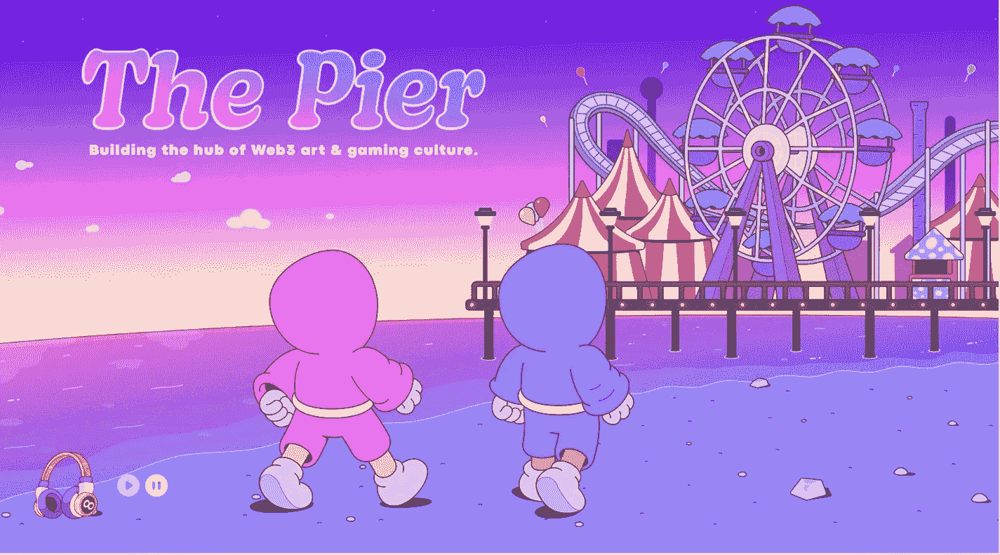

# 禁止跳下码头！但是你可以小心翼翼的一头扎进魔法世界！✨🎨🎈

> 原文：<https://medium.com/coinmonks/jumping-off-the-pier-is-prohibited-but-you-can-carefully-plunge-into-the-magical-world-4cb0db026781?source=collection_archive---------17----------------------->

*问候所有，* [***无现金无上限***](https://twitter.com/NoCashNoCap) 🚫🧢 *，出于感激，您卑微的仆人*[**deepsyg**](https://twitter.com/BradWoofy)*，我马上预约文章用两种语言写，英语和俄语。
今天我给大家讲讲* [***码头***](https://mysticsuniverse.io/pier) *项目的生态系统，我会告诉你他们是谁，他们想做什么，他们在准备什么项目，为什么很酷。特别是，我们将谈论他们的 NFT 项目* [***神秘主义者 NFT***](https://mysticsuniverse.io/) *，因为它将是他们后续项目的“基础”，而* ***码头*** *将是三个主要项目的所在地，每个项目都追求自己的目标——在 Web3 中引入创新。* ***你准备好了吗？那我们走吧！***

# 码头是什么？

码头项目的主要目标是建立 hub web3 艺术和游戏文化。 **THE PIER** 想要实现许多基于 Web3 创新的精英艺术和游戏项目的概念。

***码头将包括 3 个主要项目:***
**1。神秘主义者 NFT** 是一个项目，一切都将从这里开始，生态系统社区将会形成。我认为发射会很快。
**2。Skate Crew WEB3** ，目前还没有关于这个项目的信息，但发射计划在 2022 年第三季度进行，所以我认为信息很快就会出现。事实上，我唯一想到的是，也许它会是一个与滑板有关的 M2E，也许它会针对教学技巧和骑行，我不能肯定，但即使是名字听起来也足够酷和有趣。
**3。街机。嗯，在这里，我想每个人都很清楚，我们正在等待一个街机类型的 NFT 游戏(最有可能)。发射计划于 2022 年第四季度进行**

# 什么样的神秘主义者？

[**神秘主义者 NFT**](https://mysticsuniverse.io/) 是 [**以太坊**](http://t.co/4ddfpMCNLY) 网络上的一个项目，由**5000 个**动画、高质量的艺术以小型神秘主义者的形式组成。
这些**5000**神秘者是**码头**生态系统中的第一批集合。
这个项目的灵感来自于这个系列的艺术家(在我看来已经是蓝筹) [**看不见的朋友**](https://t.co/wbqmHNIvMQ)**[**@ motionmarkus**](http://twitter.com/motionmarkus)和他的艺术工作室[**@ motiondesignme**](http://twitter.com/motiondesignme)，据我所知，他已经尊重创始人和他的想法，也许他甚至参与其中，但他们只是不告诉我们😱**

> **交易新手？尝试[加密交易机器人](/coinmonks/crypto-trading-bot-c2ffce8acb2a)或[复制交易](/coinmonks/top-10-crypto-copy-trading-platforms-for-beginners-d0c37c7d698c)**

# **让我们深入研究这个项目。**

****社交网络**
**神秘主义者 NFT** 已经在 [**推特**](https://twitter.com/MysticsNFT) 上聚集了数量可观的粉丝，关注者数量已经超过 **13 万**，推特上的资产非常优秀，僵尸计向我展示了一个小的**10–15%**作弊，但我们知道这是正常的，每个项目都这样做。**

****

**项目的 [**discord**](https://discord.gg/pier) 最近才开放，现在有 **14K** 成员，平均在线 **5K** ，考虑到 discord 最近才开放，这个指标还算不错。
**神秘主义者 NFT** 项目有一个非常方便和丰富多彩的 [**网站**](https://mysticsuniverse.io/) 在这里你可以熟悉 [**路线图**](https://mysticsuniverse.io/magic-map)[**团队**](https://mysticsuniverse.io/team)**项目合作伙伴**，并且只需看看漂亮的、有创意的设计，听听冷冽的音乐。但是现在它可以被称为神秘主义者 NFT 网站，因为大部分关于他的信息都在那里(这个网站甚至有了合适的名字)。**

****

# **这个项目能提供什么？**

**总的来说，我会马上预订这个项目更侧重于有创造力的人，我就是这样的人，所以我一上他们的网站，这个项目就吸引了我。**

## **[**魔法地图✨**](https://mysticsuniverse.io/magic-map)**

****1。免费 WL**
自然，所有神秘主义者的持有者都将有权访问码头所有后续项目的白名单(甚至可能是免费造币厂哈哈)。但这很明显，而且不是最酷的。**

****2。工作室*(这很有趣)*。**
是的，这些家伙想用 21 点、妓女和兰博基尼做他们自己的创意工作室，我开玩笑的，不要妓女。
但现在严肃地说，工作室的重点是所有神秘主义者的所有者将每周收到与当前正在开发的项目相关的创意和设计任务。如果社区成员的概念被添加到集合中，他们将被添加到一个单独的池中，以获得该项目的总收入的 3-5%。 ***你明白吗？好吧，如果你不明白，我会再次解释，在这里的社区帮助建立未来的项目，他们与你协商，你可以想出一些东西或自己开发它，这些家伙会把它带到生活中，所以他们也会支付版税，这是超级酷，事实上你可以在 web3 中获得宝贵的经验，我们所有的 NFT 德根都在努力解决，最酷的事情是你不需要经验或技能，这里的想法是让你学会如何做！
这也是开发人员的明智之举，没有什么比一个单一的原因更能团结人们，这是建立一个有凝聚力的有机社区的真正机会，我一直说，我会说，项目的成功主要取决于社区！**社区>公用事业*******

****3。该基金会的作者计划(这通常是不平衡的)**
资助者将向神秘主义者社区中选定的建设者和创造者提供免费资金、建议和联系，帮助巫师创造他们自己的 Web3 魔法！也就是说，如果你工作出色，你被指定为最佳建设者，他们会帮助你开发你的项目，你是他们的——他们是你的，这很神奇。**

****

# **世卫组织是项目的顾问、参与者和合作伙伴吗？**

*****伙计们，抓紧了，*** *因为这里有一堆著名的项目和他们的社区，我们来浏览一下列表:*
[**涂鸦**](http://doodles.app)***(***[***我在这里写了他们***](/@NoCap_Barack/one-doodles-is-good-but-2-0-is-better-f4cc986c78d3)***)***[**Kara furu**](http://linktr.ee/karafurunft) [**项目 Godjira**](http://linktr.ee/projectgodjira) **，** [**少数**](https://y.at/%E2%9B%B0%F0%9F%8C%95%E2%9C%A8) **，**[**Llamaverse**](http://linktr.ee/llamaverse)**，** [**元宇宙总部**](http://mvhq.io) **，** [**项目 Nanopass**](http://nanopass.io)
*令人印象深刻的名单不是吗！？***

****

****WHO`S INSIDE?****

# **组**

**Mystics 雇佣了一个热情的全职 Web3 开发者团队，他们分布在世界各地，被一个单一的愿景所团结。
这些家伙有一个非常大的团队，它主要由**黑暗梯队**团队组成，其中有一个人来自**项目 Godjira。**
*网站上只列出了关键人物，现在想象一下还有多少 web3 的辛勤工作者聚集在那里。***

****主创团队:**
[**第三纪**](https://twitter.com/thirdagee)**——**是项目的主要创始人或“主要魔术师”。
[**YSL**](https://twitter.com/yslikesnfts)**——**黑暗梯队顾问，主要内容制作人，团队策略师。
[**AMEER HUSSAIN**](https://twitter.com/AmeerHussainn)—黑暗梯队顾问，主要策略师项目开发及 PR 经理。
[**ERIC PROBER**](https://twitter.com/NFTking223)—黑暗梯队顾问，社区经理。
****——**黑暗梯队顾问，社区兼公关经理
[**邓谷**](https://twitter.com/RubenJunger)**——**god jira 顾问，也是一名社区经理****

********

******Here they are from left to right — Namjoon, Jeongguk, Chingachguk(hahaha joke)******

******美术团队:**
[**GROOD**](https://twitter.com/Grood_ink)—主画师
**VALENTINE K.** —画师助理
[**BRAD EATON**](https://twitter.com/EatonMotion)**—合集的动画师
[**FLICK**](https://twitter.com/Patolin_Flick)**—第二个动画师是 1\1 和故事的创作者。********

************

******这个团队激发了人们的信心，如果仅仅是因为这些人在创建系列方面有成功的经验，以及联系，不要忘记谁是黑暗梯队，这是一个有名字的团队，他们在密码领域赢得了尊重和权威，所以我认为谈论甚至假设 ragpool 或 recta 是愚蠢的。这些人已经有了追随他们的观众，以及一个强大的社区，这个社区知道如何建立一个项目并相信它。所以我希望他们在这个项目上超越他们的成功******

# ********我们来总结一下********

******为什么神秘主义者 NFT 和码头注定会成功？
**第一个因素**当然是一个强大的团队，他们热爱 web3，知道如何做高质量的事情，这些人知道他们在说什么，他们在构建什么。
**第二个因素**。一个好的，扎实的，有创意的项目想法和有前途的路线图，哦，不好意思，魔图，随便想想！你被教导在 web3 中工作和开发项目，这是不可思议和有前途的，特别是因为社会刚刚从 web2 转移到 web3，所以它将在 5-10 年内相关，任何智商高于 2 的人都明白这一点。
**第三个因素**。强大的背景，领先的收藏和他们的社区的巨大支持。******

********

******BULLISH******

*******如何获得 WL，值得铸造吗？***
**是的！是啊！再一次，是的！**
如果你想在 web3 中发展，并且你是一个有创造力的人，那么这就是你需要的！
获得 WL 真的非常容易，做你自己，传播积极的振动，展示你的创造力，让你的想象力尽情发挥。
反过来，我也会努力在这里拿到架空线，铸币，捧到死，因为我真的很喜欢这个项目的想法，我真的很想参与团队未来的项目。****

********

# ****今天就到这里，谢谢大家的关注！我希望你们都能掌握魔术，成为村子里最酷的人。****

******码头&神秘主义者链接:** [**网站**](https://mysticsuniverse.io/) **/** [**推特**](https://twitter.com/MysticsNFT) **/** [**不和**](https://discord.gg/pier) **我的链接:** [**推特**](https://twitter.com/BradWoofy) **NCNC 链接:** [**推特**](https://twitter.com/NoCashNoCap)****

# ****ПРЫЖКИ С ПИРСА ЗАПРЕЩЕНЫ! НО ВЫ МОЖЕТЕ ОСТОРОЖНО ОКУНУТЬСЯ В ВОЛШЕБНЫЙ МИР!✨🎨🎈****

*****欢迎大家来电* [***No Cash No Cap***](https://twitter.com/NoCashNoCap) *,特别是您忠实的仆人* [***D* eepsyG**](https://twitter.com/BradWoofy) *,我郑重声明,这篇文章是用英文和俄文写的。今天我将告诉你关于项目生态系统* [***THE PIER***](https://mysticsuniverse.io/pier) *,我将告诉你他们是谁,他们想做什么,他们正在准备什么项目,以及为什么它很酷。具体来说,我们将讨论他们的 NFT 项目* [***MYSTICS*** ***NFT***](https://mysticsuniverse.io/) *,因为它将成为他们后续项目的“基础”,而* ***THE PIER*** *将成为三个主要项目的家园,每个项目都有自己的目标,即在 Web3 中实现创新。你准备好了吗?(T46)然后被驱逐!*****

# ****什么是 The Pier?****

******THE PIER 项目总目标:**创建艺术和游戏文化中心 web3。
**THE PIER** 想要实现一系列基于 Web3 创新的精英艺术和游戏项目的概念。****

********

******THE PIER**将包括***3 个主要项目:***
**1。Mystics NFT -** 一个项目,一切都将开始并形成生态系统的共性。发射将很快,我认为。
**2。Skate Crew WEB3**目前还没有关于这个项目的信息,但计划在 2022 年第三季度推出,所以我认为信息很快就会出现。事实上,我想到的唯一的事情是,它可能是与滑板相关的 M2E,也许它将用于训练技巧和驾驶,我不能确切地知道,但即使是名字听起来相当酷和有趣。
**3 阿卡德**好吧,我认为每个人都很清楚,NFT 在街机风格的游戏(最有可能)等着我们。计划于 2022 年第四季度发射****

********

# ****神秘是什么?****

****[**Mystics NFT**](https://mysticsuniverse.io/) **是一个在**[**以太坊**](http://t.co/4ddfpMCNLY)网络上的项目,由**5000 个**动画组成,以神秘小人物的形式呈现出优质的神器。这 5000 个神秘物是**The PIER**生态系统中的第一个收藏品。
该项目的灵感来自艺术家的集合(已经是芯片在我看来) [**INVISIBLE FRIENDS**](https://t.co/wbqmHNIvMQ) [**@motionmarkus**](http://twitter.com/motionmarkus) 和他的艺术工作室 [**@motiondesignme**](http://twitter.com/motiondesignme) 正如我所理解的,他已经敬仰了粉丝和他的想法,也许他甚至参加了,但他只是没有告诉我们这件事。↓(T33)********

# ****ДАВАЙТЕ УГЛУБИМСЯ В ПРОЕКТ.****

******社会网络**
**神秘主义者 NFT**聚集在[**推特**](https://twitter.com/MysticsNFT)已经有令人印象深刻的粉丝数量,粉丝数量已经超过**130K**,在推特上的活动很好,机器人计数器显示在**10-15%**的小转弯,但我们知道这是正常的,每个项目都这样做。
**项目近期开工,现在有**14K**膜,平均在线在**5K**,基本上是一个不错的指标,考虑到最近开工的盘子。******

********

****项目**MYSTICS NFT**非常方便和丰富多彩的[**网站**](https://mysticsuniverse.io/),在那里你可以浏览:[**Roadmap**](https://mysticsuniverse.io/magic-map)[**团队**](https://mysticsuniverse.io/team)**项目合作伙伴**,嗯,只要看看美丽,创意的装饰。但是现在它可以被称为**MYSTICS NFT,**网站,因为现在大部分信息都是关于它的*(网站甚至有相应的名称)。(T19)*****

********

# ****ЧТО ПРЕДЛАГАЕТ ПРОЕКТ?****

****Вообще сразу оговорюсь о том , что проект больше ориентирован на творческих людей , которым я и являюсь, поэтому проект меня зацепил как только я зашел на их вебсайт.****

## ****[**魔力地图**](https://mysticsuniverse.io/magic-map)****

******免费 WL**
当然,Mystics 的所有持有者将获得所有后续项目的白名单 THE PIER(甚至可能是免费的 Mint Ha)。这是显而易见的,这不是最酷的。****

******结构(T28)(这已经很有趣了)**
是的,小伙子们想做自己的创意工作室,配上杰克,妓女和兰博,开玩笑,没有妓女。现在,严肃地说,工作室的意义在于,所有 Mystics 所有者每周都会收到与正在开发的项目相关的创意和设计任务。如果社区成员的概念被添加到集合中,他们将被添加到一个单独的池中,以获得该项目总收入的 3-5%。你怀念吗?好吧,如果你不明白,我再解释一下,这里的社区有助于塑造未来的项目,与你建议,你可以自己想出一些东西或开发,和家伙们把它变成生活,所以他们会支付版税,它是超酷,基本上你可以得到宝贵的经验在 web3 工作,我们所有的 NTDESNs 试图适应,最酷的是,你不需要经验或技能,这里只是一个想法,你已经学会了这样做!
所以这也是来自开发商的智能苍蝇,没有什么能将人们团结在一起,这是一个真正的机会,可以建立一个有凝聚力的有机社区,而我一直说,我说,我会说,项目的成功首先取决于社区! **通讯(T41) 乌蒂利(T35)******

******作者基金会计划** *粉丝们将免费为 Mystics 社区中的精选建设者和创造者提供资金、建议和联系,帮助魔术师们创造他们自己的 Web3 魔法!也就是说,如果你做得很好,你会被标记为一个更好的策划者,他们会帮助你开发你的项目,你 - 他们是你,这是惊人的。*****

**********

# *****КТО АДВИЗОРЫ , УЧАСТНИКИ И ПАРТНЕРЫ ПРОЕКТА?*****

*****)(我)(们)(都)(不)(知)(道)(,)(我)(们)(还)(不)(知)(道)(,)(我)(们)(还)(不)(知)(道)(,)(我)(们)(还)(不)(知)(道)(,)(我)(们)(还)(不)(知)(道)(,)(我)(们)(还)(不)(知)(道)(,)(我)(们)(还)(是)(不)(知)(道)(,)(我)(们)(还)(不)(知)(道)(,)(我)(们)(还)(不)(知)(道)(,)(我)(们)(还)(不)(知)(道)(道)(,)(我)(们)(还)(不)(能)(不)(知)(道)(,)(我)(们)(还)(不)(知)(道)(,)(我)(们)(还)(不)(会)(不)(知)(道)(,)(我)(们)( [**【Llamaverse】**](http://linktr.ee/llamaverse)**[**【Metaverse HQ】**](http://mvhq.io)**[**【Project Nanopass】**](http://nanopass.io)**[**NeoTokyo**](http://linktr.ee/neotokyocode) **等。 第 62 章 讨厌的名单不是吗?？*************

**************

# *******КОМАНДА*******

*******Mystics 拥有一支充满激情的 Web3 开发团队,他们全职工作,分布在世界各地,拥有共同的愿景。
他们有一个真正的大团队,主要由 Dark Echelon 团队组成,还有一个来自 Project Godjira 的人
网站上只列出了关键人物,现在想象一下还有多少 web3 工人聚集在那里。*******

*******[**THIRD AGE**](https://twitter.com/thirdagee) **——项目的主要关注者或“主要焦点”。
[**YSL**](https://twitter.com/yslikesnfts)**——**黑暗猎龙顾问,主要内容是黑客和团队战略家。
[**AMEER HUSSAIN**](https://twitter.com/AmeerHussainn) Dark Echelon Advisor, 首席策略师兼公关经理
[**ERIC PROBER**](https://twitter.com/NFTking223)【Dark Echelon】 Dark Echelon
[**【JASA】**](https://twitter.com/degen_jasa)【Dark Echelon】【Dark Echelon】
[**【GUDENG】**](https://twitter.com/RubenJunger)**【Godjira】【Godjira】【Godjira】【Godjira】【Godjira】【Godjira】***********

**************

*********Вот они слева направо — Намджун, Чонгук, Чингачгук*********

*********ART-COMANDA:** [**GROOD**](https://twitter.com/Grood_ink) - 首席艺术家
**VALENTINE K.** - 助理艺术家
[**BRAD EATON**](https://twitter.com/EatonMotion) - 收藏动画师
[**FLICK**](https://twitter.com/Patolin_Flick) - 第二个动画师 1\1 和历史的创造者。*******

**********

*******团队激发了信心**,哪怕是因为孩子们在创作收藏方面有成功的经验,也是因为人际关系,不要忘了谁是这样一个黑暗的 Echelon,这是一个名叫团队的团队,他们在密码空间中获得了尊重和权威,所以我认为在这里谈论甚至是暗示 ragguple 或演讲都是愚蠢的。这些人已经有一个观众会跟随他们,还有一个团队,他们知道如何主持并相信这个项目。所以我希望他们在这个项目上超越他们的成功。*****

# *****ПОДВЕДЕМ ИТОГ*****

*****为什么神秘的 NFT 和 THE PIER 注定要成功?
**第一个因素**所以这绝对是一个强大的团队,他们热爱 web3,并且知道如何做高质量的事情,这些人知道他们在谈论什么,他们正在建设什么。
**第二个因素。**一个很好的,整体的,创意的项目和有前途的 Roadmap,哦,对不起,Meggy Map,只是想想!你被教导在 web3 工作和开发项目,这是令人难以置信的和前瞻性的,特别是社会刚刚从 web2 互联网过渡到 web3,因为这将是相关的,并在 5 年后,任何智商高于 2 的人都会明白这一点。
**第三个因素。**强大的后台,来自领先的收藏品和他们的社区的巨大支持。*****

**********

*******BULLISH*******

*******如何获得 WL 并值得挖掘它?
是的!是的!整个空间是的!
如果你想在 Web3 中成长,并且你是一个创造性的人,这就是你所需要的!
获得空中巴士其实很简单,只要做你自己,传播积极的振动,展示你的创造力,让你的想象力。
反过来,我会尽我所能来这里排练,挖掘并停留到死,因为我真的很喜欢这个项目的想法,我真的很想参与团队未来的项目。*******

**********

# *****ВОТ И ВСЕ НА СЕГОДНЯ , БЛАГОДАРЮ ВАС ЗА ВНИМАНИЕ! ЖЕЛАЮ ВСЕМ ВАМ ОВЛАДЕТЬ МАГИЧЕСКИМИ ШТУКАМИ И БЫТЬСАМЫМ КРУТЫМ ПАРНЕМ НА ДЕРЕВНЕ.*****

*****)(我)(们)(都)(不)(知)(道)(,)(我)(们)(还)(不)(知)(道)(,)(我)(们)(还)(不)(知)(道)(,)(我)(们)(还)(不)(知)(道)(,)(我)(们)(还)(不)(知)(道)(,)(我)(们)(还)(不)(知)(道)(,)(我)(们)(还)(不)(知)(道)(,)(我)(们)(们)(还)(不)(知)(道)(,)(我)(们)(们)(还)(不)(知)(道)(,)(我)(们)(还)(不)(知)(道)(,)(我)(们)(还)(不)(知)(这)(些)(事)(,)(我)(们)(还)(没)(见)(到)(你)(。*****